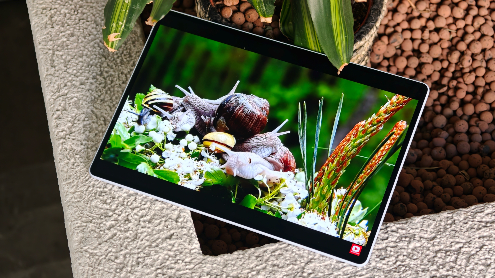
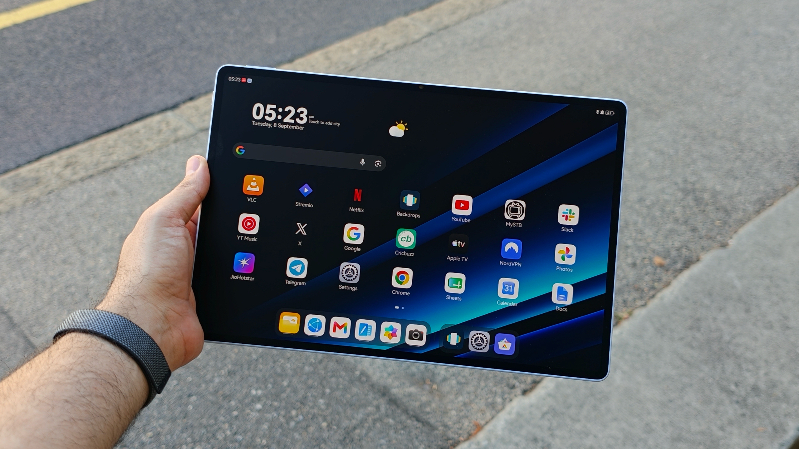
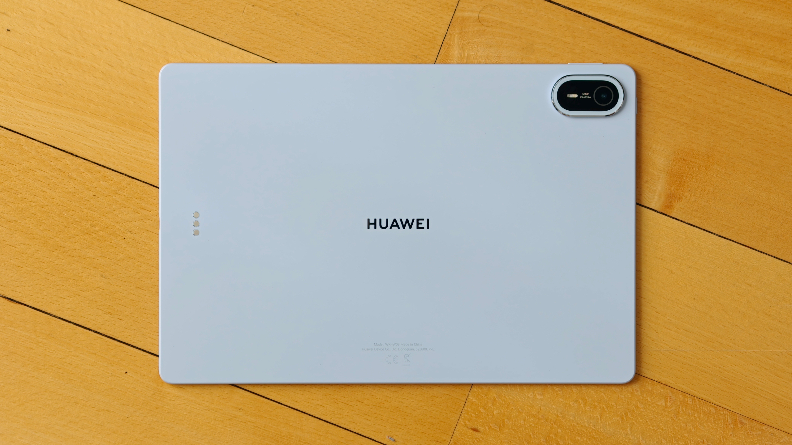
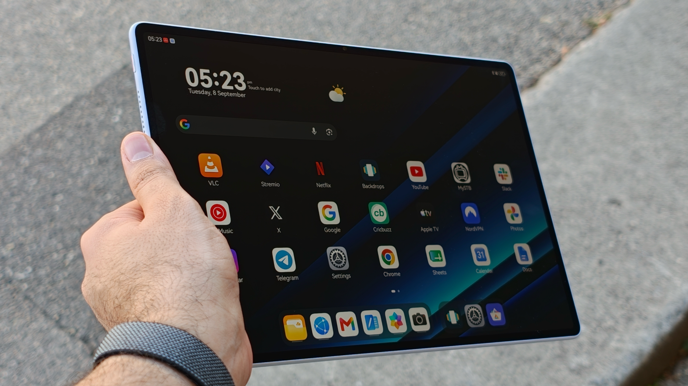

Huawei es una compañía que innova en varios frentes a la vez, pero con un problema recurrente para el comprador occidental: buena parte de su catálogo no se vende fuera de Asia. De vez en cuando, sin embargo, la firma lanza algún producto en Europa y vuelve a recordar qué se están perdiendo los demás fabricantes. Eso es lo que ha ocurrido con la nueva MatePad Air, según la experiencia que relata el analista Sanuj Bhatia en TechRadar.

Bhatia usa habitualmente un iPad Air M1 de 2022 como tablet principal, pero durante el último mes ha trabajado con la MatePad Air como dispositivo de cabecera. Su conclusión, expresada como valoración personal y no como una medición de laboratorio, es que hay una mejora concreta que le gustaría recuperar en el próximo iPad Air de Apple: la pantalla.

## Una pantalla que marca la diferencia

La MatePad Air monta un panel OLED de 12 pulgadas con una tasa de refresco de hasta 144 Hz y un brillo máximo de 1.200 nits. La unidad que el analista ha probado durante un mes es la variante de gama alta con tratamiento PaperMatte, que según Huawei alcanza los 2.000 nits.

Sobre el PaperMatte, Huawei asegura que se trata de un tratamiento antirreflectante capaz de eliminar hasta el 99 % de los reflejos de la luz ambiente. Además, aporta a la pantalla una textura más parecida al papel, algo que el analista describe como natural al escribir con un lápiz óptico, y que también ayuda a reducir la fatiga visual y las huellas.

El propio Bhatia resume su experiencia: ha usado la tablet en el metro, en aviones y en casa, y no tener reflejos rebotando en la pantalla de forma constante le ha parecido una gran ventaja. El contraste con su iPad Air es, según cuenta, lo que le ha hecho preferir la MatePad Air durante este mes.

La comparación no deja bien parado al tablet de Apple en este apartado. El iPad Air sigue usando un panel LCD limitado a 60 Hz y con marcos bastante gruesos. Bhatia aclara que a él nunca le habían molestado esos detalles y que su iPad Air le ha funcionado bien durante años, pero que alternar entre ambos equipos hizo que la diferencia resultara evidente. Apple ya ofrece su acabado nano-texture en el iPad Pro, recuerda, aunque solo como opción en las configuraciones más caras (1 TB o más), que elevan el precio hasta los 1.899 dólares, 1.899 libras o 3.249 dólares australianos.

## Precio, hardware y disponibilidad en Europa

La baza de Huawei, según el analista, es que hace más fácil asumir ese salto. En el Reino Unido, la pantalla PaperMatte está disponible en todas las versiones de la MatePad Air, y la más barata parte de 699,99 libras. El equipo no se vende en Estados Unidos, lo que refuerza la idea de que se trata de uno de esos lanzamientos puntuales de la compañía en mercados occidentales.

A la hora de comparar almacenamiento, el modelo base de Huawei arranca con 256 GB, frente a los 128 GB del iPad Air. El resto del hardware también deja buenas sensaciones al analista: con 12 pulgadas, la MatePad Air se sitúa entre los modelos de 11 y 13 pulgadas de Apple, pesa 509 gramos y recurre a un chasis y una trasera de aluminio, lo que la deja más de 100 gramos por debajo del iPad Air de 13 pulgadas.

El equipo también es más delgado, con 5,3 mm frente a los 6,1 mm del iPad Air grande, y eso a pesar de que Huawei ha integrado una batería de 10.100 mAh, por encima de los aproximadamente 9.705 mAh del tablet de Apple.

Conviene añadir un matiz de contexto para el lector europeo: como es habitual en los productos de Huawei fuera de China, sus tablets funcionan con HarmonyOS y sin los servicios de Google, lo que condiciona el acceso a las aplicaciones distribuidas a través de Play Store. Es un factor a tener en cuenta antes de comprar, más allá de las bondades de la pantalla.

## Lo que el iPad sigue haciendo mejor

Bhatia es explícito al señalar que la MatePad Air no gana en todo. Los chips de la serie M de Apple siguen dando al iPad una ventaja de rendimiento notable, y si tuviera que editar vídeo o hacer un trabajo intensivo en cómputo sobre una tablet, seguiría eligiendo el iPad Air. Su uso real, en cambio, pasa sobre todo por consumir contenido y navegar por la web, y para esas dos tareas prefiere la pantalla de la MatePad Air.

Por eso el analista no está dispuesto a deshacerse por completo de su iPad: continúa prefiriendo su rendimiento, su ecosistema de aplicaciones y la integración con el resto de sus dispositivos Apple. Lo que reclama no es un cambio de plataforma, sino una decisión de producto: que el próximo iPad Air incorpore una pantalla OLED con una opción antirreflectante similar al PaperMatte y a un precio asumible. Si eso ocurre, asegura, su iPad Air M1 tendría por fin un motivo para jubilarse.
