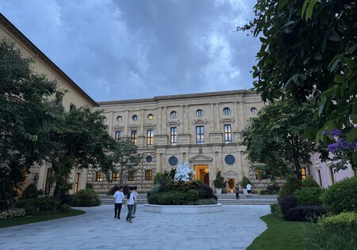
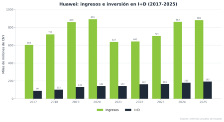
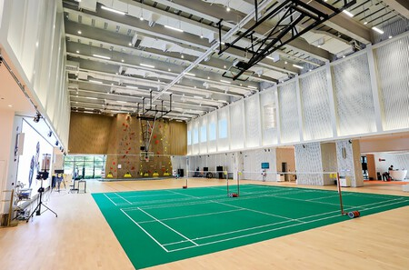
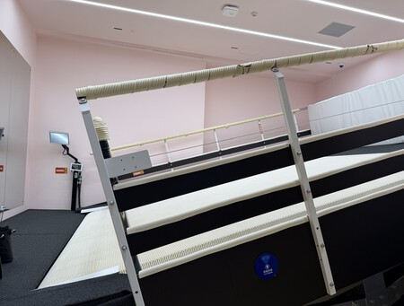
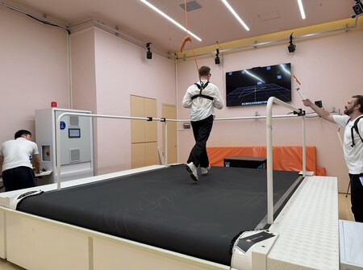
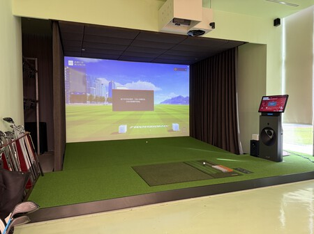
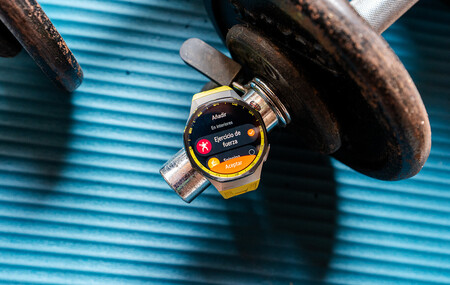
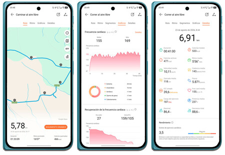
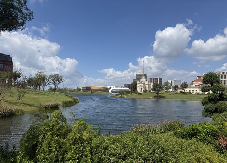

Los relojes inteligentes se han convertido en una de las líneas más visibles de Huawei en Europa, pero buena parte de su competitividad se decide mucho antes de que el producto llegue a la tienda. La directora de Xataka, María González, pasó cuatro días recorriendo varios campus y laboratorios de la compañía en China para entender cómo se diseñan y se calibran los sensores de sus smartwatch, y de paso para intuir hacia dónde apunta la empresa. Este artículo resume lo que relató en su crónica de la visita.

## Un campus que parece una ciudad europea

La primera parada es Dongguan, una ciudad cercana a Shenzhen de más de diez millones de habitantes. Al cruzar una puerta aparece una reproducción del Palacio de Versalles y, en su interior, una réplica de la Biblioteca Nacional de París. No es un decorado: es el Ox Horn Campus de Huawei, donde hay oficinas y laboratorios reales.

Según los datos que la compañía comparte con la prensa, el campus terminó de construirse en 2019 y ocupa 1,27 millones de metros cuadrados, con doce «pueblos» de estilo europeo distribuidos por su superficie. Uno de ellos es Granada, la única ciudad española homenajeada, y para moverse entre zonas la firma ha habilitado su propio sistema de tranvía interno. En total, el recinto acoge a más de 30.000 empleados, la mayoría en puestos ligados a la innovación.

La propia crónica enmarca ese esfuerzo en un contexto concreto: en 2019 Estados Unidos bloqueó comercialmente a Huawei, lo que le cortó el acceso a tecnología estadounidense y la obligó a dejar de trabajar con TSMC en chips o a prescindir de los servicios de Google en sus móviles. La respuesta de la compañía, según recuerda Xataka, fue invertir más en innovación cada año.

## Los laboratorios donde se afinan los sensores

Menos espectacular que el campus, el Huawei Health Lab de Dongguan es el lugar donde los relojes aprenden a medir bien. Al entrar, la sensación es la de un polideportivo, pero lleno de cámaras y sensores: incluye piscina, pared de escalada, pista de baloncesto, zona de tiro y una minipista de esquí. La idea es medir distintos deportes y posturas, capturar el movimiento y compararlo con equipos médicos para calibrar las lecturas del reloj.

El reto técnico es que los smartwatch estiman métricas como las pulsaciones o la saturación de oxígeno (SpO2) mediante fotopletismografía: iluminan la piel y los capilares y detectan los cambios en la señal que vuelve. Es una técnica muy sensible al movimiento, de ahí que el reloj pueda desplazarse en la muñeca al correr, saltar o hacer fuerza. Una de las instalaciones destacadas es una cámara que simula altitud de hasta 6.000 metros, con temperaturas de entre -10 ºC y 40 ºC y humedad del 35 % al 95 %.

En el caso del esquí, la apuesta del reciente Watch GT 7 Pro es especialmente ambiciosa: además de métricas como el número, el tipo y la frecuencia de giros, el reloj distingue entre esquí indoor y al aire libre e incorpora más de 3.000 mapas de estaciones con su dificultad. Todo el laboratorio está rodeado de 28 cámaras infrarrojas de alta velocidad, de hasta 10.000 Hz, que según Huawei permiten registrar movimientos con precisión milimétrica.

## Cómo ha cambiado el sensor del reloj

Toda esa maquinaria sirve a un objetivo: que la tecnología de sensores que Huawei agrupa bajo la marca TruSense sea lo más precisa posible. La compañía la define con una analogía clara: es a sus wearables lo que los chips a los teléfonos y los sensores de imagen a las cámaras. El ingeniero responsable del proyecto señala que el principal obstáculo es la variedad de muñecas, tonos de piel y formas de llevar el reloj, y la necesidad de extraer una señal limpia de todo ese ruido.

Para lograrlo, Huawei dice haber reorganizado los sensores de la parte trasera en tres zonas circulares en lugar de las dos habituales, combinando varios de ellos en cada medición, y haber oscurecido el cristal trasero para alcanzar capas más profundas de la piel. La firma afirma que así ha aumentado la calidad de la señal un 20 % y que ha alcanzado una precisión superior al 98 % en la medición de la frecuencia cardiaca, además de medir el SpO2 en 10 segundos, un 40 % más rápido que antes.

Conviene leer estas cifras como lo que son: datos que la compañía presenta sobre su propia tecnología, no resultados de una medición independiente. El debate sobre cuánto de esa precisión se traduce en beneficio real para la salud sigue abierto, como muestra [la brecha que la evidencia todavía deja en las puntuaciones de recuperación de los wearables](/noticias/wearable-readiness-scores-evidence-gap/).

## Lo que está por venir

Los relojes son solo el principio. Según lo que Huawei trasladó a Xataka, la compañía prepara otros formatos de dispositivos de salud más allá de los smartwatch, como anillos, y asegura que pronto veremos otros productos «innovadores». La firma presume de medir más de 70 indicadores con sus relojes y de tener en marcha más de 340 proyectos de investigación en salud con hospitales e instituciones de todo el mundo; su línea Watch D, que estima la tensión arterial desde la muñeca, es clave en esa estrategia aunque no sea su gran superventas.

La visita también deja ver la ambición general de la empresa. En su campus de Shanghai, con metro propio y más de 30.000 científicos e ingenieros, Guo Ping, presidente de su Consejo de Supervisión, resumía el rumbo hace unos días ante los empleados: «El objetivo de Huawei es convertirse en Nvidia». Una frase que apunta al peso creciente de sus chips para inteligencia artificial y que ayuda a entender por qué la compañía insiste en una idea que repite en sus instalaciones: la mejor forma de predecir el futuro es crearlo.
