La medición de la presión arterial se ha convertido en uno de los próximos frentes de los relojes inteligentes, y Huawei lleva años en la primera fila. El **Huawei Watch D3**, analizado por **T3**, es su propuesta de salud más completa hasta la fecha: en lugar de estimar la presión con sensores ópticos y algoritmos, esconde un pequeño brazalete mecánico en la correa que se infla alrededor de la muñeca como un tensiómetro convencional y ofrece lecturas reales de sistólica y diastólica.

## Un brazalete mecánico escondido en la correa

No es una idea nueva en la casa: el Huawei Watch D original ya podía tomar la presión. La diferencia del D3 es la miniaturización. El cuerpo baja a 11,3 mm de grosor frente a los 13,3 mm del D2, con una caja de 46,5 x 41 x 11,3 mm y unos 40 gramos sin la correa, unas proporciones cercanas a las de un Apple Watch. Visto de lejos, cuesta distinguirlo de un reloj inteligente convencional.

La pantalla también gana terreno. El panel AMOLED de 1,92 pulgadas promete un pico de 3.000 nits, muy por encima de las 1,82 pulgadas y 1.500 nits del D2, y se lee sin problemas en exteriores. La correa sigue siendo algo más gruesa de lo habitual porque aloja la bolsa inflable, el motor de bombeo y los sensores de presión, pero en la muñeca no resulta incómoda.

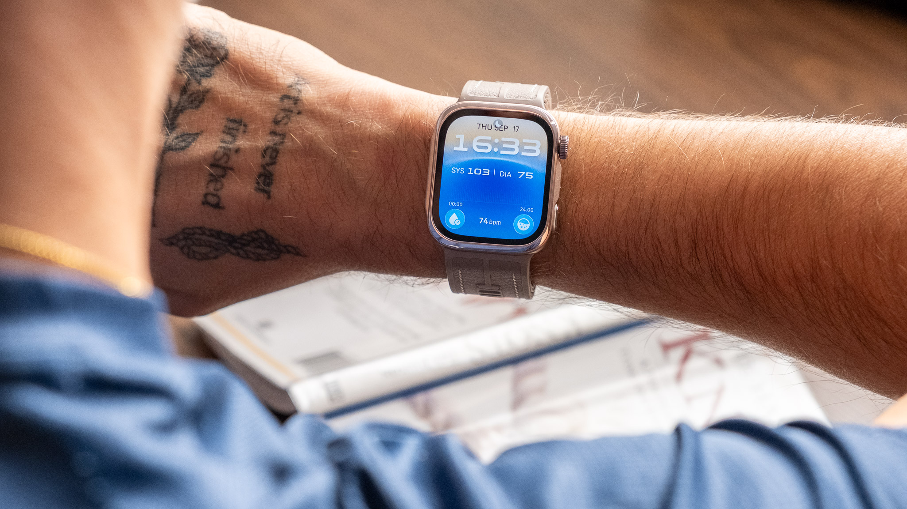

Tomar una lectura es sencillo: se inicia la medición, se coloca el brazo en la posición correcta sobre el pecho y la bolsa se infla despacio alrededor de la muñeca. Huawei emplea el método oscilométrico, que combina el brazalete mecánico con un sensor de presión para obtener los valores de sistólica y diastólica, y el sistema cuenta con certificación de producto sanitario CE-MDR en la Unión Europea. El detalle que más sorprendió al analista fue el silencio: apenas emite sonido, y la única señal de que está trabajando es la presión creciente en la muñeca.

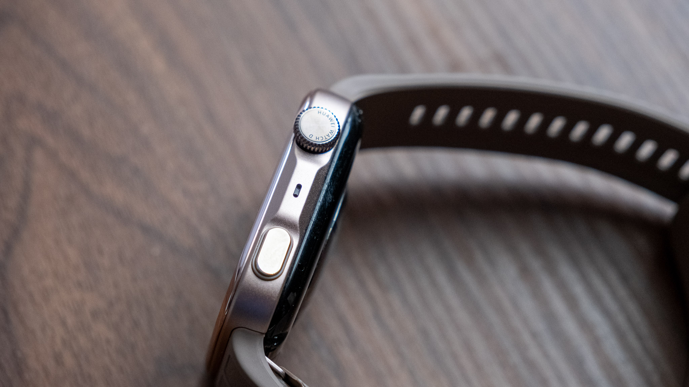

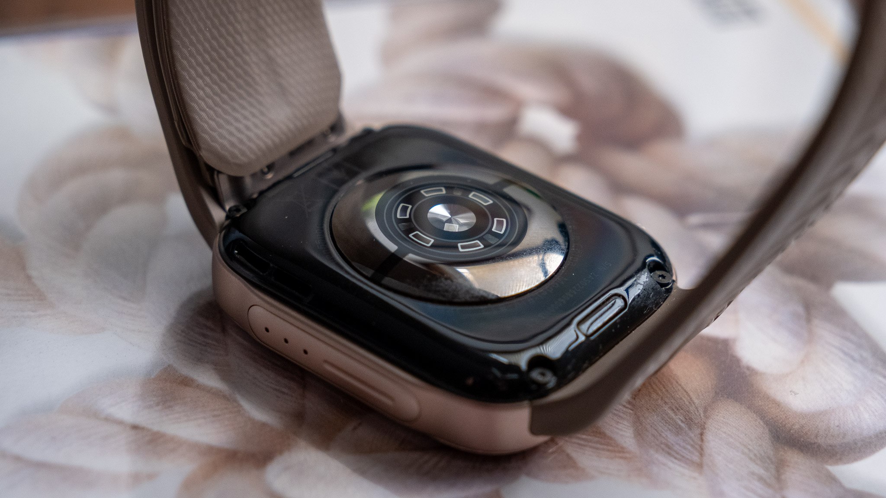

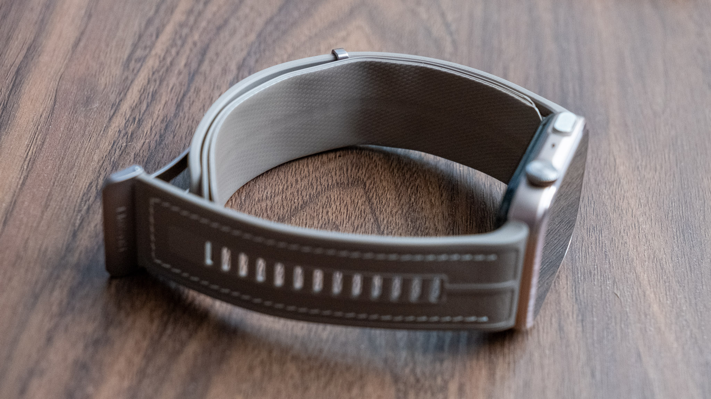

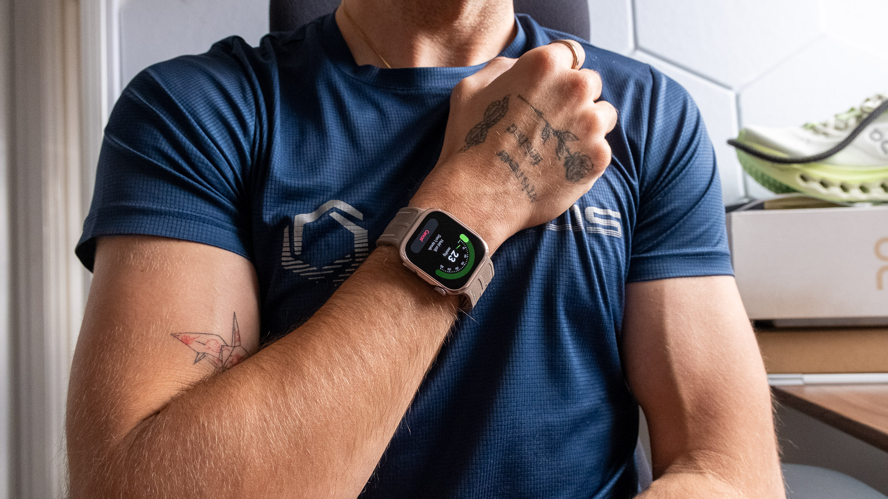

## La duda: lecturas por debajo de la referencia

Aquí llega el matiz importante de la reseña. El analista comparó el Watch D3 con un tensiómetro de brazo **Garmin Index BPM** en varias mediciones y obtuvo de forma constante cifras más bajas con el reloj de Huawei.

| Garmin Index BPM | Huawei Watch D3 |
| --- | --- |
| 127/82 | 109/76 |
| 119/80 | 111/74 |
| 128/76 | 105/72 |

En esas tres pruebas, la sistólica del Huawei quedó unos 16 mmHg por debajo de media y la diastólica, unos 5 mmHg. Es una diferencia demasiado constante como para pasarla por alto en un reloj cuya principal razón de compra es precisamente medir la presión. Casi todas las lecturas del Watch D3 se mantuvieron por debajo del valor óptimo de 120/80.

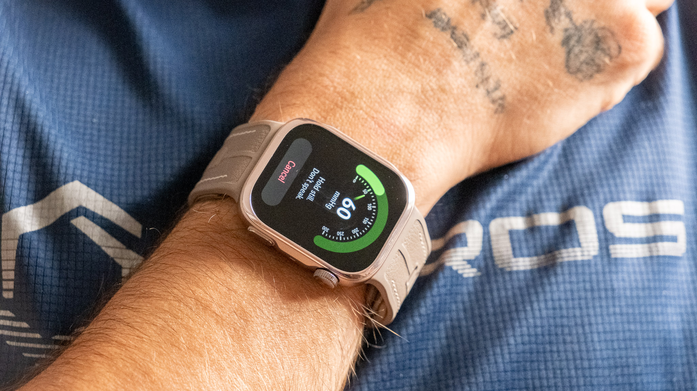

Conviene calibrar el alcance de esa comparación. No fue una prueba clínica y el dispositivo de Garmin tampoco es un equipo de referencia de laboratorio; además, la posición del cuerpo, el momento del día e incluso el brazo elegido influyen en el resultado. El propio autor evita concluir que el reloj sea inexacto de forma universal. Un dato tranquilizador: la aplicación de Huawei nunca avisó de lecturas anormalmente bajas, algo coherente si se tiene en cuenta que el registro más bajo, 105/72, sigue por encima del umbral de hipotensión que maneja el sistema sanitario británico, situado por debajo de 90/60 mmHg.

La precisión de las métricas de salud en los wearables es, en cualquier caso, un frente abierto: ya hemos analizado en TechSpain24 [el hueco científico que arrastran las puntuaciones de readiness](/noticias/wearable-readiness-scores-evidence-gap/).

## Mapeo ambulatorio y el resto de la salud

El Watch D3 también hace monitorización ambulatoria de la presión arterial (MAPA), con lecturas repetidas a lo largo del día y de la noche. El sistema permite detectar patrones que una sola medición no muestra, pero exige cooperación: durante el día hay que adoptar la postura correcta, con la muñeca elevada sobre el pecho y un codo apoyado en la otra mano. El analista reconoce que se le escaparon varias mediciones programadas por estar ocupado, mientras que las nocturnas, automáticas, no dieron problemas. Con la MAPA activada, la autonomía baja de hasta seis días a alrededor de uno.

En salud general, el D3 es probablemente el reloj más completo de Huawei en este terreno. La función **Health Glance** reúne hasta once mediciones en un único informe, y el reloj suma ECG, frecuencia cardiaca, SpO2, VFC, seguimiento del sueño, temperatura de la piel, estrés y la ampliada función de bienestar emocional. A ello se añaden una nueva puntuación de preparación física, un análisis de sueño mejorado y las conclusiones de salud que cruzan las tendencias de presión a largo plazo con la actividad y el descanso.

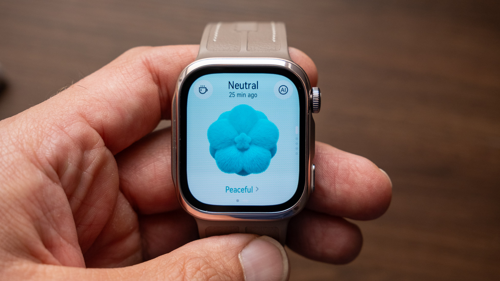

La aplicación Huawei Health expone toda esa información con solvencia, aunque adolece del mismo problema que otras plataformas del sector: es exhaustiva más que elegante, y la avalancha de datos puede resultar abrumadora. Para el autor, el enfoque de Oura sigue siendo el estándar. Quien busque una experiencia parecida en otro tipo de sensor puede ver [cómo la glucosa continua llegó a la muñeca](/noticias/sugar-sense-freestyle-libre-watch/).

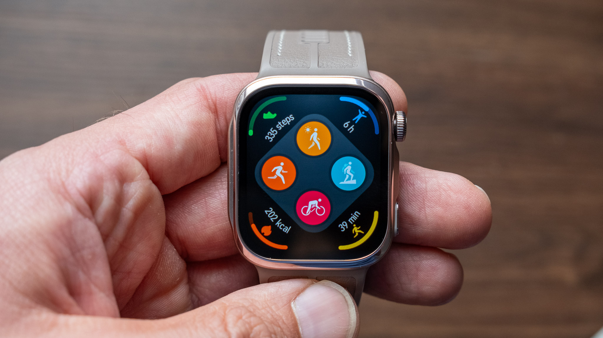

El seguimiento deportivo cumple, con más de 100 modos de entrenamiento —golf, esquí o trail running, entre otros—, navegación de rutas y avisos de salida de recorrido. Aun así, no sustituye a un Garmin dedicado ni a los relojes de rendimiento de la propia Huawei si el entrenamiento de resistencia serio es la prioridad.

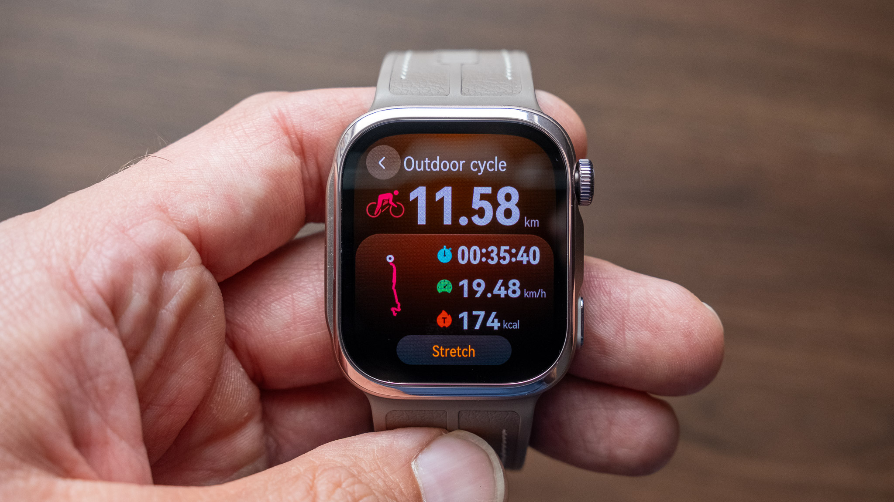

## Precio, batería y veredicto del Huawei Watch D3

El Watch D3 se anunció en septiembre de 2026 y ya está a la venta en Huawei Reino Unido por 399,99 libras, en acabados negro, dorado y Mocha Gold. En Europa cuesta 449 euros, y no hay lanzamiento ni precio oficial en Estados Unidos, de modo que un comprador estadounidense tendría que importarlo. El precio lo sitúa en la parte alta de la gama de Huawei, aunque la medición con brazalete integrada le da una función que pocos rivales generalistas pueden igualar.

En el apartado inteligente cubre lo básico —notificaciones, llamadas por Bluetooth, calendario y pagos NFC mediante Curve Pay en Reino Unido— y la autonomía supera lo prometido. Huawei anuncia hasta seis días; en la prueba, tras cargar del 8 % al 100 % en no más de 55 minutos, todavía quedaba un 34 % seis días después, con una actualización de software y una hora de caminata con GPS registrada de por medio. Según el consumo observado, el reloj apuntaba a unos nueve días entre cargas.

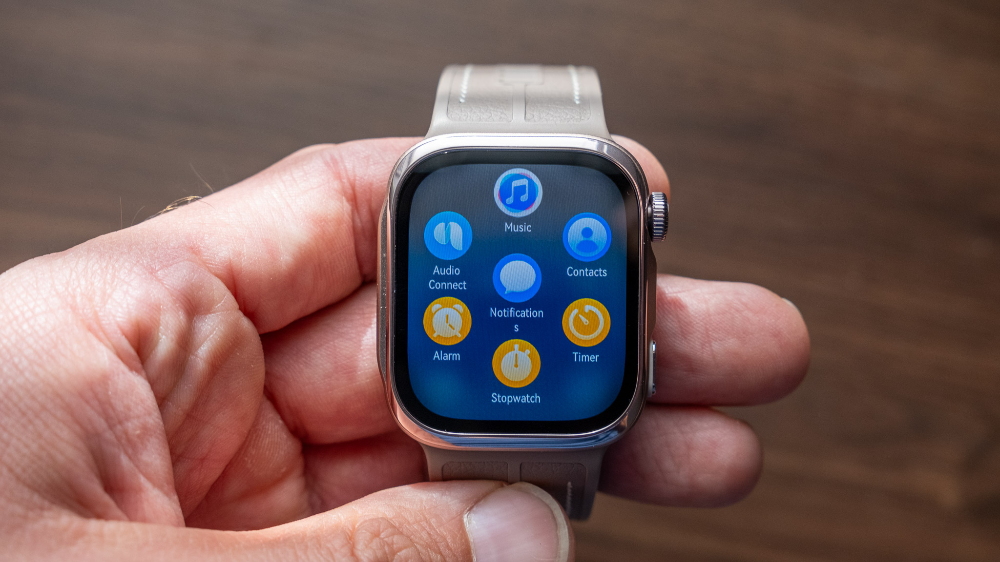

El veredicto es agridulce. El Huawei Watch D3 es el argumento más sólido hasta la fecha para llevar una medición real de la presión arterial en un reloj de uso diario, y casi todo en él resulta excelente: pantalla, batería, comodidad y un catálogo enorme de métricas. La pega, y no es menor, es que la función que más importa arrojó lecturas sistemáticamente más bajas que un tensiómetro de referencia en esta prueba de alcance limitado.

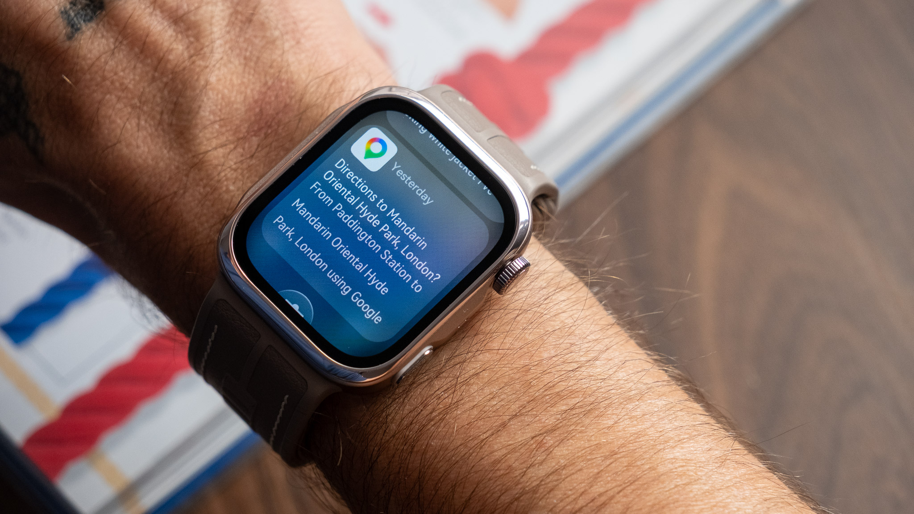
