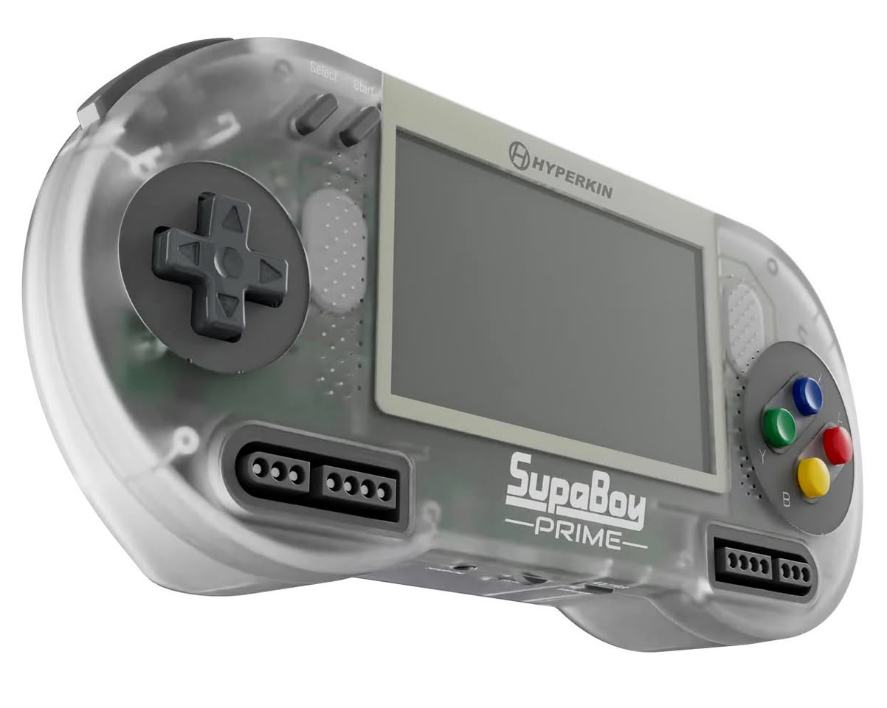
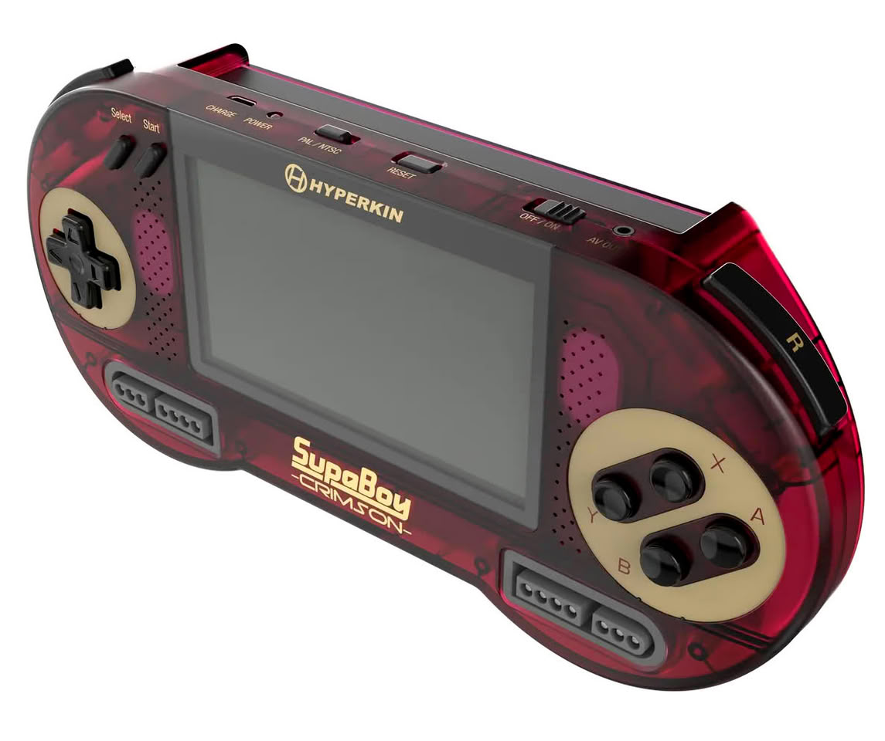
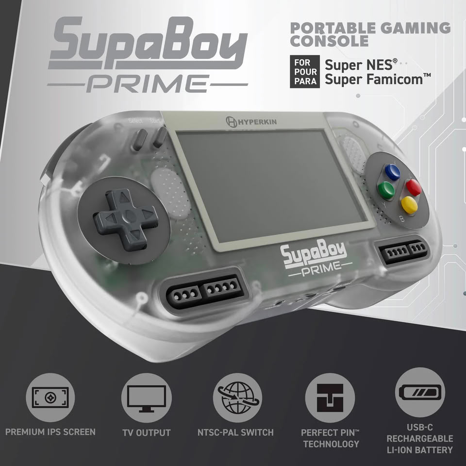
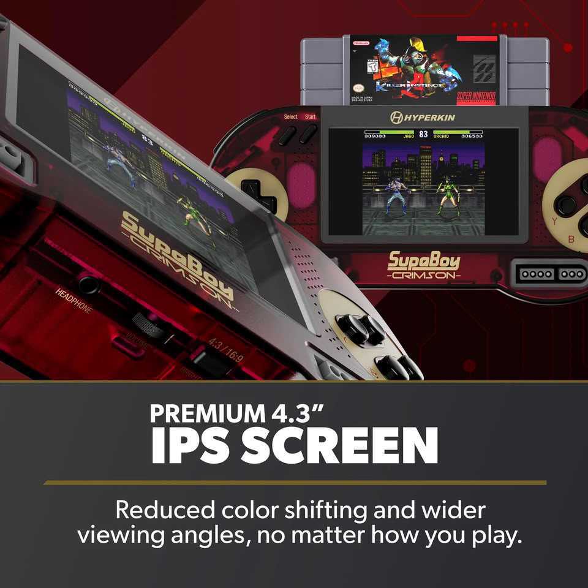

Hyperkin ha abierto las reservas de dos nuevas versiones de su SupaBoy, la consola portátil que reproduce cartuchos originales de Super Nintendo y Super Famicom. El fabricante ha fijado la salida en Estados Unidos y la Unión Europea para el **28 de octubre de 2026**, con un precio de referencia de **129,99 dólares, 129,99 euros o 119,99 libras** según el mercado.

Los dos modelos llegan con carcasas translúcidas y sustituyen a las variantes del SupaBoy que están a la venta en la actualidad, según la compañía. Las reservas ya están activas en la tienda oficial de Hyperkin.

## Qué ha anunciado Hyperkin

El anuncio se concreta en dos ediciones con nombres y referencias estéticas propias:

- **SupaBoy Crimson (edición limitada)**: se inspira en la Famicom japonesa original. Hyperkin la presenta como la primera entrega de una serie anual de actualizaciones de color de tirada limitada.
- **SupaBoy Prime**: adopta una paleta que remite al diseño clásico de la Super Famicom japonesa y europea.

El resto del hardware es el mismo que ya caracteriza al producto. La consola mantiene una ranura de cartuchos integrada, compatible con cartuchos originales de Super Nintendo y Super Famicom de las regiones PAL, NTSC y JP. Hyperkin insiste en que no recurre a la emulación ni a archivos ROM, y que no requiere inicio de sesión ni actualizaciones de firmware.

En el apartado técnico, la compañía detalla una pantalla IPS de **4,3 pulgadas**, una batería de litio recargable integrada que ofrece **hasta 10 horas** de uso por carga, salida de vídeo AV para conectar a un televisor y **dos puertos frontales para mandos**, pensados para partidas de dos jugadores con controladores originales o compatibles.

## Por qué importa al público retro

La propuesta del SupaBoy no compite con las consolas portátiles basadas en emulación, que abundan en el mercado a precios mucho más bajos. Su diferencial es el soporte de **cartuchos físicos originales**: quien conserve su colección de Super Nintendo o Super Famicom puede jugarla en movilidad sin depender de ROMs ni de descargas.

Ese enfoque explica también el precio. Frente a alternativas de emulación que se mueven en decenas de euros, el SupaBoy se dirige a un público coleccionista dispuesto a pagar por una máquina que trata el cartucho como el formato principal. Los dos nuevos acabados refuerzan justamente esa veta nostálgica, con referencias directas a los diseños de Famicom y Super Famicom.

## Qué cambia para el lector hispanohablante

El lanzamiento está confirmado para Estados Unidos y la Unión Europea, por lo que España entra en el ámbito de distribución europeo y el precio en euros ya está anunciado. Quien quiera asegurarse una unidad, y en particular la edición limitada Crimson, tiene hasta el 28 de octubre para reservarla, aunque la disponibilidad dependerá de cada tienda.

La letra pequeña importa: se trata de una consola de cartuchos, no de una plataforma digital. Si no se conserva una colección física de cartuchos originales, el gasto no termina en la consola, ya que habrá que sumar el precio de los juegos o de un cartucho flash. Para ese perfil, las alternativas basadas en emulación siguen siendo más económicas.

