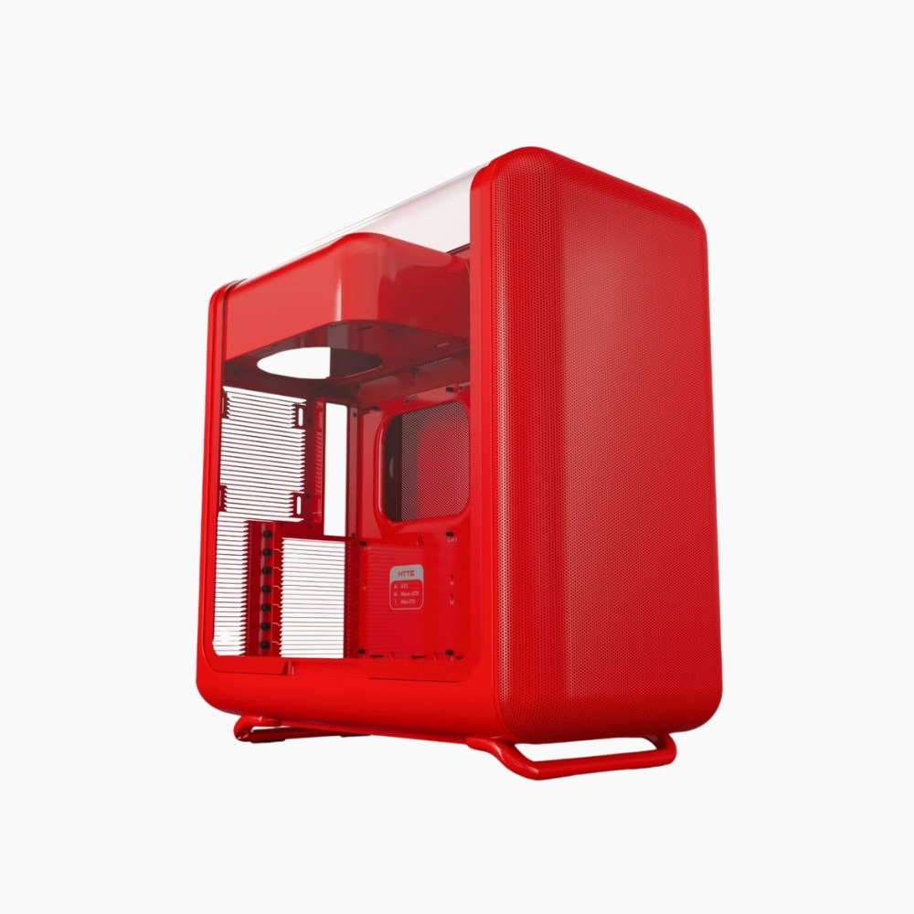

Hyte ha rebajado su caja para PC **X50** en su propia tienda: el modelo de cristal curvo se queda en **99,99 dólares**, 50 dólares menos de su precio habitual, y la promoción se mantiene hasta el **21 de septiembre de 2026**. La ficha de la oferta recogida por The Verge muestra un descuento del 33 % sobre una referencia de 150 dólares. Es una rebaja temporal, así que conviene verificar el precio final y la disponibilidad antes de comprar, ya que pueden cambiar sin aviso.

Para quien no siga el mercado de cajas, la X50 es la apuesta de Hyte por salirse del diseño de bloque negro que domina el segmento. Su rasgo más reconocible es un **panel de cristal curvo** que recorre el lateral izquierdo y la parte superior del chasis, una solución poco habitual que busca convertir el interior del equipo en parte del aspecto exterior.

## Compatibilidad amplia y airflow cuidado

El cristal no ha llegado a costa de la ventilación. La X50 incorpora **aletas en la parte trasera**, un **frontal de malla poroso** y varios puntos de anclaje para ventiladores y radiadores, una combinación que en teoría permite montar configuraciones exigentes sin sacrificar la refrigeración.

En cuanto a compatibilidad, la caja admite placas base **desde ITX hasta E-ATX**, lo que cubre desde equipos compactos hasta plataformas de gama alta, y acepta tarjetas gráficas de **hasta 430 mm de longitud**, suficiente para prácticamente cualquier GPU del mercado actual. También hay margen para distintas combinaciones de refrigeración líquida o por aire.

El catálogo de acabados es otro de sus atractivos: además de los clásicos **negro** y **blanco**, Hyte ofrece tonos más llamativos como el lavanda suave que la marca llama **"taro milk"** y el verde **"matcha"**.

## Una alternativa más discreta: la X50 Air

Quien prefiera prescindir del cristal tiene la **X50 Air**, que cambia el panel de vidrio por una **malla curva** y mantiene el enfoque en el flujo de aire. Su precio durante la promoción es de **79,99 dólares**, frente a los 119,99 dólares que cuesta habitualmente, también en la tienda de Hyte.

## Qué significa para el lector en España

Como otras ofertas de medios estadounidenses, los precios están en dólares y no incluyen impuestos ni envío, y la promoción se gestiona desde la tienda oficial de Hyte, que aplica sus propias condiciones de envío e importación según el país. Para quien compre desde España, la referencia sirve sobre todo para calibrar cuánto debería costar una caja con cristal curvo y compatibilidad E-ATX en el mercado europeo, más que como un precio replicable tal cual.

Lo relevante del movimiento es de fondo: que una caja con un acabado tan distintivo y soporte para E-ATX ronde los 100 dólares confirma que el segmento de chasis premium sigue ajustando márgenes para competir. Si el diseño encaja con el equipo que se quiere montar, esta es una de esas ventanas en las que el ahorro justifica adelantar la compra; si no hay prisa, conviene comparar con el resto de la gama X50 y con las alternativas de otros fabricantes antes de decidir.
