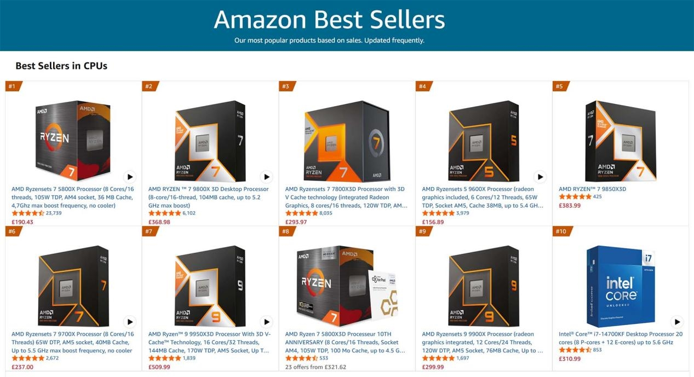
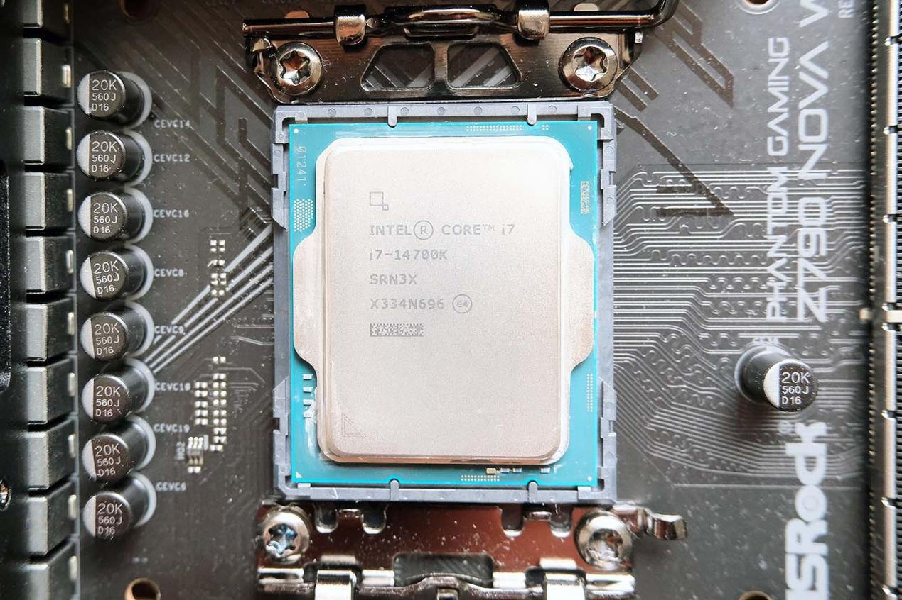

En el mercado de procesadores de sobremesa suele darse por hecho que lo más nuevo es lo que más vende. El último ranking de CPU de Amazon, publicado en septiembre, desmonta esa idea: el procesador Intel más popular entre los compradores no pertenece a la arquitectura Arrow Lake Refresh, la más reciente de la compañía, sino a un veterano que está a punto de cumplir tres años, el Core i7-14700K.

Según los datos de Amazon recogidos por MyDrivers, el i7-14700K ocupa el puesto 14 en la lista de la tienda estadounidense, lo que lo convierte en el chip de Intel mejor clasificado. En la tienda del Reino Unido el resultado es aún más llamativo: la variante sin gráficos integrados, el i7-14700KF, entra directamente en el top 10.

## Por qué gana un chip "viejo"

La razón de esta resistencia no está en el rendimiento bruto, sino en la compatibilidad. El i7-14700K admite memoria DDR4 y DDR5, una flexibilidad que la nueva serie Ultra ya no ofrece: los Arrow Lake Refresh obligan a pasar por DDR5, que sigue siendo notablemente más cara.

Esa diferencia convierte al i7-14700K en una opción de actualización mucho más asequible para quien ya tiene un equipo con memoria DDR4. El usuario puede reutilizar sus módulos actuales y gastar solo en el procesador y la placa, en lugar de asumir el coste de un cambio completo de plataforma.

A la compatibilidad con la memoria se suma el zócalo. El i7-14700K funciona sobre el conector LGA1700, ya consolidado y con un ecosistema de placas maduro y económico. Frente a él, el LGA1851 de las nuevas generaciones presenta un recorrido aún incierto, lo que hace que muchos compradores sientan que su inversión en la plataforma antigua está más amortizada.

## Especificaciones y precio

El i7-14700K ofrece 20 núcleos (8 de rendimiento y 12 de eficiencia) y una frecuencia de impulso de hasta 5,5 GHz. En comparación con las opciones de gama inferior de su misma familia, aporta dos núcleos de rendimiento y cuatro de eficiencia adicionales, lo que se traduce en un mejor comportamiento en juegos.

Frente al tope de gama i9-14900K, la ventaja es de otra naturaleza: su precio se sitúa en 310,99 libras esterlinas (unos 2.886 yuanes), lo que le da una relación prestaciones-precio más favorable. Además, al no perseguir las frecuencias extremas del i9, su temperatura bajo carga es más fácil de controlar con refrigeración por aire o con una líquida de gama media.

## Qué dice esto del mercado

La persistencia del i7-14700K en lo alto del ranking refleja un cambio de actitud del comprador de hardware. En lugar de dejarse llevar por la novedad, buena parte del mercado vuelve a priorizar la compatibilidad y el precio, las dos variables que históricamente han movido el bricolaje de componentes.

Para el lector hispanohablante, la lectura práctica es clara: si el objetivo es actualizar un PC sin cambiar memoria ni placa, la generación Raptor Lake todavía tiene sentido económico, y el i7-14700K es su ejemplo más visible. La renovación del parque de equipos DDR4 no se ha completado, y mientras exista stock y la DDR5 siga costando más, este tipo de chips conservará una demanda que las cifras de Amazon confirman mes a mes.
