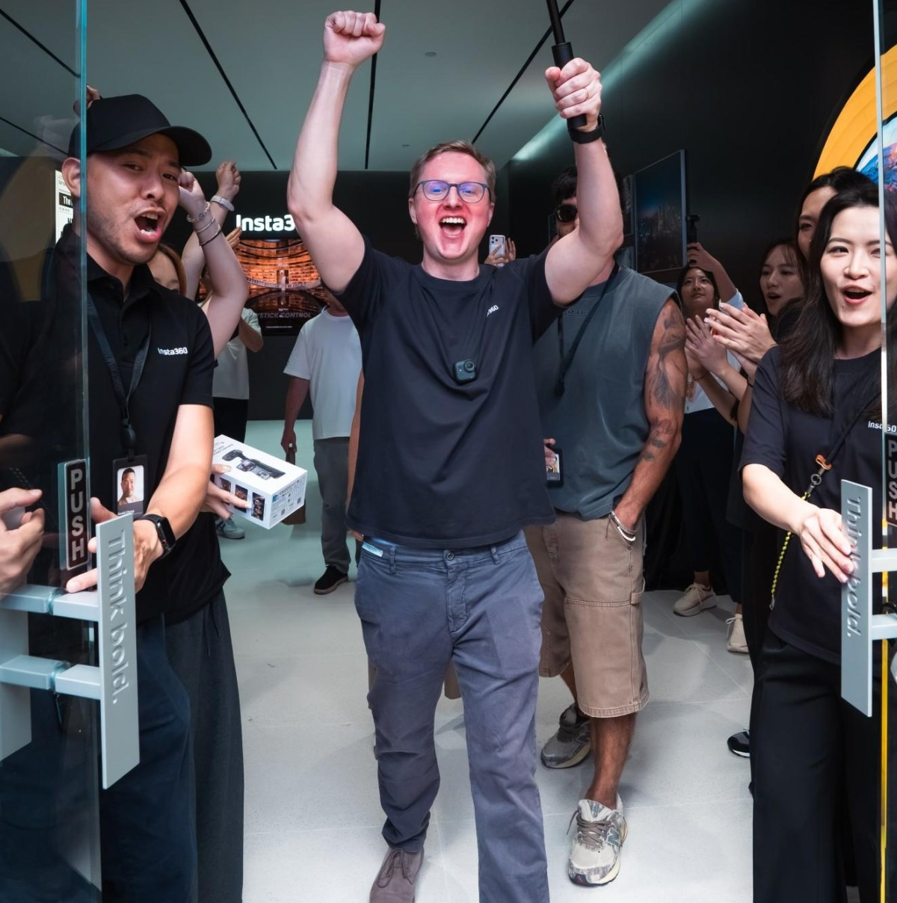

Insta360, la marca conocida por sus cámaras de 360 grados, estudia entrar en las gafas inteligentes con una idea poco habitual: sacar la batería de la montura para que el peso no recaiga sobre la nariz y las orejas. De momento no hay producto anunciado, ni fecha, ni precio, ni especificaciones; lo que existe es una confirmación de que la compañía experimenta con el formato y una patente que describe esa arquitectura de energía separada.

## Qué se sabe de estas gafas hasta ahora

El cofundador de Insta360, Max Richter, explicó en una entrevista con The Verge que la compañía desarrolla de forma experimental sus propias gafas inteligentes, además de cámaras sin espejo. Sobre las gafas, Richter matizó que, de llegar a venderlas, no competirían necesariamente en funciones inteligentes de asistente, sino en facilitar la captura de imágenes de alta calidad con las manos libres.

En paralelo, una patente de la compañía titulada «wearable glasses», recogida por medios como GSMArena a partir de un reporte de la prensa china, describe unas gafas sin batería integrada: la energía llegaría desde un paquete externo que se llevaría en otra parte del cuerpo, conectado a la montura mediante un cable. La patente, identificada como CN224328287U y concedida en junio de 2026 según GSMDome, plantea como objetivo reducir el peso sobre la cabeza y acercar el diseño al de unas gafas convencionales. Una patente, en todo caso, protege una idea y no confirma cómo será —ni siquiera si existirá— el producto final.

El contexto ayuda a entender el movimiento: The Verge sitúa a Insta360 como dominadora del mercado mundial de cámaras 360, con alrededor del 73 % de cuota según datos de IDC, y recoge que la empresa acaba de abrir su primera tienda insignia fuera de Asia en Times Square, en plena expansión más allá de la acción y los drones. La propia compañía enmarca estas exploraciones en su ambición de convertirse en una gran empresa de imagen, orientada a una nueva generación de creadores.

## Por qué importa

El equilibrio entre autonomía y comodidad es el dilema central de las gafas inteligentes actuales: meter la batería en las patillas, como hacen modelos como las [Ray-Ban Meta Gen 3](/noticias/ray-ban-meta-gen-3/), permite un diseño autónomo, pero añade peso justo donde más se nota. La propuesta de Insta360 invierte la ecuación y traslada ese peso al cuerpo, a cambio de introducir un cable y un accesorio más que gestionar.

El enfoque productual también marca distancias: en lugar de pelear en el terreno del asistente de voz sobre la cara, Insta360 apuntaría a la captura cómoda para creadores a los que grabar con el móvil les resulta engorroso. Es una apuesta coherente con su historial —cámaras de acción, estabilizadores y su nuevo modelo X6 con funciones automáticas de encuadre—, pero queda por ver si una montura ligada por cable a una batería externa resulta aceptable en el uso diario, con los roces, el sudor y el movimiento que eso implica.

## Qué cambia para el lector

De momento, nada que comprar ni que probar: no hay nombre comercial, ni configuraciones de cámara, ni capacidad de batería, ni funciones de IA confirmadas. Quien siga este posible lanzamiento debería tomarlo como lo que es, un desarrollo en fase experimental apoyado en una patente, y esperar al anuncio oficial en los canales de la compañía antes de tomar decisiones de compra.

Si el concepto llega a tienda, la pregunta práctica será sencilla: si unas gafas más ligeras compensan llevar una batería externa conectada por cable, o si el cable acaba siendo más molesto que el peso que elimina. Hasta entonces, la noticia sirve como pista de por dónde puede evolucionar el formato cuando la prioridad es la comodidad en sesiones largas de grabación.
