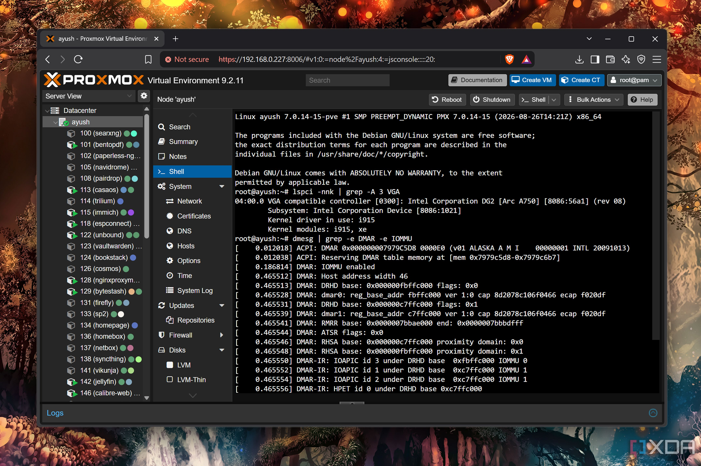
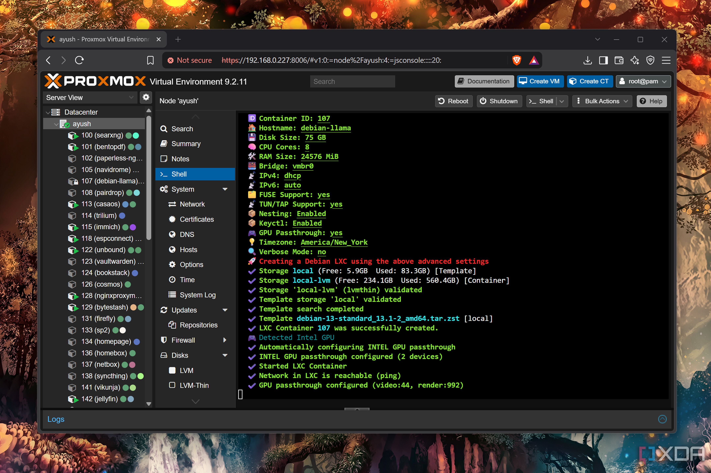
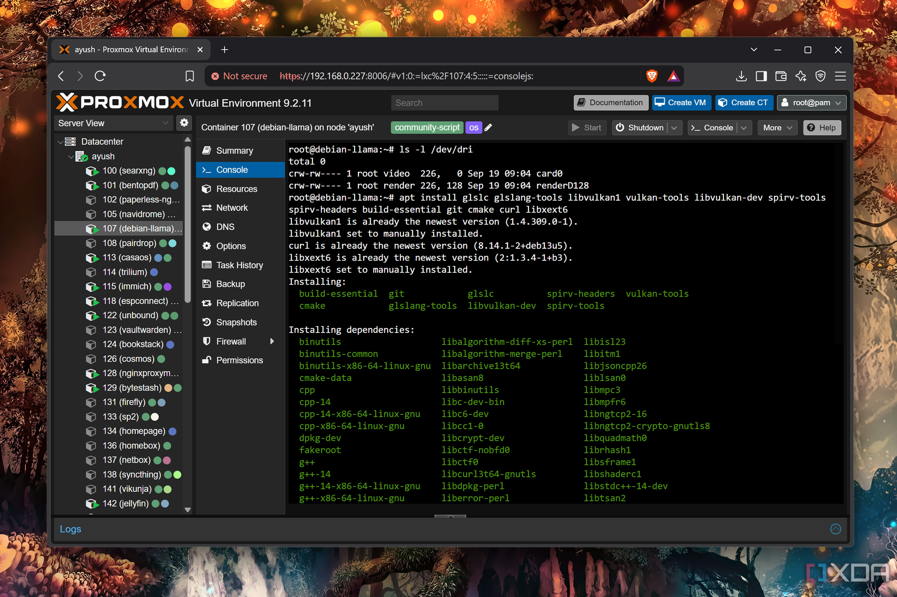
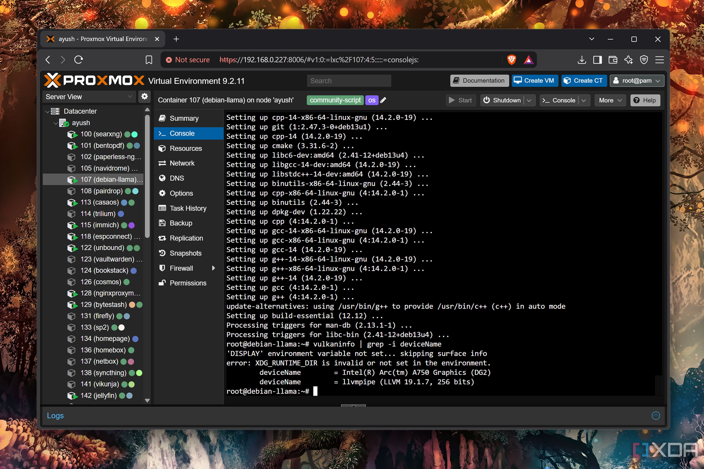
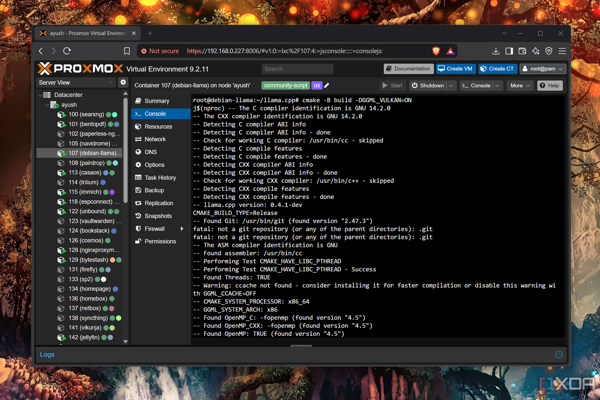
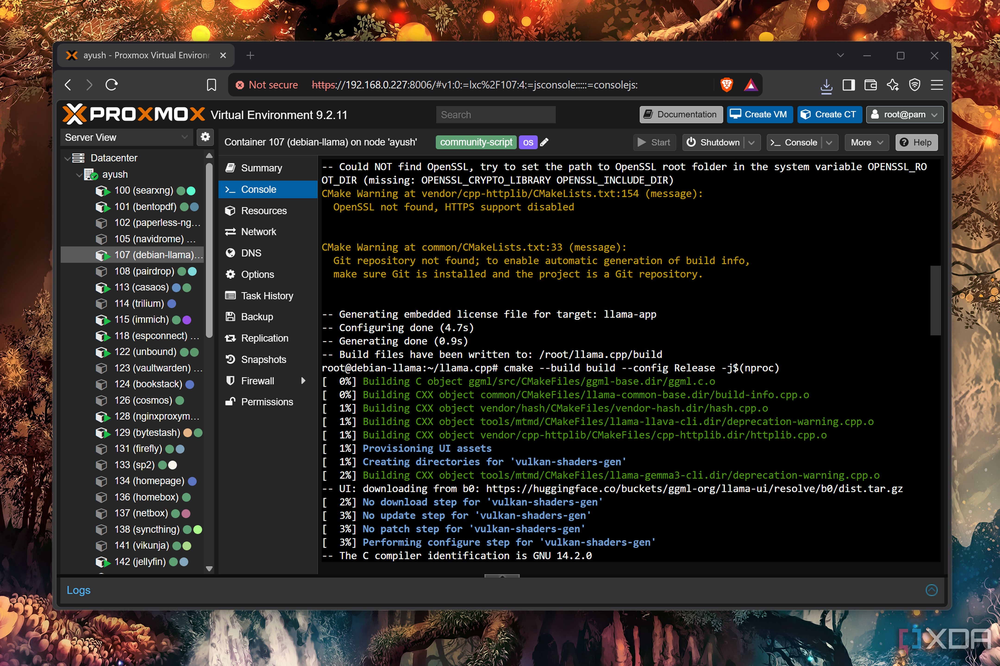
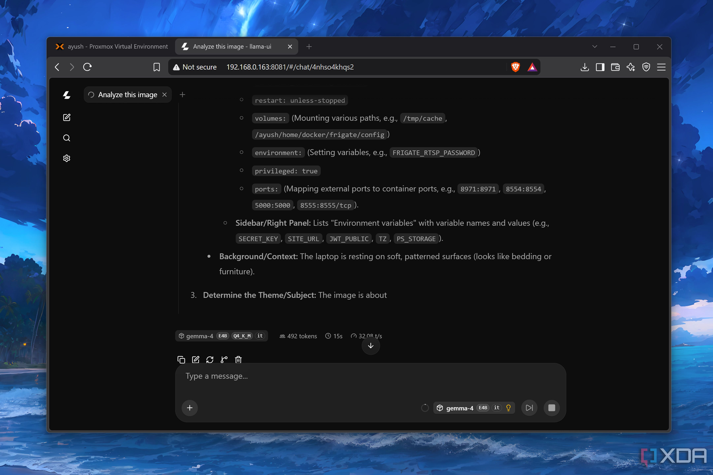
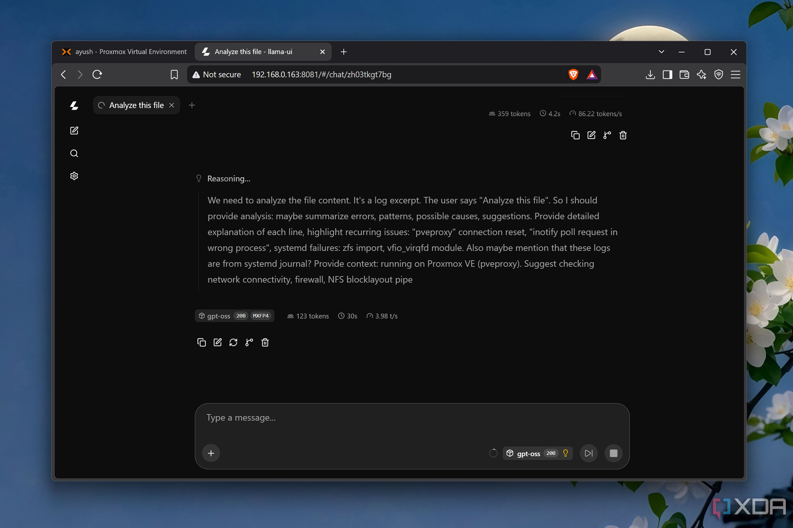
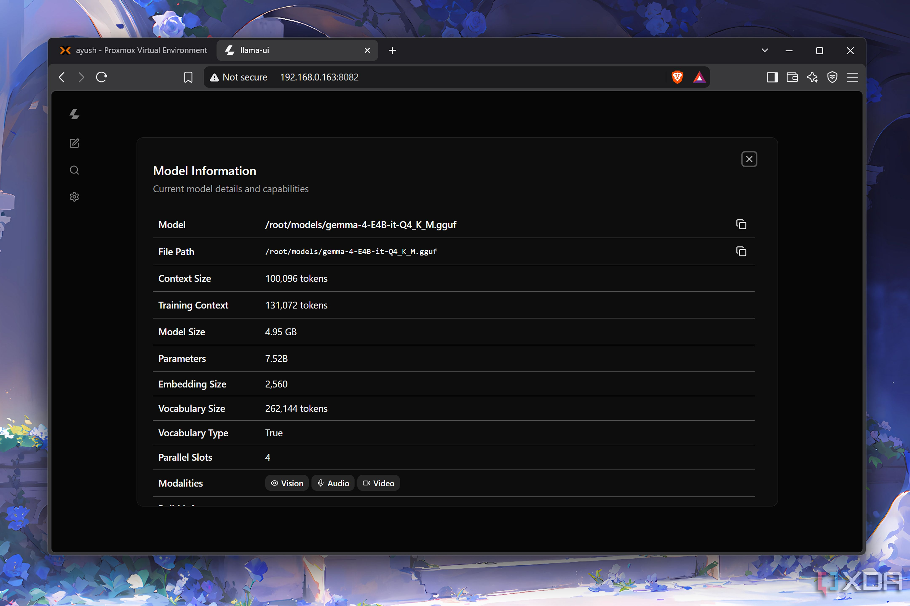

La Intel Arc A750 fue una tarjeta de primera generación que muchos usuarios compraron con descuento y que hoy apenas sirve para dar salida de vídeo en equipos viejos. El redactor de XDA Ayush Pande rescató la suya para un proyecto de fin de semana: convertirla en un servidor de LLM locales. Su conclusión, publicada en primera persona, es más optimista de lo que cabría esperar de una GPU con 8 GB de memoria: con **Gemma-4-E4B** alcanza una media de **33 tokens por segundo**, apenas 4 a 6 tokens por debajo de la GTX 1080 que usa habitualmente.

Conviene leerlo como la experiencia de un usuario concreto y no como un benchmark de laboratorio. No hay una batería de pruebas reproducibles, sino las mediciones de alguien que ya tenía la tarjeta guardada y quería comprobar si todavía servía para algo más que encender una pantalla.

## Montar llama.cpp con Vulkan sobre una Intel Arc A750

Para reducir capas intermedias, el autor descartó Ollama y optó directamente por **llama.cpp**. También evitó Windows 11 por su sobrecarga y montó el motor dentro de un contenedor LXC de Debian sobre **Proxmox**. El equipo anfitrión es un servidor casero con dos procesadores Xeon 2650 v4 y 64 GB de memoria DDR4 ECC, la única máquina libre que podía alojar una GPU dedicada.

La buena noticia para quien tenga una Arc de escritorio es el passthrough: Proxmox detectó la tarjeta sin intervención manual, algo que el autor destaca frente a su experiencia previa con una GTX 1080. Tras actualizar los controladores Vulkan del anfitrión, desplegó el contenedor con el script de la comunidad de ProxmoxVE y activó el passthrough de GPU. Dentro del contenedor instaló las dependencias de compilación y comprobó con `vulkaninfo | grep -i deviceName` que el sistema veía la Arc A750 como único dispositivo compatible.

A partir de ahí, la secuencia es la habitual en llama.cpp: clonar el repositorio, configurar la compilación con `cmake -B build -DGGML_VULKAN=ON` y compilar en modo Release. El uso de **Vulkan** en lugar de una API propietaria es lo que permite que la tarjeta funcione sin depender del ecosistema de software de otro fabricante.

## Gemma-4-E4B a 33 tokens por segundo

El modelo elegido para la prueba principal es **Gemma-4-E4B en cuantización Q4_K_M**, lanzado con `llama-server` y todas las capas descargadas en la GPU (`-ngl 999`). El autor acompañó el modelo de texto con su archivo `mmproj` para darle capacidad multimodal, de modo que el servidor también acepta imágenes y audio.

El resultado fue una velocidad media de **33 tokens por segundo**, con bajadas puntuales hasta 28 t/s. La referencia importa: el propio autor esperaba que esta Arc de primera generación se quedara por debajo de los 15 t/s. Además, el montaje digirió sin problema imágenes, clips de audio y hojas de cálculo grandes, que es justo el tipo de carga que un servidor doméstico recibe en el día a día.

## Los modelos MoE se atragantan

El panorama cambia con los modelos de mezcla de expertos (MoE), que el autor usa para repartir parte del trabajo entre la CPU y la memoria del sistema y así esquivar el límite de VRAM. Su GTX 1080, con 8 GB, mueve **Gemma-4-26B-A4B a más de 14 tokens por segundo** con esa técnica.

En la Arc A750, en cambio, el mismo modelo con 30 capas descargadas a la CPU apenas llega a **3,5 tokens por segundo**. Bajar a 20 capas hacía que llama.cpp se cerrara con un error, y dejarlo en 25 capas reduciendo la ventana de contexto a 10.000 tokens daba el mismo resultado. Probar con **GPT-OSS-20B** no cambió las cifras. El autor apunta a varios hilos de GitHub que describen un comportamiento muy pobre de las GPUs Intel con determinados indicadores de descarga de MoE en llama.cpp, por lo que sospecha que puede tratarse de un fallo del propio motor y no solo de la potencia de la tarjeta.

## Para quién tiene sentido reutilizar una Arc

Pese a ese tropiezo, el balance del experimento es positivo. La Arc A750 sigue siendo válida para alojar modelos pequeños y medianos, y el autor planea dejar que se encargue de Gemma-4-E4B mientras reserva la GTX 1080 para GPT-OSS-20B. Lo que no haría es comprar una Arc solo para esto: el interés nace de aprovechar una tarjeta que ya se tiene.

Para quien esté montando un servidor de inferencia en casa con hardware modesto, la lección es doble. Por un lado, el soporte Vulkan de llama.cpp abre la puerta a GPUs que no son NVIDIA sin renunciar a un rendimiento digno en modelos compactos, en la línea de otros montajes con hardware limitado como [el portátil con 12 GB de RAM que repartió un modelo entre varios dispositivos](/noticias/qwen-27b-12gb-ram-laptop/). Por otro, conviene ajustar las expectativas con los modelos MoE: si el plan depende de ellos, una tarjeta de gama baja puede convertirse en un cuello de botella.

*Capturas: Ayush Pande / XDA Developers.*
