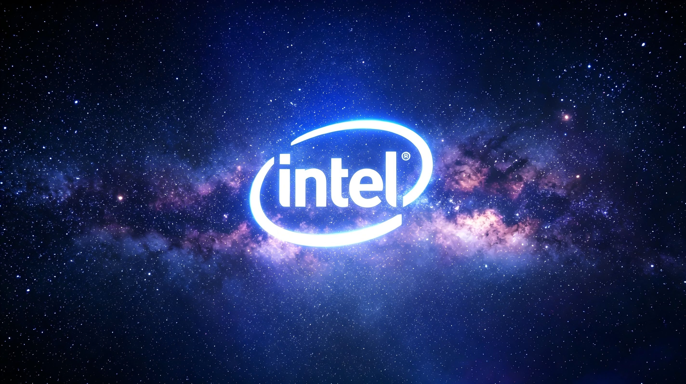

Intel atraviesa una paradoja poco habitual en el sector de los semiconductores. Su consejero delegado, Lip-Bu Tan, reconoció durante su intervención en el Splunk .conf26 celebrado en Denver que la compañía solo puede atender alrededor de la mitad de la demanda de CPU de sus clientes. Según el relato recogido por MyDrivers, varios consejeros delegados de grandes empresas llamaron directamente a Tan para reclamar más suministro de chips, y este tuvo que disculparse por no poder responder a esas peticiones.

## La demanda de CPU se dispara por la IA de inferencia

El problema no está en las fábricas de Intel, sino en una demanda que ha superado todas las previsiones. La compañía cerró el segundo trimestre de 2026 con unos ingresos de 16.100 millones de dólares, un 25 % más que en el mismo periodo del año anterior. Es su ritmo de crecimiento interanual más fuerte en casi quince años y supera en unos 2.000 millones de dólares las estimaciones de los analistas.

Tan atribuye ese salto al auge de la inferencia de inteligencia artificial. A diferencia del entrenamiento de modelos, que se apoya sobre todo en GPU, los agentes de IA necesitan grandes cantidades de CPU para coordinar procesos, invocar herramientas y gestionar datos. La consultora TrendForce calcula que, en la era de los agentes, cada gigavatio de centro de datos pasará de requerir unos 30 millones de núcleos de CPU a 120 millones, el triple.

El segmento de centros de datos e inteligencia artificial fue el gran beneficiado: facturó 6.300 millones de dólares en el trimestre, un 59 % más interanual, más del doble que el conjunto de la empresa. A eso se suma que el precio medio de venta de los procesadores para servidores de Intel subió alrededor de un 22 % respecto al trimestre anterior, una combinación de más volumen y más precio por unidad.

## Cuatro cuellos de botella hasta 2027

La oferta, en cambio, no puede acompañar ese ritmo. Tan ya advirtió en la presentación de resultados que el mundo afronta una de las restricciones de cadena de suministro más graves de su historia, con cuatro eslabones en escasez prolongada: los chips lógicos avanzados, las obleas, la memoria y los sustratos. La [presión sobre la memoria](/noticias/ai-cost-memory-2027/) se suma así a los cuellos de botella de fabricación, en un contexto en el que la IA concentra cada vez más recursos. Ninguno de esos frentes, según el directivo, se descomprimirá a corto plazo.

La previsión de la compañía es que la escasez se mantenga, al menos, hasta 2027. En ese escenario, el foco del mercado debería desplazarse de la demanda hacia la capacidad real de entrega.

## Qué cambia para el lector

Para quien compra hardware, la señal es clara: cuando la oferta va por detrás de la demanda, los precios tienden a sostenerse y los plazos de entrega se alargan. Intel ya lo está reflejando en el precio medio de sus procesadores de servidor, y ese encarecimiento puede terminar trasladándose a la gama de consumo y a los equipos que dependen de sus chips.

La cita más importante para comprobarlo llegará en octubre, con las próximas cuentas de la compañía. El dato que conviene vigilar entonces no es la cifra de pedidos, sino el volumen real de envíos: solo lo que sale de fábrica convierte la demanda no satisfecha en ingresos.
