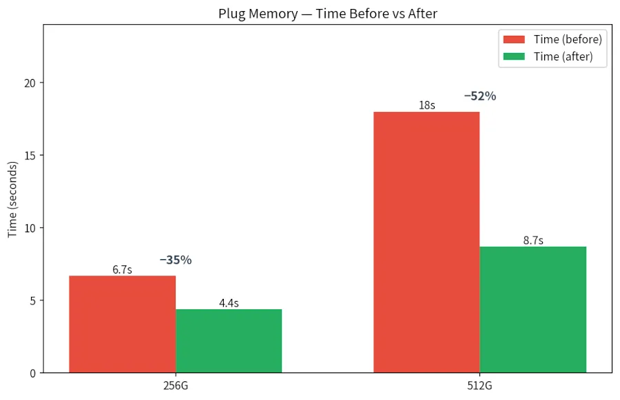

El intercambio de memoria en caliente en Linux está a punto de volverse mucho más rápido. Una optimización liderada por el ingeniero de Intel Yuan Liu reduce hasta un 81 % el tiempo necesario para añadir memoria a un sistema en marcha, según informó MyDrivers: en las pruebas con 512 GB, la operación pasa de 36 a 7 segundos.

## Qué cambia en el intercambio de memoria en caliente

El parche actúa sobre la lógica de comprobación de continuidad de zona durante el intercambio de memoria en caliente. Hasta ahora, esa comprobación recorría bloque por bloque toda la zona de memoria, un proceso costoso cuando el volumen crece hasta cientos de gigas. La nueva versión evita ese barrido completo y recorta de raíz el trabajo necesario.

El cambio ya se ha integrado en la rama `for-next` del repositorio `mm/core.git` del núcleo, el paso previo a su envío en la ventana de integración de Linux 7.4 prevista para octubre.

## Resultados medidos: de 36 a 7 segundos

Los datos proceden de un escenario de máquina virtual. La conexión de memoria en caliente mejora hasta un 81 % y la desconexión hasta un 75 %: con 512 GB, la conexión baja de 36 a 7 segundos y la desconexión de 36 a 9 segundos. El gráfico publicado muestra además la ganancia con 256 GB, de 10 a 3 segundos al conectar y de 11 a 4 segundos al desconectar.

Las pruebas de Samsung confirman el efecto en un escenario CXL: al conectar memoria por interfaz CXL, la configuración de 256 GB reduce su tiempo un 35 %, de 6,7 a 4,4 segundos, y la de 512 GB un 52 %, de 18 a 8,7 segundos.

## Por qué importa para los centros de datos

El intercambio de memoria en caliente se usa para ampliar la memoria de una máquina virtual sin detenerla y para incorporar memoria del ecosistema CXL como memoria del sistema. Con la expansión de la nube nativa y de CXL, cada segundo ahorrado en estas operaciones agiliza la asignación de recursos en el centro de datos.

El movimiento encaja además en la estrategia de Intel en el subsistema de gestión de memoria de Linux y prepara el terreno para reservas de memoria de mayor tamaño. Conviene recordar que, como ya contamos, [Intel considera que CXL quedará como almacenamiento secundario y no sustituirá a la HBM](/noticias/intel-cxl-vs-hbm/): esta optimización hace precisamente más ágil ese segundo nivel.

