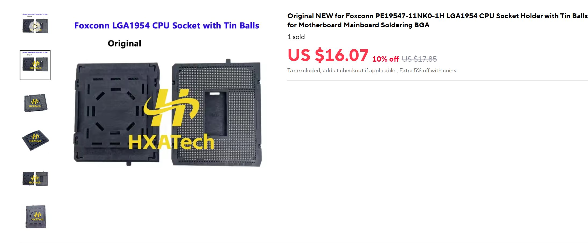
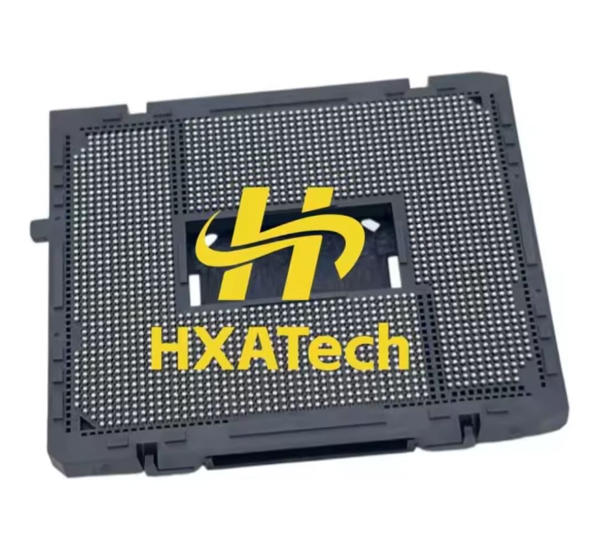
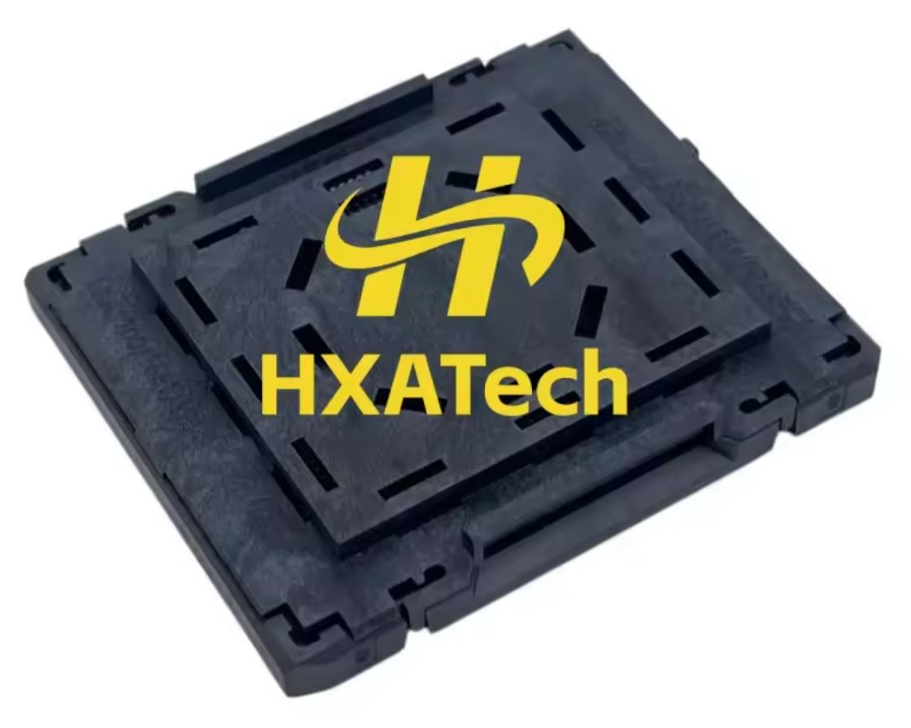

El zócalo de la próxima plataforma de sobremesa de Intel ha vuelto a dejarse ver, y esta vez no como una filtración de especificaciones, sino como una pieza a la venta. En AliExpress ha aparecido un componente del LGA1954 por 16,07 dólares, una señal de que la cadena de suministro empieza a moverse de cara al lanzamiento del Nova Lake-S.

## Qué pieza ha aparecido y dónde

El producto lo ha detectado el filtrador @momomo_us en X y lo ha recogido Wccftech. Se describe como un «soporte de zócalo LGA 1954 con bolas de estaño» (LGA 1954 CPU Socket Holder with Tin Balls) y lleva la marca Foxconn, con el logotipo de HXA Tech visible en las imágenes del anuncio.

No se trata de un zócalo de venta al público listo para montar. Es un componente preparado para soldadura que va destinado a la fabricación de placas base: el fabricante lo fija sobre la placa y a partir de ahí establece la conexión física y eléctrica con el procesador. Por eso su interés es industrial, no doméstico.

## Qué revela el zócalo LGA1954 sobre Nova Lake-S

El número que acompaña al nombre no es decorativo. LGA1954 designa 1954 contactos, 103 más que los 1851 del zócalo LGA1851 de Arrow Lake-S, un incremento de alrededor del 5,6 %, según los datos recogidos por IT之家 (ITHome). Ese detalle confirma que el relevo de la plataforma actual exige una placa base nueva.

La vinculación con Nova Lake-S no es una suposición. La tienda de herramientas Design-In de Intel ya había listado un «ILM Kit for the LGA1954 NVL-S Interposer for the Gen5 VR Test Tool», el primer documento en el que aparecen juntos el nombre NVL-S (Nova Lake-S) y el zócalo LGA1954. Wccftech apunta además a varios chipsets para la plataforma —Z970, B960, Q970 y W980— repartidos entre el segmento de consumo y el de estaciones de trabajo, y a un mecanismo de carga de doble palanca (ILM) en algunas placas de gama alta para mejorar el contacto con el procesador y la refrigeración.

En cuanto a los plazos, la información sitúa la producción en masa del Nova Lake en el cuarto trimestre de 2026, con llegada al mercado a principios de 2027. El zócalo, según las mismas fuentes, debería mantenerse durante varias generaciones, incluida la familia Razor Lake.

## Qué cambia para quien arma un PC

Para el usuario final, la aparición de este componente no es un producto que comprar, sino un indicador de calendario. Ver piezas de un zócalo a la venta antes de su lanzamiento suele preceder en unos meses al arranque de la producción, y este tipo de componentes suelen filtrarse cuando los fabricantes de placas empiezan a preparar sus diseños.

Para quien se plantee montar un equipo en 2027, la conclusión práctica es que la actual plataforma LGA1851 y sus placas no serán compatibles con el Nova Lake-S: habrá que pasar por caja con una placa nueva y el zócalo LGA1954. Ese escenario convive con la estrategia de Intel de estirar otras plataformas, ya que la compañía también prepararía un [Raptor Lake Next que alargaría la vida del LGA1700 con memoria DDR4](/noticias/intel-raptor-lake-next-8p/).

Conviene mantener la cautela. Todo esto procede de filtraciones y de la observación de un listado de venta, no de un anuncio oficial de Intel, así que tanto las fechas como la lista de chipsets deben tomarse como rumores hasta que la compañía mueva ficha.
