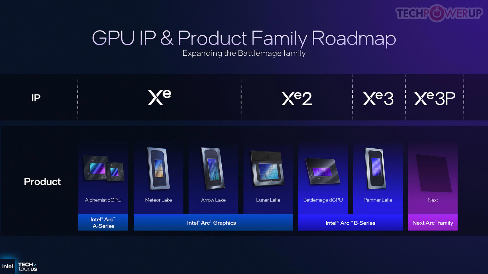

Intel ha añadido a su Compute Runtime el soporte para PISA (Portable Instruction Set Architecture), una nueva arquitectura de conjunto de instrucciones virtual y un modelo de programación pensados para sus GPU. El movimiento persigue algo que en el mundo de las CPU se da por sentado y que en el de las gráficas no: que el software se escriba una vez y no haya que recompilarlo desde cero para cada generación de hardware.

## Qué es una ISA virtual y por qué las GPU la necesitan

En una CPU, el software suele apuntar a ISA consolidadas como x86 o Arm, estables durante años. Las GPU funcionan de otro modo: cada arquitectura tiene su propio conjunto de instrucciones nativo y sus peculiaridades de hardware. Cuando una generación nueva incorpora capacidades, funciones de ejecución o instrucciones, los compiladores que apuntan a la ISA de máquina deben tener en cuenta las diferencias entre arquitecturas.

PISA introduce una capa de abstracción entre la salida del compilador y el código máquina nativo de la GPU. En la práctica, ofrece un objetivo de compilación común: el código generalizado se escribe una vez y después se finaliza para varias arquitecturas de GPU Intel compatibles.

## PISA 0.1: qué incluye y qué no garantiza

La versión actual es PISA 0.1 y llega acompañada de documentación sobre su modelo de ejecución y de memoria, basado en OpenCL 3.0, y sobre cómo la ISA define tipos de datos como enteros y números en coma flotante, además de direcciones, acceso a registros y otras partes habituales de la documentación de una ISA.

Intel sitúa entre los objetivos de PISA el rendimiento cercano al metal, el soporte para bibliotecas escritas a mano y el ensamblador en línea. Es decir, la propuesta no renuncia al control de bajo nivel: quiere mantenerlo, pero sobre una base portable.

Conviene matizar una promesa fácil de malinterpretar. Un programa compilado a PISA no se ejecutará automáticamente en cualquier GPU Intel: la compatibilidad depende de la arquitectura objetivo y de las funciones e instrucciones que use el programa. Lo que sí habilita es que una misma carga de trabajo, compilada a PISA, se ejecute en varias arquitecturas Intel compatibles sin generar código específico para cada generación, y que se finalice a instrucciones nativas para la GPU de destino, aprovechando las capacidades del hardware más nuevo cuando estén soportadas, sin tocar el código PISA original.

## El espejo de NVIDIA y la disputa por el software

PISA no es la primera ISA virtual de Intel para GPU: su vISA ya lleva tiempo funcionando como representación intermedia de su pila de compiladores. Lo nuevo es una ISA portable y un modelo de programación más recientes.

El referente de la industria es PTX (Parallel Thread Execution) de NVIDIA, la ISA virtual que actúa como representación intermedia entre el código CUDA de alto nivel y el código máquina nativo de la GPU. PTX ofrece un objetivo de compilación independiente del hardware sin dejar de exponer conceptos de GPU de bajo nivel a los desarrolladores. Si la implementación de Intel sigue un modelo similar, PISA permitirá programar cerca del metal pero desde una capa de abstracción superior.

## Qué cambia para el lector

A corto plazo, nada de esto se traduce en una GPU nueva ni en precios distintos. Lo relevante es la señal que envía: Intel sigue invirtiendo en el software de sus gráficas, un terreno donde compite con NVIDIA y su [ecosistema CUDA](/noticias/cuda-13-4-windows-on-arm/) tanto como en silicio. Una ISA portable reduce el trabajo de portar código entre generaciones, lo que puede abaratar el soporte de aplicaciones de cómputo en las Arc y facilitar que los desarrolladores apunten a Intel sin reescribir su código para cada arquitectura.

Para quien usa una [Intel Arc como acelerador de cómputo](/noticias/intel-arc-local-llm-server/), la noticia importa a medio plazo: si PISA madura, el mismo esfuerzo de optimización podría servir en más de una generación de hardware. Y confirma que Intel mantiene su apuesta por las GPU, después de haber dedicado recursos significativos a crear esta arquitectura.
