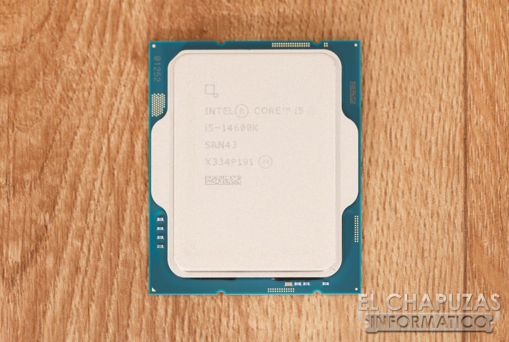

El filtrador Jaykihn ha asegurado en X que Intel prepara un nuevo procesador de sobremesa bajo el nombre Raptor Lake Next con ocho núcleos de rendimiento (P-cores) y ocho de eficiencia (E-cores), una configuración de 16 núcleos llamada a relevar al popular Core i5-14600K. La información ha sido recogida por VideoCardz y TechPowerUp, y sitúa el TDP de la pieza en 125 W. Por ahora Intel no ha confirmado nada de forma oficial.

## Qué se ha filtrado

La filtración describe un chip de 8 P-cores y 8 E-cores. Comparado con el i5-14600K actual, que combina 6 P-cores y 8 E-cores, el sucesor ganaría dos núcleos de alto rendimiento manteniendo el mismo número de núcleos de eficiencia. El TDP que maneja la filtración es de 125 W, el mismo rango que el modelo al que reemplaza.

El salto en P-cores acerca la propuesta al terreno del Core i7-14700K, que también ofrece ocho núcleos de rendimiento. Conviene matizar, eso sí, que igualar el recuento de P-cores no implica igualar el resto de la ficha: la filtración no concreta caché ni frecuencias, dos apartados donde el i7-14700K parte con ventaja. Tampoco detalla el número total de núcleos ni los relojes de la supuesta pieza.

## Una plataforma que se estira hasta 2027

Raptor Lake Next no es una arquitectura nueva. Se trata de una revisión del diseño original de Raptor Lake, no del Raptor Lake Refresh, pensada para alargar la vida del zócalo LGA1700 con silicio nuevo. Según lo publicado, estos procesadores llegarían acompañados de nuevas placas base LGA1700 de los socios de Intel a principios de 2027, sin que se sepa todavía si las placas actuales podrán darles soporte.

La jugada encaja con la estrategia de Intel de cubrir huecos en la gama de 14ª generación en lugar de retirarla de golpe. La filtración también menciona más modelos de escritorio de 125 W y 65 W, además de variantes para portátiles, y señala el soporte de memoria DDR4 como uno de los argumentos de venta, en un contexto de precios de la DDR5 al alza.

## Qué cambia para quien arma un PC

Si la filtración se confirma, la noticia es relevante para quien ya tiene una plataforma LGA1700 y memoria DDR4: un chip de gama media con dos P-cores extra podría ser una actualización más económica que un cambio completo a una plataforma que exija DDR5. El éxito del i7-14700K en las listas de ventas, precisamente por su compatibilidad con DDR4, ya dejó claro que ese factor pesa en la decisión de compra.

Ahora bien, hay que tomarlo con cautela. Se trata de una filtración de una sola fuente sobre unos procesadores que no han sido anunciados, así que tanto la configuración exacta como las fechas deben tratarse como rumor hasta que Intel o sus socios muevan ficha. Quien necesite montar o renovar un PC hoy no debería esperar a una pieza que, en el mejor de los casos, llegaría en 2027.
