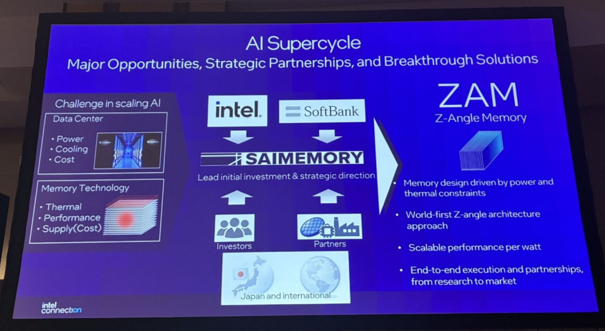
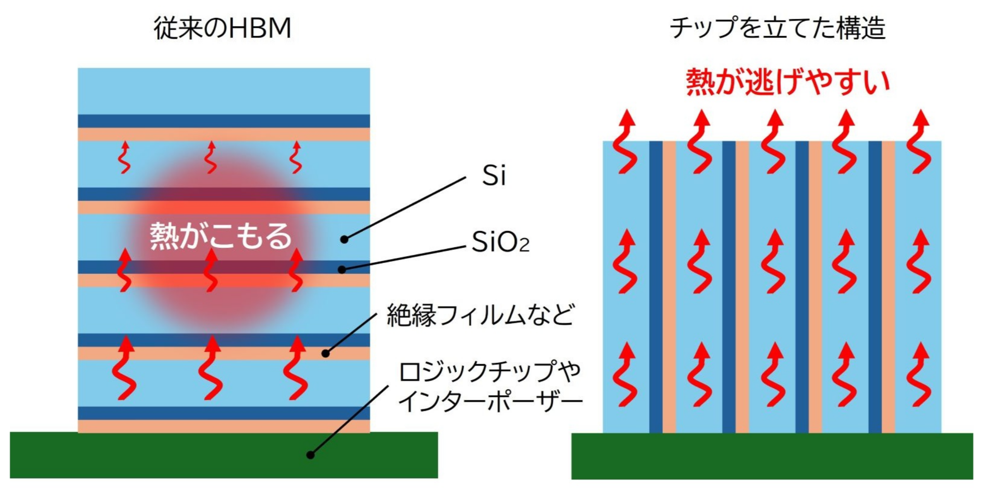
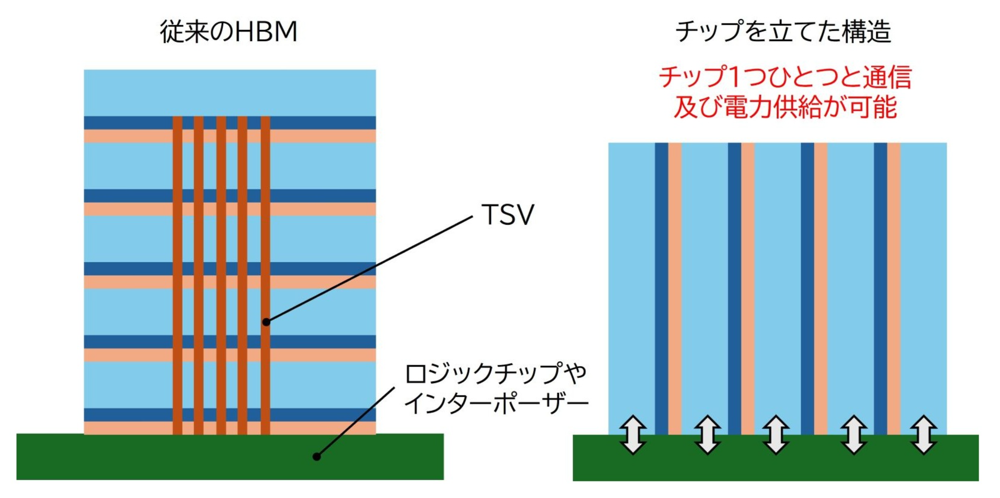

Intel quiere volver al mercado de la memoria más de cuarenta años después, y lo hará con una tecnología propia: la memoria ZAM. Según informa MyDrivers, la compañía la desarrolla junto a SAIMEMORY, filial de SoftBank, con financiación del Gobierno japonés y un plan de investigación de tres años y medio. La memoria ZAM avanza además más rápido que la XBM, el otro proyecto de memoria que Intel tiene entre manos.

## Qué es la memoria ZAM y en qué se diferencia de la HBM

ZAM son las siglas de Z-Angle Memory (memoria de ángulo Z). Su particularidad está en la interconexión: varios chips DRAM se apilan de forma compacta y se comunican mediante una interconexión dedicada en forma de Z, en lugar del apilado plano que utiliza la memoria HBM actual.

Ese apilado vertical es la clave del diseño. Al colocar los chips en vertical, el calor se disipa con mayor rapidez, lo que reduce tanto el consumo como la acumulación térmica, dos de los problemas más difíciles de resolver en la HBM del futuro. La compañía asegura además que el diseño en Z simplifica el proceso de fabricación, lo que debería facilitar la producción a gran escala.

## Capacidad de 512 GB y hasta un 50 % menos de consumo

Las cifras anunciadas son ambiciosas: un solo chip ZAM alcanzaría una capacidad máxima de 512 GB, con un consumo entre un 40 % y un 50 % inferior al de la memoria HBM. De confirmarse en producción, sería una alternativa directa a la HBM en aceleradores de inteligencia artificial y centros de datos, donde la capacidad por chip y la eficiencia energética marcan la diferencia.

Conviene, eso sí, leer estos datos con prudencia: son objetivos del proyecto en fase de desarrollo, no mediciones de un producto terminado. Faltan por conocer detalles esenciales como el ancho de banda, la velocidad por pin o la compatibilidad con los controladores actuales.

## Calendario: pruebas en 2027 y comercialización hacia 2029

Según recogen medios japoneses citados por MyDrivers, la memoria ZAM entraría en producción de prueba en 2027, con la comercialización orientada a 2029. Es un horizonte largo, pero coherente con un proyecto que aún está en fase de investigación y que cuenta con un plan de tres años y medio respaldado por fondos públicos japoneses.

## Por qué importa este movimiento

Si Intel logra llevar la ZAM al mercado en esos plazos, el mapa de la memoria de alto ancho de banda dejaría de ser un terreno dominado por tres fabricantes coreanos. El contexto acompaña: [la pugna por el suministro de memoria a partir de 2027 ya enfrenta a laboratorios de IA y fabricantes de chips](/noticias/anthropic-openai-memory-supply-ram/), así que toda alternativa nueva cuenta. Para el lector europeo, la consecuencia práctica sería más competencia en el eslabón que hoy más encarece las GPU y los aceleradores de IA: más oferta de memoria apilada podría traducirse, a medio plazo, en precios menos tensionados y en equipos con mayor memoria disponible. Queda, no obstante, un largo camino de validación industrial antes de que la ZAM llegue a un producto que se pueda comprar.
