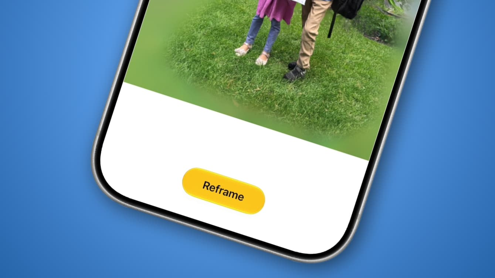
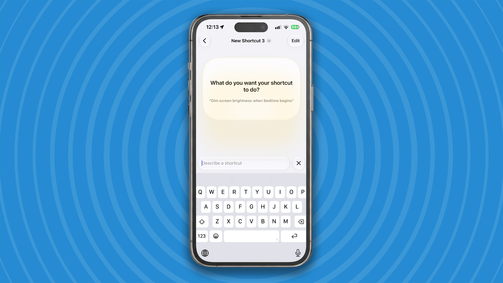
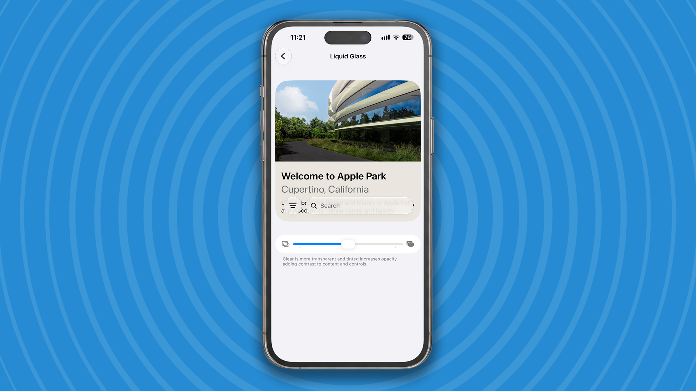
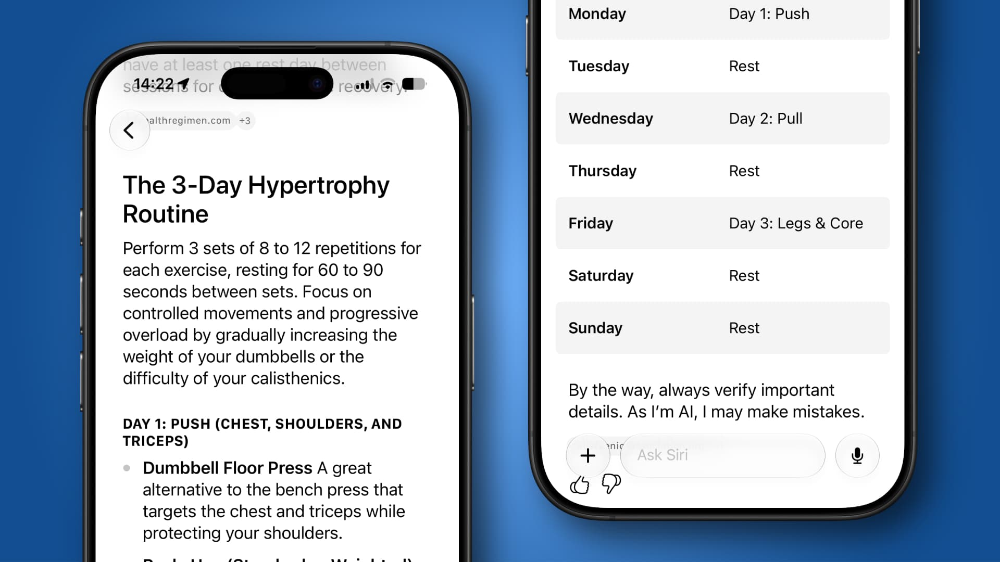

Apple comienza hoy el despliegue de iOS 27 en millones de iPhone de todo el mundo. La nueva versión llega después de meses de pruebas en su canal de desarrolladores, y trae consigo un buen puñado de novedades centradas en la inteligencia artificial, la personalización y la comodidad de uso.

La buena noticia es que cualquier iPhone compatible con iOS 26 puede actualizarse a iOS 27. Eso sí, algunas de las funciones más avanzadas de Siri AI, como la capacidad de ajustar su ritmo y su expresividad, quedan reservadas a los modelos más recientes, con chipsets más potentes. Para actualizar basta con ir a **Ajustes > General > Actualización de software**.

## Una edición de fotos más inteligente

iOS 27 incorpora herramientas de edición de imágenes impulsadas por IA, entre ellas una llamada **Reframe**. Permite modificar ligeramente el ángulo de una fotografía que ya has tomado, y la IA reajusta el fondo para que el resultado se mantenga coherente.

En la app Fotos, al abrir una imagen y tocar el icono de los tres controles deslizantes se accede a **Herramientas** y, desde ahí, a **Reframe**. Basta con arrastrar sobre la pantalla para cambiar la perspectiva, usando dos dedos para hacer paneo y zoom. El menú de herramientas ofrece además **Extender**, que genera con IA un lienzo más amplio, y **Limpiar**, para eliminar objetos o personas concretas de las imágenes.

## Atajos con lenguaje natural y control del volumen

La app **Atajos** es una de las más potentes de iOS, pero no siempre resulta sencilla de manejar. Con iOS 27, crear una automatización se simplifica: ahora basta con describir lo que quieres conseguir usando lenguaje natural.

Al tocar el botón **+** en la pantalla principal de atajos se puede explicar qué debe hacer la rutina, ya sea adjuntar capturas a un correo o resumir la lista de tareas del día. Otra mejora discreta pero muy útil es la posibilidad de fijar el **volumen de la alarma por separado** del tono de llamada y del volumen del sistema: en **Sonidos y vibración** se desactiva el interruptor que iguala ambos niveles y se elige un valor propio para las alarmas.

## Un efecto Liquid Glass a tu medida

El efecto visual **Liquid Glass**, que algunos usuarios encontraban algo recargado en su estado por defecto, ahora se puede suavizar. Desde **Ajustes > Apariencia > Liquid Glass**, un control deslizante permite pasar de una transparencia elevada a una casi nula, con una vista previa en tiempo real.

Apple también ha pulido este efecto en iOS 27. Según la compañía, Liquid Glass ofrece ahora una refracción más uniforme y un contraste mejorado, mientras que los iconos de las aplicaciones se muestran más nítidos y detallados.

## Siri AI, el gran salto

La mayor novedad de iOS 27 es la renovación integral de Siri, que estrena nombre y unos modelos subyacentes mucho más capaces. El asistente queda ahora a la altura de soluciones como ChatGPT en cuanto a la calidad y amplitud de sus respuestas.

Al activarse por primera vez, Siri AI dedica un tiempo a indexar el contenido del teléfono para ofrecer más contexto sobre mensajes, calendarios y correos, sin que esos datos se envíen a Apple. También puede ejecutar más acciones dentro de las aplicaciones, como crear notas, rotar fotos o reanudar pódcast, y responde a peticiones con contexto personal del tipo «muéstrame las fotos de cuando fui a España». Además, por primera vez existe una app de Siri independiente, que permite guardar conversaciones y sincronizarlas entre dispositivos.
