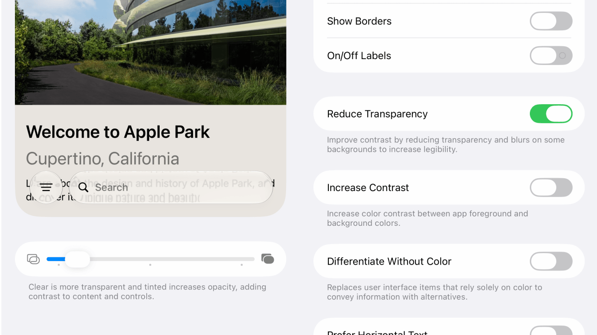
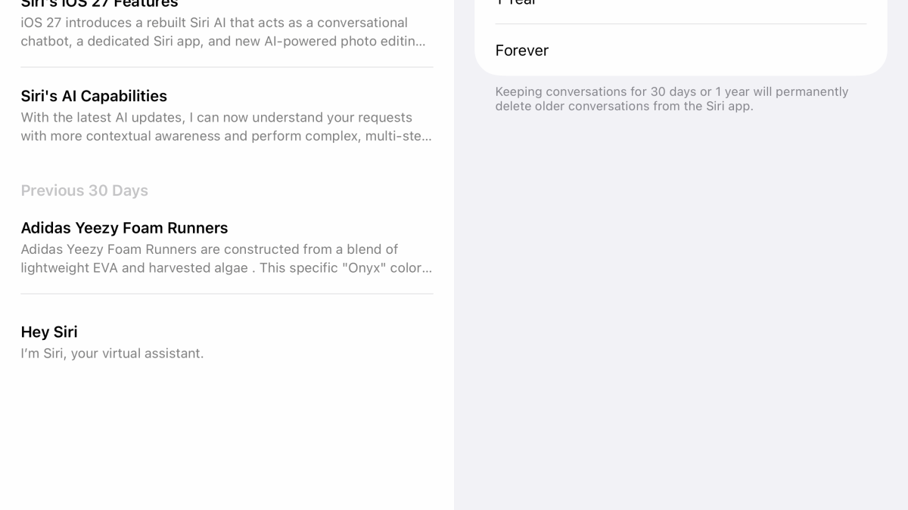
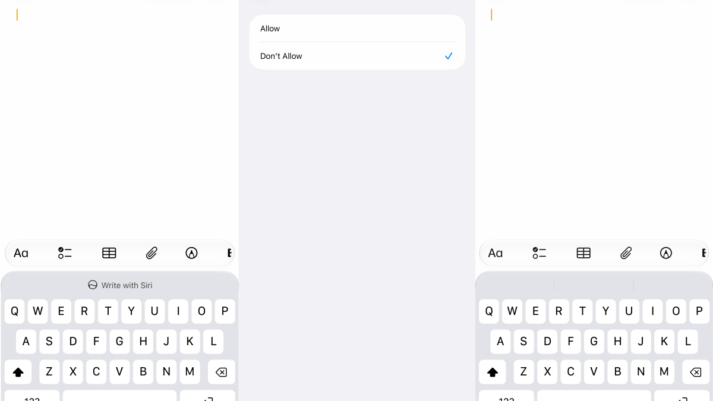
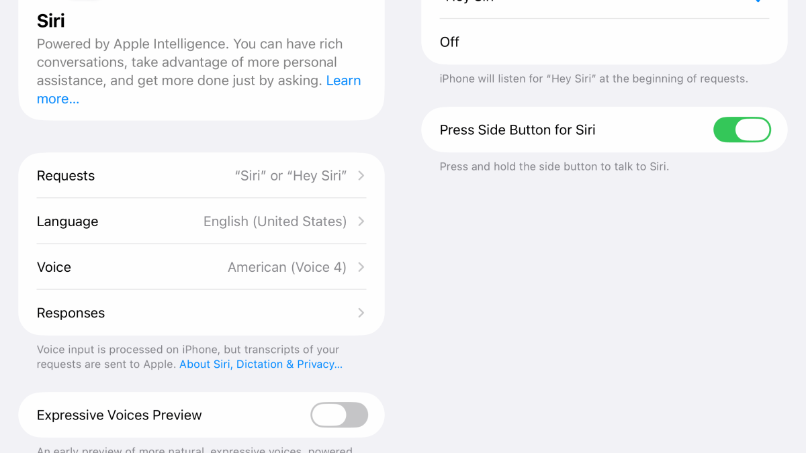
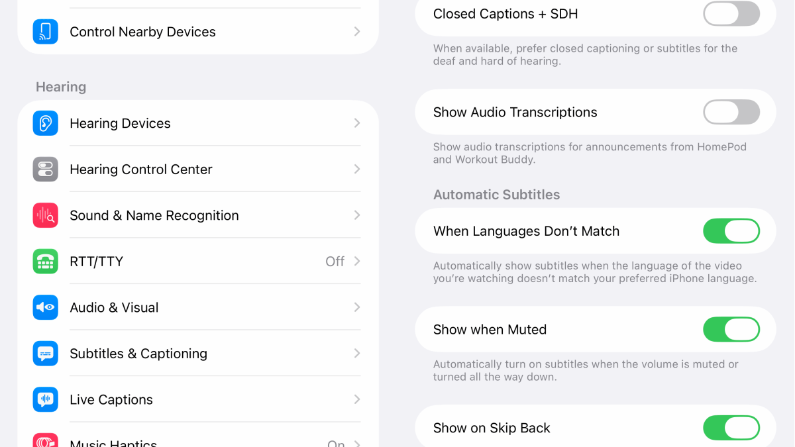

iOS 27 ya está disponible y trae mejoras de rendimiento, herramientas de edición de fotos con IA y una versión mucho más capaz de Siri. La contrapartida es que algunas novedades se activan por defecto y pueden resultar molestas: Siri aparece en más sitios, su aplicación guarda las conversaciones de forma indefinida y los subtítulos se muestran solos en los vídeos.

Esta guía reúne los ajustes de iOS 27 que conviene revisar para dejar el sistema a nuestro gusto, con la ruta exacta de cada menú. Está pensada para quien ya actualizó el iPhone y quiere rebajar esos comportamientos sin renunciar a la versión nueva.

## Requisitos previos

- Tener el iPhone actualizado a **iOS 27**.
- Los ajustes relacionados con Siri AI solo aparecen si el dispositivo es compatible: Apple exige un **iPhone 15 Pro, 15 Pro Max, iPhone Air o un iPhone 16 o posterior**. En equipos anteriores, esas opciones pueden no existir.
- Algunos ajustes requieren haber aceptado antes las condiciones de Siri AI en pantalla.

> **Nota sobre los nombres de los ajustes:** las rutas se indican en español tal como aparecen en un iPhone configurado en ese idioma, con la denominación original en inglés entre paréntesis. El nombre exacto puede variar ligeramente según la versión del sistema y el idioma elegido.

## Cómo hacer que Liquid Glass sea más fácil de leer en iOS 27

Liquid Glass, el efecto translúcido que Apple introdujo con iOS 26, se aplica a menús, botones y notificaciones. En iOS 27 hay más control sobre cuánta transparencia conserva la interfaz.

1. Abre **Ajustes > Apariencia > Liquid Glass**.
2. Desplaza el control deslizante hacia la derecha para añadir más tinte y opacidad: así los botones y el texto se distinguen mejor de lo que queda detrás. Hacia la izquierda, la interfaz vuelve a ser más transparente.

Si el nivel más opaco sigue siendo insuficiente, hay un segundo recurso:

1. Abre **Ajustes > Accesibilidad > Pantalla y tamaño de texto** (Display & Text Size).
2. Activa **Reducir transparencia** (Reduce Transparency). Esto vuelve más sólidos los fondos translúcidos en todo iOS, aunque **anula los controles normales de Liquid Glass**.

## Cómo evitar que Siri guarde tus conversaciones para siempre

La nueva aplicación de Siri permite revisar conversaciones anteriores y las sincroniza mediante iCloud, de modo que se puede empezar una conversación en el iPhone y continuarla en un Mac. Por defecto, iOS 27 las conserva indefinidamente, pero es posible aplicarles una caducidad.

1. Abre **Ajustes > Siri > Conservar conversaciones** (Keep Conversations).
2. Elige **30 días** o **1 año**. Con cualquiera de las dos opciones, las conversaciones que superen ese plazo se eliminan de forma permanente.

Mientras sigues en ese menú, puedes evitar que la aplicación se abra siempre mostrando los chats recientes:

1. Toca **Se abre en** (Opens To).
2. Selecciona **Una conversación nueva** (A New Conversation) para que la app arranque con un chat en blanco.

Si lo que quieres es apagar por completo el asistente o volver al Siri de siempre, la guía [Cómo activar Siri AI o volver a Siri Classic en iOS 27](/noticias/siri-ai-ios-27/) repasa ese proceso de principio a fin.

## Cómo desactivar Escribir con Siri si no lo usas

iOS 27 coloca un botón **Escribir con Siri** (Write with Siri) encima del teclado en aplicaciones como Mensajes, Correo y Notas. Sirve para pedir al asistente que redacte un texto desde cero, lo corrija o lo reescriba con otro tono. Si no se usa, se puede restringir desde Tiempo de uso.

1. Abre **Ajustes > Tiempo de uso > Restricciones de contenido y privacidad** (Content & Privacy Restrictions).
2. Activa el interruptor de **Restricciones de contenido y privacidad** si no lo está.
3. Entra en **Siri > Asistencia de escritura** (Writing Assistance) y marca **No permitir** (Don't Allow).

Este cambio desactiva el acceso a las herramientas de escritura en todo el iPhone, no solo oculta el botón del teclado. Por eso conviene aplicarlo únicamente si no se utilizan. Para recuperarlas, basta con volver al mismo menú y elegir **Permitir** (Allow). Si lo que buscas es una restricción más amplia de la inteligencia artificial de Apple, la guía [Cómo desactivar Apple Intelligence en iOS 27](/noticias/disable-apple-intelligence-ios-27/) detalla todas las opciones disponibles.

## Cómo evitar que Siri se active con demasiada facilidad

Desde iOS 17, Siri puede activarse diciendo solo **«Siri»** en lugar de «Oye, Siri». Es cómodo, pero también multiplica las activaciones accidentales cuando alguien pronuncia su nombre en una conversación o en un vídeo. Requerir la frase completa reduce esos falsos positivos.

1. Abre **Ajustes > Siri > Hablar con Siri** (Talk to Siri).
2. Elige **«Oye, Siri»** (Hey Siri) en lugar de «Siri».

El asistente sigue respondiendo a la voz, pero la palabra adicional hace menos probable que se despierte cuando no se le habla directamente. Este ajuste no es exclusivo de iOS 27, aunque con Siri AI como protagonista de la actualización resulta más relevante que nunca.

## Cómo evitar que los subtítulos aparezcan solos en los vídeos

iOS 27 muestra subtítulos automáticos en los vídeos de Fotos, Safari y otras aplicaciones que usan el reproductor de Apple. No aparecen al azar: por defecto, el sistema puede activarlos cuando el vídeo está en otro idioma, cuando el iPhone está silenciado o cuando se retrocede en la reproducción.

Para desactivarlos en un vídeo concreto:

1. Toca el vídeo para mostrar los controles de reproducción.
2. Pulsa el botón **Más controles** (More Controls).
3. Entra en **Subtítulos** (Subtitles) y elige **Desactivados** (Off).

Si iOS vuelve a activarlos porque cree que el vídeo está en otro idioma, se puede desactivar ese disparador de forma global:

1. Abre **Ajustes > Accesibilidad > Subtítulos y subtitulado** (Subtitles & Captioning).
2. Dentro de **Subtítulos automáticos** (Automatic Subtitles), desactiva **Cuando los idiomas no coincidan** (When Languages Don't Match).

En ese mismo menú hay interruptores para **Mostrar al silenciar** (Show When Muted) y **Mostrar al retroceder** (Show on Skip Back), de modo que se puede desactivar cada comportamiento por separado sin renunciar a todos los subtítulos automáticos.

## Cómo verificar que funcionó

- **Liquid Glass:** vuelve a un menú o a la pantalla de inicio y comprueba que el texto se lee con más claridad sobre los fondos. Si activaste Reducir transparencia, los fondos aparecerán sólidos y el control deslizante de Liquid Glass dejará de tener efecto.
- **Conversaciones de Siri:** abre la aplicación de Siri y confirma que las conversaciones anteriores al plazo elegido ya no están disponibles.
- **Escribir con Siri:** abre Mensajes, Correo o Notas y comprueba que el botón de escritura con IA ya no aparece encima del teclado.
- **Activación de Siri:** di solo «Siri» y verifica que no responde; después prueba con «Oye, Siri».
- **Subtítulos:** reproduce un vídeo y confirma que no aparecen solos. Si el vídeo está en otro idioma, prueba también con uno en el idioma del sistema.

## Advertencias y limitaciones

- **Los nombres pueden variar.** La localización de los ajustes cambia según el idioma y la versión del sistema; las rutas de esta guía corresponden a un iPhone en español.
- **Reducir transparencia anula el control de Liquid Glass.** Al activarlo, el ajuste fino de tinte y opacidad deja de aplicarse.
- **La restricción de escritura es global.** Desactivar Escribir con Siri desde Tiempo de uso afecta a todas las aplicaciones del iPhone, no solo al botón del teclado.
- **No todos los iPhone acceden a Siri AI.** Las opciones de conversaciones y escritura requieren un iPhone 15 Pro o posterior, un iPhone Air o un iPhone 16 o posterior.
- **Los subtítulos dependen del reproductor.** Algunas aplicaciones y sitios web usan su propio reproductor, así que puede ser necesario buscar en ellos un botón de subtítulos independiente.
- **El ajuste de activación de Siri no es nuevo.** Requerir «Oye, Siri» está disponible desde iOS 17 y sigue funcionando igual en iOS 27.
