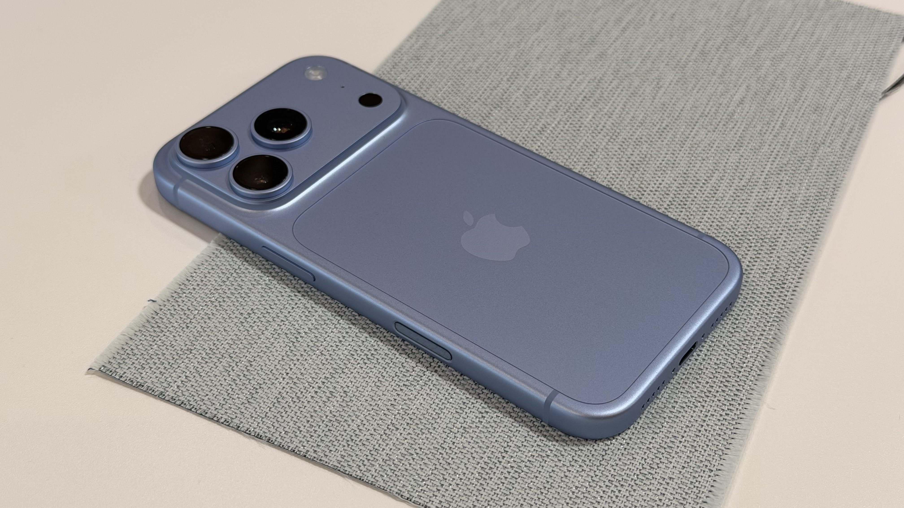

La nueva generación de iPhone ya está a la venta en China, y las primeras comparaciones entre el iPhone 18 Pro y el iPhone 17 Pro apuntan a una conclusión incómoda para quien pensaba renovar: por fuera, ambos teléfonos son casi idénticos. Según recoge el medio chino MyDrivers, varios usuarios que ya recibieron el iPhone 18 Pro publicaron fotografías junto al modelo del año anterior, y el veredicto fue unánime. La continuidad del diseño es tal que las fundas del iPhone 17 Pro sirven para el iPhone 18 Pro.

## Dos generaciones que parecen gemelas

Los propios usuarios describieron ambos equipos como «gemelos»: un año de diferencia, pero un lenguaje de diseño que se mantiene sin cambios visibles. En el uso diario, las diferencias de acabado y de geometría son tan pequeñas que resultan indistinguibles a simple vista, y las fotos comparativas publicadas en redes sociales no ayudan a separar una generación de la otra.

Esa continuidad exterior tiene una consecuencia muy concreta para el comprador: los accesorios de una generación encajan en la siguiente. Quien ya tenga una funda o una carcasa para el iPhone 17 Pro no necesitará comprar otra si da el salto al iPhone 18 Pro.

## El precio del salto: mismo almacenamiento, más dinero

La gama iPhone 18 Pro desembarcó en el mercado chino con un precio de partida de 9.999 yuanes para la versión de 256 GB, la misma capacidad base que la generación anterior. Las configuraciones de mayor almacenamiento se van muy por encima de los 20.000 yuanes: el iPhone 18 Pro de 2 TB queda en 20.499 yuanes y el iPhone 18 Pro Max de 2 TB, en 21.499 yuanes.

Para el lector que compra en España, la referencia útil no es la cifra exacta —los precios chinos no se trasladan de forma directa a Europa—, sino la proporción: se trata de un desembolso de gama alta para un cambio que, a la vista, es mínimo. Ese contraste es justamente el que resume el titular original del medio chino, que habla de una actualización de casi 10.000 yuanes solo para cambiar de color.

## Un estreno con descuentos poco habituales

A la escasa diferenciación estética se suma otro factor que no suele acompañar a los lanzamientos de la gama Pro de Apple. Según MyDrivers, el precio de salida se agrietó en cuestión de días: en varias páginas de comercio electrónico, el iPhone 18 Pro de 256 GB apareció por 9.099 yuanes tras aplicar subsidios de plataforma y cupones de tienda, 900 yuanes por debajo del precio oficial. Otros canales de venta mostraron rebajas de varios cientos de yuanes, un escenario poco frecuente en la primera semana de venta de un Pro de Apple.

## ¿Vale la pena el salto?

Para quien ya tiene un iPhone 17 Pro, la continuidad del diseño elimina uno de los motivos clásicos de renovación: la sensación de estrenar algo distinto. El atractivo, si existe, queda del lado de lo que no se ve en una fotografía —el comportamiento del sistema, la cámara o la autonomía—, y no de la apariencia.

La lectura práctica es sencilla: si el diseño es lo que empuja la compra, esta generación no ofrece argumentos. Quien esté conforme con su iPhone 17 puede esperar con tranquilidad a la siguiente iteración, tal como sugieren los propios usuarios que compararon ambos equipos en China.
