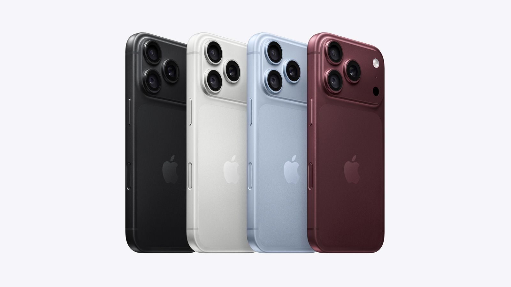
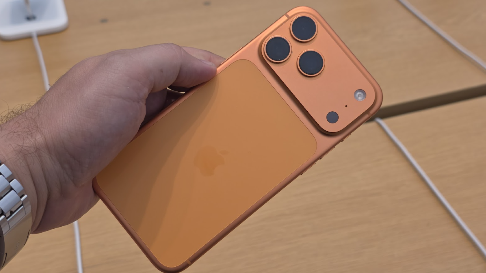
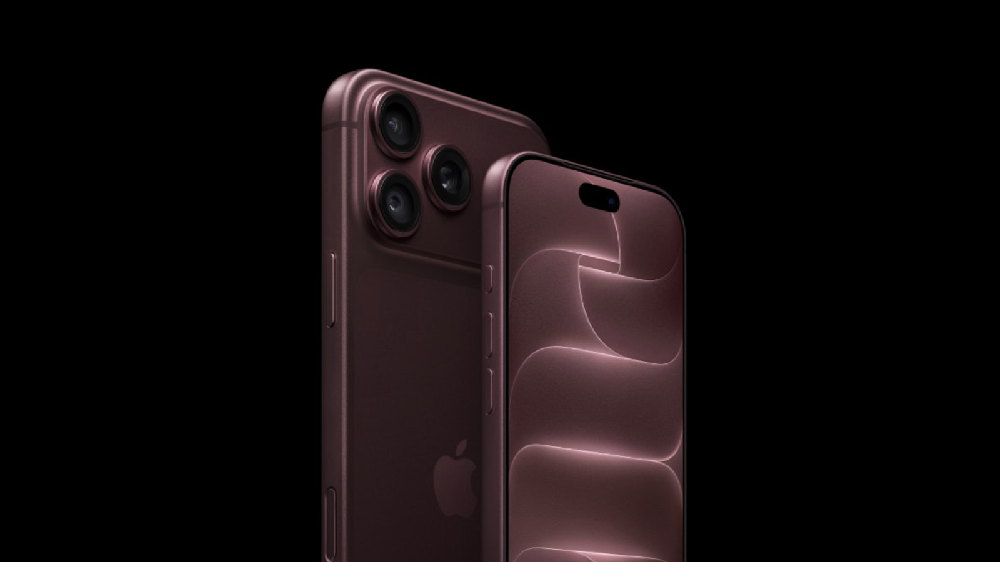
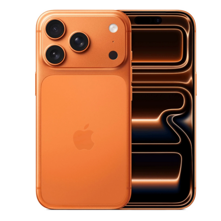
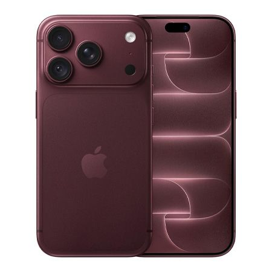

El iPhone 18 Pro ya está en el mercado y acumula novedades en procesador, cámaras,
batería y almacenamiento, pero conserva buena parte de la fórmula que Apple estrenó
con el iPhone 17 Pro. Por eso la pregunta interesante no es si el nuevo modelo es
mejor —lo es—, sino si justifica el desembolso de cambiar. A continuación van las
diferencias reales entre ambos y, sobre todo, en qué casos compensa cada uno.

Un matiz previo: el iPhone 17 Pro ya no figura en el catálogo oficial de Apple, así
que quien quiera comprarlo tendrá que hacerlo en otras tiendas que aún conserven
stock.

## Qué cambia del iPhone 17 Pro al iPhone 18 Pro

| Característica | iPhone 17 Pro | iPhone 18 Pro |
| --- | --- | --- |
| Pantalla | 6,3" Super Retina XDR OLED, LTPO, 120 Hz, Always-On, 3.000 nits | 6,3" Super Retina XDR OLED, LTPO, 120 Hz, Always-On, 3.000 nits |
| Dimensiones | 150 × 71 × 8,75 mm | 150 × 71,9 × 8,75 mm |
| Procesador | Apple A19 Pro | Apple A20 Pro |
| Memoria y almacenamiento | 12 GB / 256 GB, 512 GB y 1 TB | 12 GB / 256 GB, 512 GB, 1 TB y 2 TB |
| Cámaras | Triple de 48 MP: principal f/1.78, ultra gran angular f/2.2 y teleobjetivo 4x f/2.8 | Triple de 48 MP: principal con apertura variable f/1.48-f/4.0, ultra gran angular 120° y teleobjetivo 5x f/2.8 |
| Batería | Hasta 33 horas de reproducción de vídeo | Hasta 36 horas de reproducción de vídeo; carga al 50 % en unos 15 minutos |
| Otros | USB-C, MagSafe, IP68, Camera Control, botón de acción, LiDAR | USB-C, MagSafe, IP68, Camera Control, botón de acción, LiDAR, módem C2, controles manuales de cámara |
| Precio en España | Desde 1.319 € | Desde 1.469 € |

Los cambios que de verdad se notan se resumen en cuatro puntos:

- **Procesador.** El iPhone 17 Pro monta el A19 Pro, mientras que el iPhone 18 Pro
  estrena el A20 Pro fabricado en 2 nm, acompañado de mejoras en la refrigeración.
- **Cámara.** Ambos montan un triple sistema de 48 MP, pero el 18 Pro añade
  apertura variable en el objetivo principal (de f/1.48 a f/4.0) y controles
  manuales sobre parámetros como apertura, velocidad de obturación y balance de
  blancos. Además, el teleobjetivo pasa de 4x a 5x de zoom óptico.
- **Batería y almacenamiento.** El 18 Pro promete hasta 36 horas de vídeo frente a
  las 33 del 17 Pro, y carga el 50 % en unos 15 minutos con un adaptador de 60 W o
  superior. La carga inalámbrica sube hasta 35 W, y la gama añade una versión de
  2 TB.
- **Colores.** Junto al negro y la plata se suman el azul glaciar y el burdeos, el
  tono más llamativo de la nueva serie.

## Razones para quedarse con el iPhone 17 Pro

**Sigue siendo un terminal de gama alta.** El A19 Pro, los 12 GB de memoria, la pantalla
OLED de 120 Hz y el conjunto de tres cámaras de 48 MP siguen formando un equipo muy
completo. Para quien ya lo tiene, no hay motivos de peso para sustituirlo.

**El diseño apenas evoluciona.** El 18 Pro mide prácticamente lo mismo que su
antecesor y conserva el botón de acción, el Camera Control, MagSafe, USB-C y la
resistencia IP68: de hecho, [el iPhone 18 Pro apenas se distingue del 17 Pro por
fuera, con fundas intercambiables entre ambos](/noticias/iphone-17-18-same-design-cases/).

**La pantalla es prácticamente idéntica.** Los dos usan un panel Super Retina XDR
LTPO OLED de 6,3 pulgadas con 120 Hz, 460 píxeles por pulgada, pantalla siempre
activa, Dynamic Island y un brillo máximo cercano a los 3.000 nits.

**Las cámaras siguen siendo excelentes.** Aunque el 18 Pro suma apertura variable y
controles manuales, el 17 Pro conserva tres sensores de 48 MP y un teleobjetivo con
4x de zoom óptico.

**Puede encontrarse bastante más barato.** Al haber salido del catálogo oficial de
Apple, el 17 Pro se consigue hoy por debajo de los 1.200 € en tiendas de terceros.

## Razones para cambiar al iPhone 18 Pro

**El A20 Pro es la gran actualización interna.** El salto a un chip fabricado en
2 nm representa un avance tecnológico notable respecto al A19 Pro y viene acompañado
de mejoras en la refrigeración; en sus primeras apariciones públicas, [el A20 Pro ya
mostró en Geekbench un salto de hasta el 40 % en gráficos](/noticias/apple-a20-pro-iphone-18-pro-benchmark/).

**La cámara principal es más versátil.** La apertura variable permite adaptar el
objetivo a cada escena, y los controles manuales dan al usuario dominio directo
sobre apertura, obturación y balance de blancos, algo que hasta ahora estaba más
cerca de una cámara compacta que de un teléfono.

**La autonomía y la carga mejoran.** Tres horas más de reproducción de vídeo que el
17 Pro, carga del 50 % en unos 15 minutos con un cargador de 60 W o superior y
recarga inalámbrica de hasta 35 W.

**Te acompañará un año más.** Quien compre el modelo actual se asegura la generación
más reciente y, con ella, más tiempo de actualizaciones futuras de iOS.

## Qué modelo compensa comprar ahora

Si ya tienes un iPhone 17 Pro, la recomendación es **mantenerlo**. El nuevo modelo
es técnicamente superior, pero el salto no altera radicalmente la experiencia de uso:
la pantalla es la misma, el diseño apenas cambia y las mejoras de cámara, procesador
y batería, aunque reales, no justifican por sí solas sustituir un teléfono que sigue
en gama alta.

La situación cambia si **no tienes un iPhone 17 Pro y compras ahora**. Como el 17 Pro
ya no se vende en la tienda oficial de Apple, conviene comparar precios antes de
decidir: el iPhone 18 Pro arranca en 1.469 € con 256 GB, mientras que el 17 Pro se
encuentra por 1.179 € en PC Componentes y MediaMarkt y por 1.199 € en Amazon y El
Corte Inglés.

En la práctica, eso supone entre 270 y 290 € de diferencia por el mismo almacenamiento.
Por tanto, el **iPhone 18 Pro es la opción lógica para quien compre ahora** y quiera
la generación más reciente, mientras que el **17 Pro sigue teniendo mucho sentido si
aparece considerablemente más barato**. Los precios se actualizaron en el momento de
publicar el análisis original y pueden variar con el tiempo.
