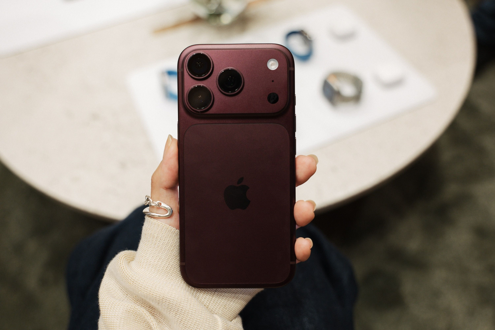
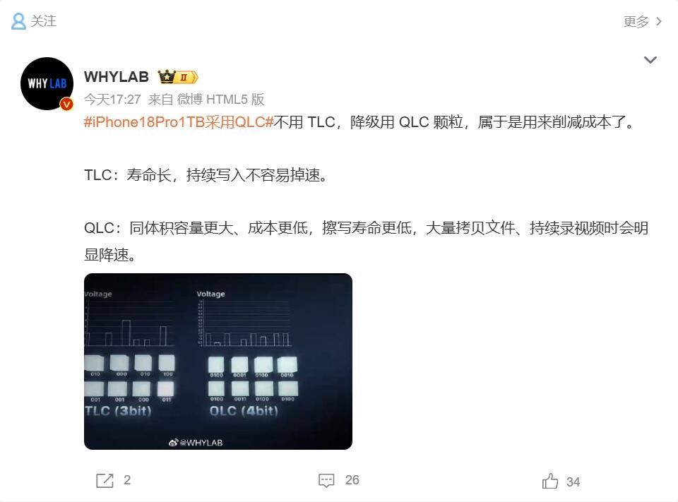

La polémica sobre el almacenamiento del iPhone 18 Pro ha encendido las redes en China. La etiqueta «iPhone 18 Pro 1 TB con QLC» entró en la lista de temas más comentados de Weibo después de que distintos análisis técnicos apuntaran a una diferencia incómoda: las versiones de 1 TB y 2 TB del teléfono usarían memoria NAND QLC, mientras que los modelos de 256 GB y 512 GB seguirían con TLC, una tecnología más rápida y duradera. El detalle resulta especialmente llamativo porque las capacidades mayores son, precisamente, las más caras.

Conviene fijar una idea desde el principio: **Apple no ha confirmado ni desmentido** esa diferencia. La compañía tampoco publica en sus especificaciones qué tipo de NAND monta cada capacidad, así que todo lo que se sabe procede de análisis de unidades reales y de filtraciones de la cadena de suministro. Es una controversia reportada, no un anuncio oficial.

## Qué diferencia hay entre la memoria QLC y la TLC

La memoria NAND flash guarda información en celdas, y cada celda puede retener varios bits según cuántos niveles de voltaje distintos sea capaz de distinguir. La **TLC** (*Triple-Level Cell*) almacena tres bits por celda; la **QLC** (*Quad-Level Cell*), cuatro. Ese bit extra parece un detalle menor, pero lo cambia casi todo.

Para leer cuatro bits hay que distinguir 16 estados de voltaje en lugar de 8, y el margen entre estados se estrecha. Eso obliga al controlador a ser más preciso y más lento, y hace que la celda se desgaste antes. Las consecuencias prácticas son dos:

- **Durabilidad de escritura.** Una celda QLC soporta menos ciclos de escritura y borrado antes de agotarse que una TLC equivalente. Es la razón por la que la memoria de mayor densidad se ha usado tradicionalmente en discos de lectura intensiva y no en equipos que reescriben datos de forma constante.
- **Velocidad sostenida.** La QLC escribe más despacio y, sobre todo, mantiene peor el ritmo cuando la escritura se prolonga. La diferencia se disimula con una **caché SLC**: el fabricante reserva una parte de la memoria para escribir rápidamente en modo de 1 bit por celda y, cuando ese colchón se llena, el rendimiento cae al nivel real de la QLC. Por eso una prueba con el disco vacío puede verse excelente y degradarse a medida que el dispositivo se llena.

## El matiz que cambia el relato: QLC utilizada como TLC

El detalle más interesante del caso no está en la etiqueta del chip, sino en cómo lo usa Apple. Un bloguero técnico chino que publica en Weibo como 白饭炒白米饭 analizó una unidad de 1 TB con la herramienta Device Lab y publicó sus conclusiones. Según ese análisis, la memoria identificada es una QLC de Kioxia (Toshiba) de 218 capas y 4 bits por celda, integrada junto al controlador S6E de Apple. Hasta ahí, lo esperado.

Lo llamativo aparece al revisar los registros de gestión de la NAND: el controlador de Apple puede configurar cada banda de almacenamiento con densidades de 1, 3 o 4 bits. En esa unidad, salvo los bloques marcados como defectuosos de fábrica, el resto del espacio funciona en un modo mixto de 3 bits más 1 bit: los datos se guardan principalmente en modo TLC y una zona pequeña se reserva en modo SLC para absorber las escrituras rápidas. En otras palabras, **usaría celdas QLC sin explotarlas en modo QLC**, sacrificando algo de capacidad a cambio de más resistencia y una velocidad más estable. Eso explicaría que, en las pruebas de ese equipo, la lectura y la escritura alcanzaran alrededor de 3 GB/s, muy por encima de lo que suele dar una QLC escribiendo en su modo nativo.

El propio análisis advierte de sus límites: detectó el mecanismo de conmutación dinámica entre SLC y TLC (el llamado *oslc*, con 479 conversiones registradas), pero no llegó a capturar un cambio automático entre TLC y QLC, algo que exigiría llenar el almacenamiento hasta un 70 u 80 % y volver a revisar los registros. El punto débil, en cualquier caso, es el que señalan todas las partes: un almacenamiento casi lleno. Cuando queda poco espacio libre hay menos bandas que reasignar, no hay margen para reservar caché SLC y la amplificación de escritura empeora, de modo que la velocidad de escritura puede desplomarse.

## Por qué ocurre y qué significa para quien compra

El motivo de fondo es el coste. El precio de la memoria NAND se ha disparado durante 2026 y los informes de la cadena de suministro cifran el salto del módulo de 256 GB de un iPhone 17 Pro en unos 13 dólares a unos 51 dólares en el iPhone 18 Pro. En ese contexto, recurrir a memoria de mayor densidad en las capacidades altas abarata cada gigabyte. Ya en julio, el filtrador Reptalica había publicado un supuesto desglose de componentes que asignaba TLC de SK hynix, Kioxia y SanDisk a los modelos de 256 GB y 512 GB, QLC de SK hynix (modelo BC8Q-1T, con algún TLC de Samsung como alternativa poco frecuente) al de 1 TB y QLC de grado empresarial (BC8Q-2T) al de 2 TB. Tampoco es la primera vez que suena algo así: en 2024 circuló un rumor equivalente sobre el iPhone 16 Pro que, según los análisis posteriores, no pareció confirmarse.

En cuanto al bolsillo, el contraste es incómodo. En el mercado chino, el iPhone 18 Pro Max de 1 TB se vende por 16.499 yuanes y el de 2 TB por 21.499, una diferencia de 5.000 yuanes entre ambas capacidades. Es decir, las versiones más caras son precisamente las que, según estos análisis, llevan la memoria cuestionada.

Para el comprador, lo razonable es poner el dato en contexto:

- **Solo la unidad de 1 TB ha sido analizada directamente.** La afirmación sobre el modelo de 2 TB procede de filtraciones y predicciones, no de una verificación sobre un equipo físico.
- **Apple no publica el tipo de NAND por capacidad**, así que no hay forma oficial de saber qué memoria trae una unidad concreta, especialmente cuando hay varios proveedores implicados.
- **Para un uso ligero, la diferencia probablemente no se note.** Mensajería, navegación, fotos y aplicaciones habituales generan escrituras cortas que la caché absorbe. El problema aparece con transferencias grandes y sostenidas, grabación de vídeo en alta calidad o edición de archivos pesados, y sobre todo con el almacenamiento casi lleno.
- **«Peor» no equivale a «se va a romper».** Se trata de una tecnología menos favorable para escrituras intensivas, no de una cifra de vida útil: Apple no publica una resistencia por capacidad.

La recomendación que circula entre los propios analistas chinos es de sentido común: quien no necesite 1 TB de verdad y valore la velocidad sostenida puede mirar con mejores ojos el modelo de 512 GB. Quien grabe vídeo o trabaje con archivos grandes en el propio teléfono, en cambio, tiene motivos para seguir de cerca cómo evoluciona este debate.
