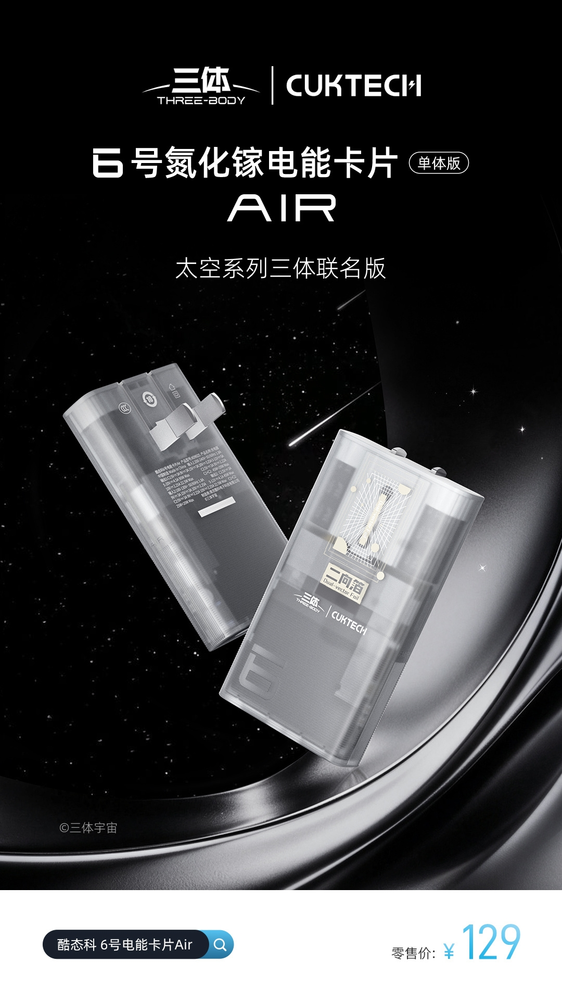
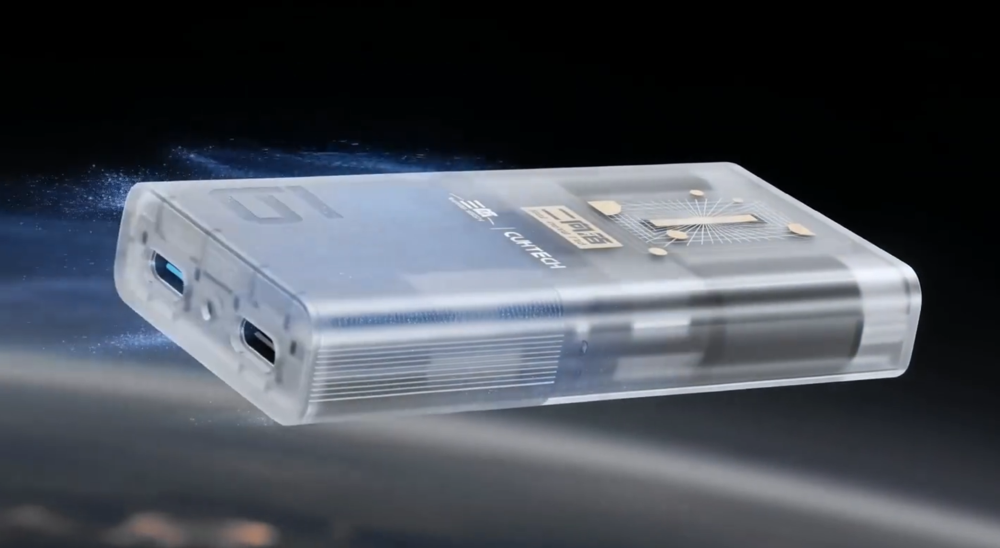
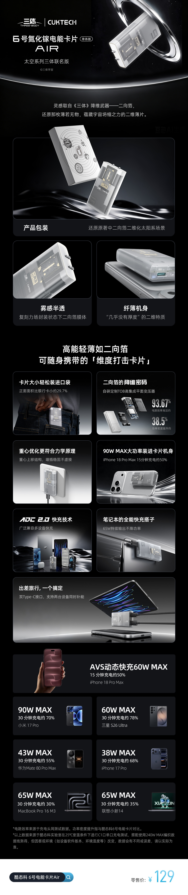

Cuktech ha puesto a la venta este 22 de septiembre en China una edición especial de su tarjeta de energía GaN «6 AIR», asociada a la saga «El problema de los tres cuerpos». El accesorio cuesta 129 yuanes, apenas 10 yuanes más que la versión estándar, y su principal reclamo técnico es la compatibilidad con la carga rápida AVS de 60 W del iPhone 18 Pro. Se trata de un cargador de viaje con formato de tarjeta, dos puertos USB-C y una carcasa translúcida que deja ver su electrónica de nitruro de galio.

## Una edición inspirada en «El problema de los tres cuerpos»

El diseño toma como motivo el «foil bidimensional» que da nombre al arma central de la novela de Liu Cixin, la lámina que reduce el sistema solar a una superficie sin grosor. Cuktech traslada esa idea a una carcasa semitransparente, con la circuitería a la vista y un grabado inspirado en el objeto ficticio. El fabricante mantiene el formato de tarjeta de la versión normal: 42 mm de ancho por 77,3 mm de alto, un peso superior a 80 gramos y patillas plegables, de modo que el conjunto es más pequeño que una tarjeta bancaria y cabe en una cartera o en un bolsillo. La compañía también señala que las patillas se han optimizado para que no se aflojen en el enchufe y que el cuerpo emplea el diseño de media envoltura del estándar chino, orientado a mejorar la seguridad.

## Doble USB-C y carga AVS de 60 W: la ficha técnica

Por dentro, la edición de coleccionista es idéntica a la tarjeta «6 AIR» corriente: usa un transformador plano TOB desarrollado por la propia marca y chips de nitruro de galio, con una eficiencia declarada del 93,67 % y un aumento de densidad de potencia del 38,5 % respecto a la tarjeta «6» de Cuktech.

En conectividad incorpora dos puertos USB-C. El primero alcanza un pico de 90 W en solitario, el segundo se queda en 22,5 W y, cuando ambos trabajan a la vez, el reparto es de 45 W + 20 W, suficiente para alimentar un teléfono y un portátil delgado al mismo tiempo. El protocolo ADC 2.0 cubre la carga rápida de Xiaomi, UFCS, PD, PPS, SCP y FCP, entre otros, por lo que sirve tanto para equipos Android como para dispositivos de Apple. La marca cifra en una media hora el tiempo necesario para llevar un Xiaomi 17 Pro al 70 % de batería.

El punto que más ha destacado la prensa china es el soporte de AVS, la modalidad de tensión ajustable que acompaña a USB Power Delivery y que permite al cargador adaptar la salida en pasos finos en lugar de saltar entre niveles fijos. Cuktech presenta la tarjeta como compatible con la carga rápida AVS de 60 W del iPhone 18 Pro. En su propia ficha, la compañía publica una medición de unos 15 minutos hasta el 50 % en el iPhone 18 Pro Max y añade un modo de 65 W sostenidos para portátiles, que describe como libre de las caídas de potencia que sufren otros cargadores en sesiones largas. Conviene recordar que todas estas cifras proceden de las pruebas de laboratorio de Cuktech, realizadas a 25 °C con un solo puerto en uso y un cable de 240 W: son datos del fabricante, no de terceros.

## Qué cambia para el comprador

El lanzamiento llega solo a China por el momento: el enlace de compra apunta a JD y la información publicada no menciona disponibilidad ni precio fuera del país. Quien quiera hacerse con él desde España tendrá que recurrir, si aparece, a la importación, con el sobrecoste y las diferencias de compatibilidad que eso supone, además de que las patillas responden al estándar chino y necesitarían un adaptador. Otra muestra del empuje de los accesorios para el iPhone 18 Pro es la [funda con pantalla de tinta electrónica que Ugreen presentó para el mismo teléfono](/noticias/ugreen-e-ink-iphone-case/), aunque en ese caso tampoco hay precio ni fecha para Europa.

Para el usuario hispanohablante, la pregunta relevante no es el precio en yuanes, sino qué aporta AVS. La utilidad de la modalidad de tensión ajustable está en que parte de la conversión de voltaje se traslada al cargador, lo que reduce el calor generado dentro del teléfono durante la carga a alta potencia. Quien tenga un iPhone 18 Pro encontrará aquí un accesorio de viaje con ese protocolo; quien no lo tenga, se queda con un cargador de 65 W sostenidos que también sirve para un portátil.

Conviene tratar el anuncio con la cautela habitual ante un producto recién lanzado y sin distribución internacional: lo confirmado son el precio, el formato, los puertos y las especificaciones que declara el propio fabricante. El rendimiento real y el comportamiento térmico solo podrán comprobarse con unidades independientes fuera del laboratorio de la marca.
