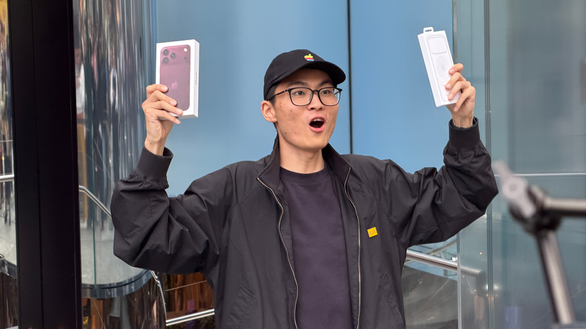
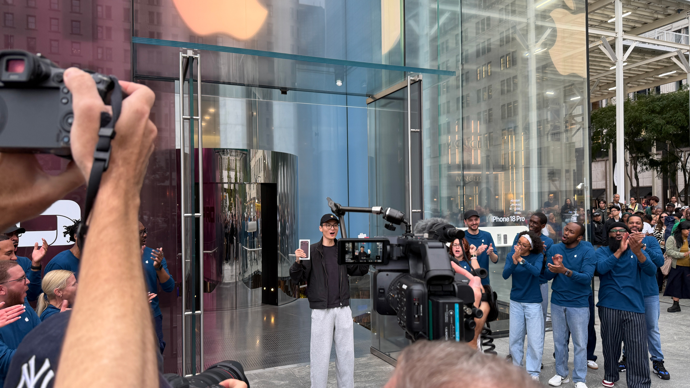
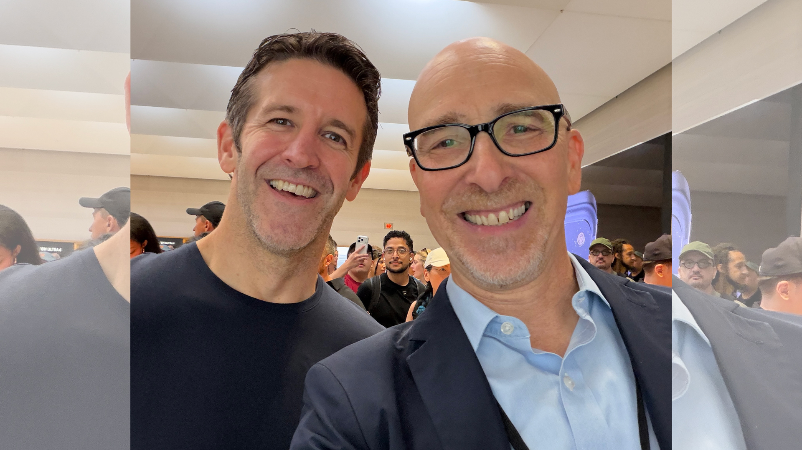
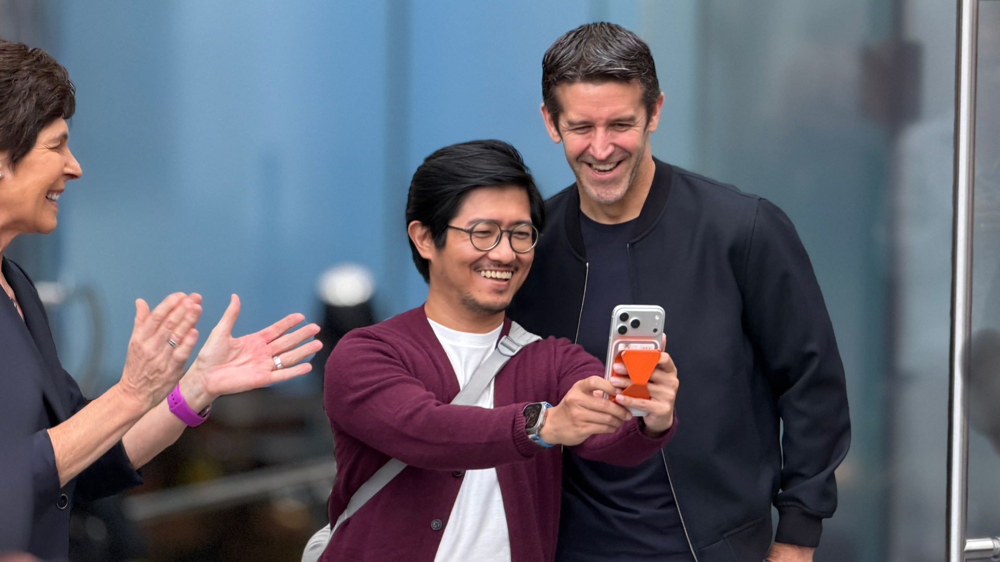
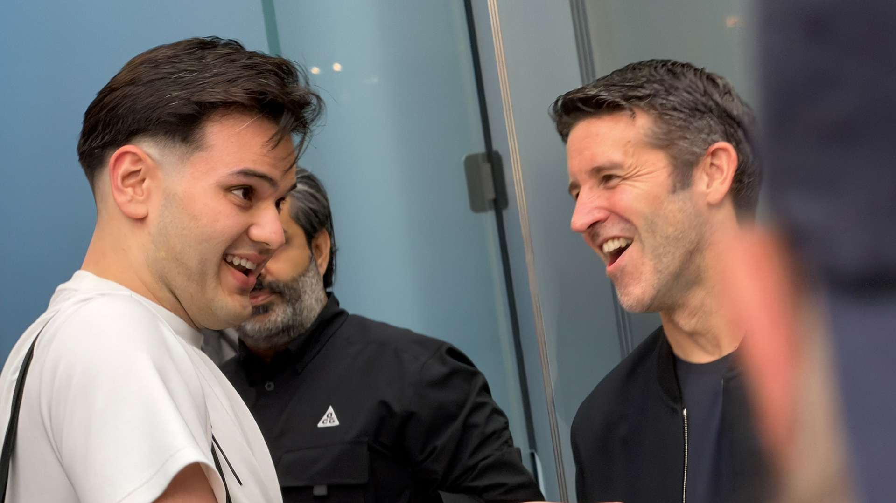
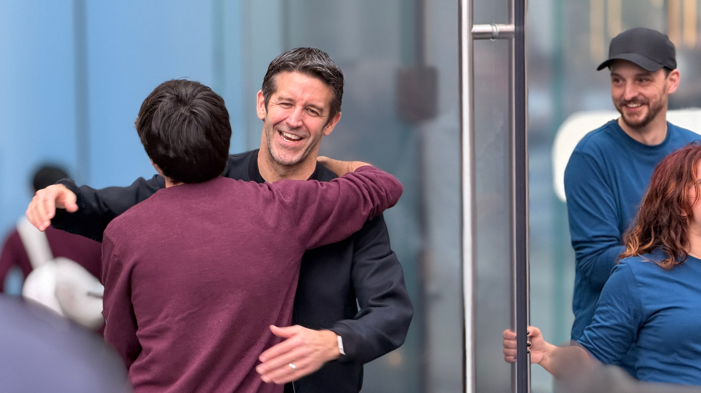
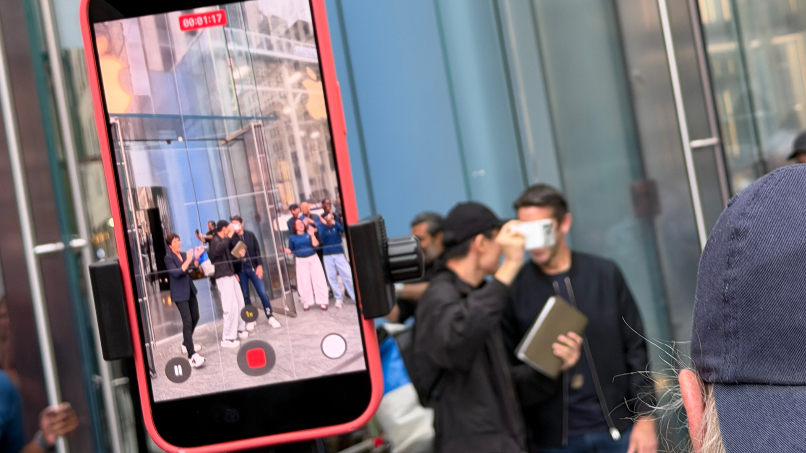
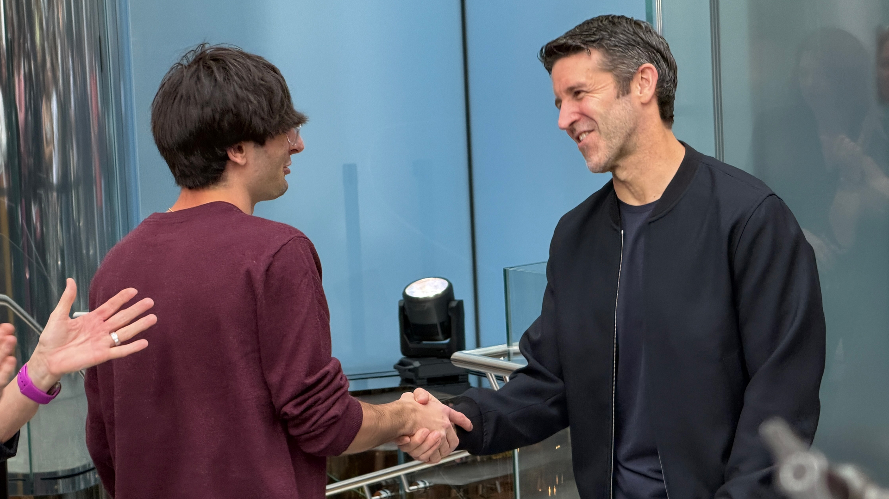
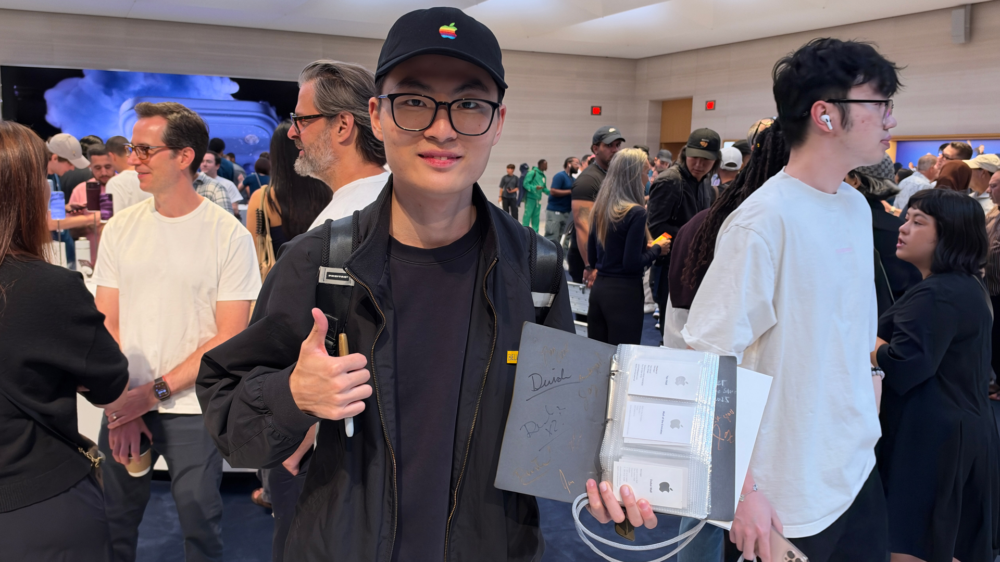

A las 8:00 de la mañana, hora del este, John Ternus apareció detrás de las puertas de vidrio esmerilado de la tienda insignia de Apple en la Quinta Avenida y las abrió de par en par. El nuevo consejero delegado de la compañía se quedó un momento saludando a una multitud que lo vitoreaba. Un poco más atrás, un grupo reducido de manifestantes protestaba por las condiciones laborales en la fabricación del iPhone, aunque, según relata el periodista de TechRadar Lance Ulanoff, su ímpetu se fue diluyendo a medida que crecía el entusiasmo del público.

Ternus se giró entonces hacia la larga fila de clientes que esperaba afuera —buena parte había reservado el teléfono la semana anterior— y empezó a saludarlos uno por uno. El primero de la fila era Harry Sung.

## Un estreno como consejero delegado

La jornada tenía un significado especial para Ternus. El directivo asumió el cargo el 1 de septiembre en sustitución de Tim Cook, que pasó a ocupar la presidencia ejecutiva, y apenas una semana después subió al escenario para presentar la gama iPhone 18 Pro, unos nuevos AirPods, nuevos Apple Watch y el plegable iPhone Duo. La apertura de la tienda fue su primer evento de lanzamiento del iPhone como consejero delegado, y las semanas previas habían sido intensas.

A pesar de la expectación, el iPhone Duo, el modelo plegable que acaparó titulares en la presentación, no estuvo presente ese día en la tienda. Aun así, Ulanoff describe una atmósfera eléctrica que, para quienes llevan casi dos décadas cubriendo este tipo de aperturas, recordó a los viejos tiempos. Al encontrarse con Ternus dentro del establecimiento, el periodista le preguntó por la jornada y el directivo se limitó a responder que era "emocionante".

## El primero de la fila

Sung tiene 21 años, nació en China, vive actualmente en Nueva Jersey y estudia en la universidad. Para asegurarse el primer puesto, reservó en línea un iPhone 18 Pro Max de 256 GB en color burdeos —nunca alquila el teléfono, siempre lo compra— y luego llegó a la tienda la tarde anterior, a las 20:30 hora del este, y se quedó esperando. Era el segundo año consecutivo en el que conseguía ser el primer cliente de Apple en el día del lanzamiento.

Bajo el brazo llevaba una carpeta con tarjetas de las 120 Apple Store que ha visitado en todo el mundo. Sung contó a Ulanoff que ya había coincidido con Ternus en otro lanzamiento, en la que Apple describe como su "tienda número 100", y que en aquella ocasión le pidió que le firmara el libro. La contracubierta interior acumula además las firmas de más de media docena de ejecutivos de la compañía. El detalle no sorprendió al periodista: en otra zona de la tienda vio a Deirdre O'Brien, responsable de Retail de Apple, firmando el MacBook de un cliente.

Cuando le preguntaron por qué visita tantas tiendas y por qué estaba allí en ese momento, Sung respondió con naturalidad: "Me encanta Apple". También resumió lo que más valora de estas esperas: "Siente el ambiente que hay aquí, eso es lo que me gusta". Nunca ha tenido un Android; su primer iPhone fue un iPhone 15.

Tras recoger su iPhone 18 Pro Max, Sung salió brevemente a la calle y levantó el teléfono en alto, lo que desató una nueva ovación. Después, Ternus siguió atendiendo al siguiente cliente de la fila.

## Por qué importa esta escena

Más allá del producto, la jornada deja una fotografía del momento que atraviesa Apple: el relevo en la cúpula con Ternus como nuevo consejero delegado, la continuidad del ritual de las colas en las tiendas físicas y la convivencia de esa celebración con las críticas sobre las condiciones de fabricación. Conviene leerlo como lo que es: la crónica personal de un periodista que estuvo allí, no una medición del interés real del mercado ni un indicador de ventas.

Para el lector hispanohablante, el interés está en las señales de fondo. Ternus no se limitó a firmar comunicados desde la distancia, sino que se puso al frente de la apertura y saludó personalmente a los clientes, un gesto que busca proyectar cercanía en su primer ciclo de lanzamientos. Y el caso de Sung muestra hasta qué punto las tiendas de Apple funcionan como puntos de encuentro para una comunidad que sigue dispuesta a esperar horas por un teléfono.
