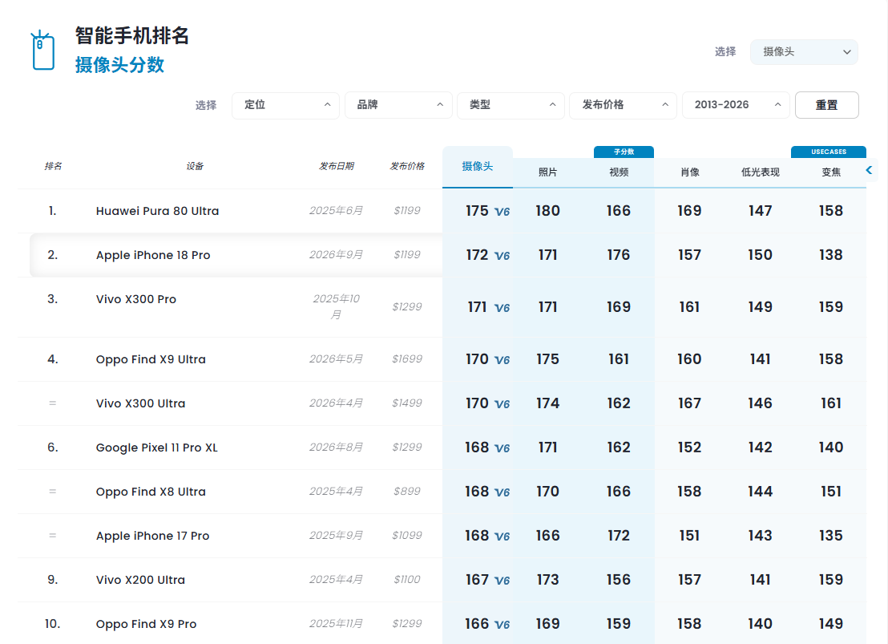
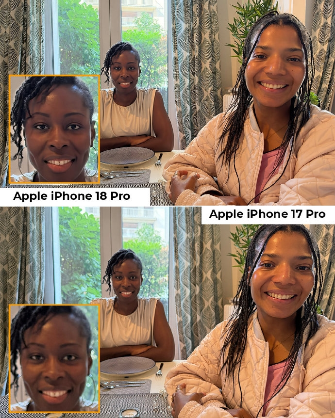
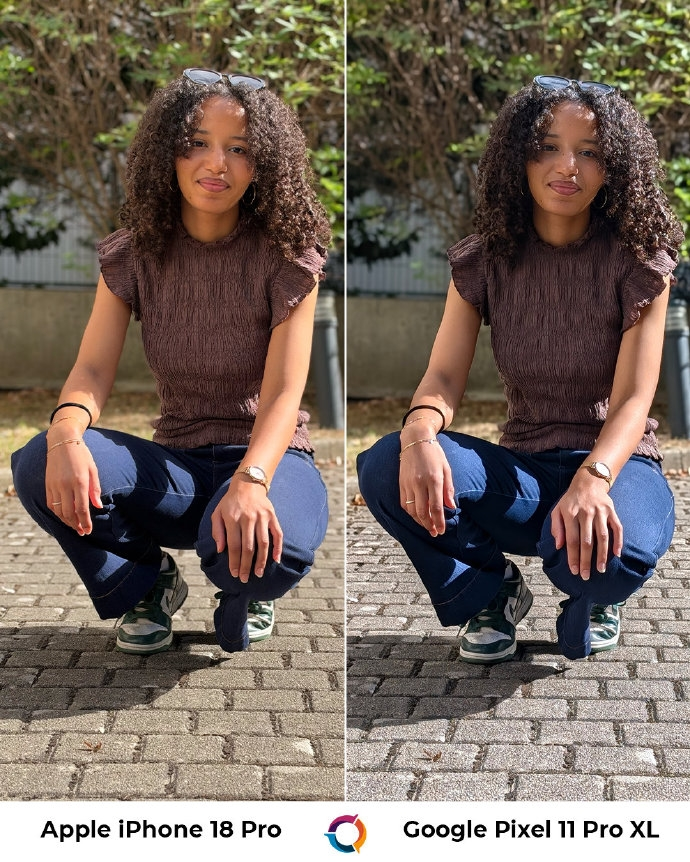
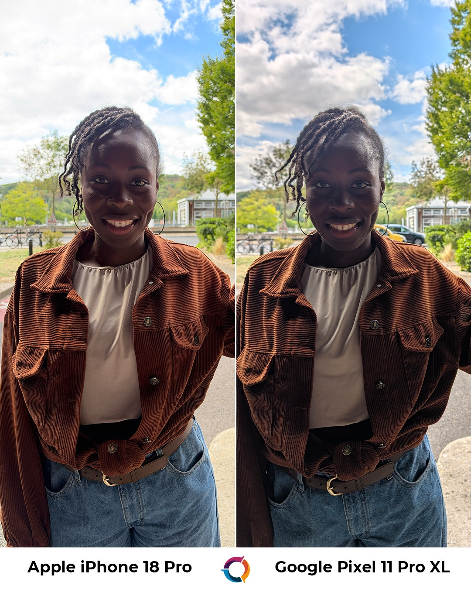
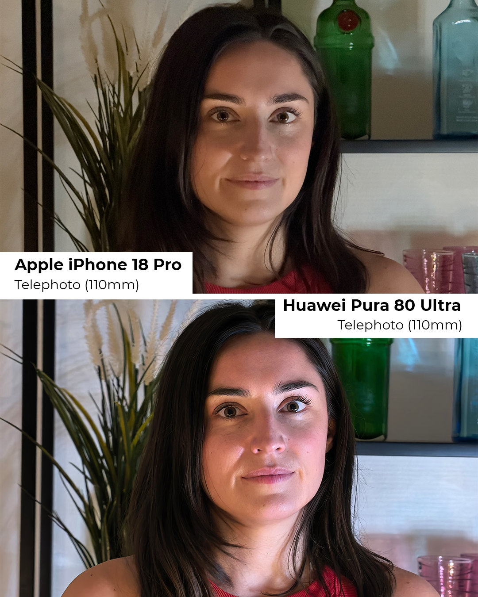
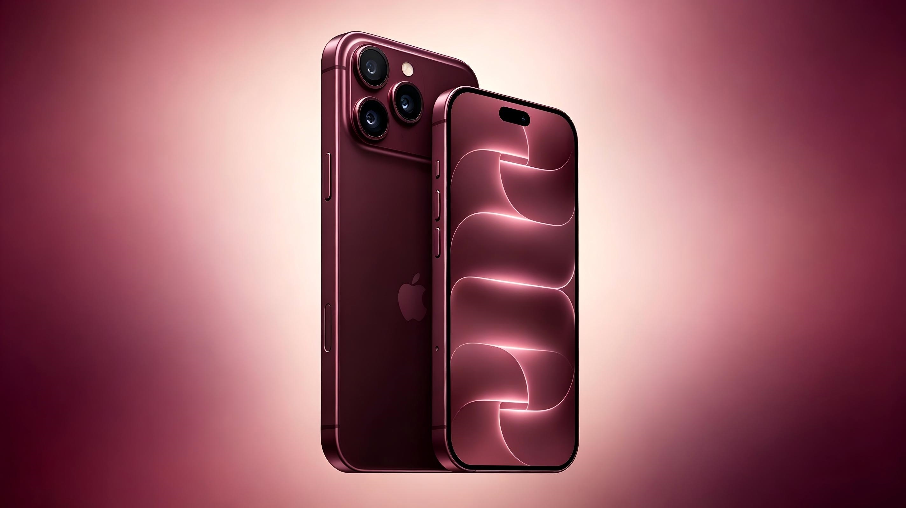

Apenas unos días después de la salida a la venta del iPhone 18 Pro, DXOMARK ha publicado la nota de su cámara. El laboratorio francés otorga al nuevo buque insignia de Apple **172 puntos** en la sexta versión de su protocolo de pruebas, un resultado que lo coloca en **segunda posición del ranking global de cámaras de smartphones**, solo por detrás del Huawei Pura 80 Ultra, que mantiene el liderazgo con 175 puntos desde agosto de 2025. La misma posición ocupa el teléfono dentro de la categoría Ultra-Premium, reservada a los modelos de más de 800 dólares.

La diferencia entre ambos es de solo tres puntos, pero marca la frontera entre el primer puesto y el resto de la tabla. DXOMARK publica el desglose completo en su ficha del dispositivo, donde se puede comprobar que el iPhone 18 Pro no domina todas las categorías: gana en vídeo, se queda cerca en la cámara principal y pierde terreno en el zoom de largo alcance.

## Los números del análisis

La nota global de 172 se construye a partir de una puntuación de **171 en foto** y **176 en vídeo**. Ese 176 es, según DXOMARK, la mejor nota de vídeo que ha registrado hasta la fecha en cualquier teléfono, con la cámara principal en 189 puntos y la ultraangular en 152, ambas también como máximas de su base de datos.

| Apartado | iPhone 18 Pro | Mejor puntuación registrada por DXOMARK |
| --- | --- | --- |
| Cámara (global) | 172 | 175 · Huawei Pura 80 Ultra |
| Foto (global) | 171 | 180 · Huawei Pura 80 Ultra |
| Foto · principal | 181 | 184 · Huawei Pura 80 Ultra |
| Foto · bokeh | 175 | 185 · Oppo Find X9 Ultra |
| Foto · ultraangular | 152 | 175 · Vivo X300 Ultra |
| Foto · teleobjetivo | 143 | 173 · Oppo Find X9 Ultra |
| Vídeo (global) | 176 | 176 · iPhone 18 Pro |
| Vídeo · teleobjetivo | 127 | 140 · Vivo X200 Ultra |

En los casos de uso, que DXOMARK puntúa al margen de la nota global, el iPhone 18 Pro obtiene el mejor resultado en fotografía con poca luz (150 puntos), mientras que se queda en 157 en retrato —frente a los 169 del Pura 80 Ultra— y en 138 en zoom, donde el Vivo X300 Ultra lidera con 161.

## Luz, retrato y vídeo: los puntos fuertes

Según DXOMARK, el teléfono expone con precisión en la mayoría de situaciones y ofrece un rango dinámico amplio, con un contraste natural. La **apertura variable** estrenada en esta generación es uno de los elementos que el laboratorio destaca: al cerrar el diafragma en retratos de grupo, más personas quedan enfocadas dentro de la profundidad de campo, y el usuario conserva el control manual cuando lo necesita. En retrato, el laboratorio aprecia mejoras en contraste y en la reproducción del tono de piel respecto al modelo anterior; con poca luz, señala que se conservan detalles y que el equilibrio entre textura y ruido está bien resuelto.

El vídeo es el apartado más sólido. DXOMARK describe una estabilización eficaz que mantiene el plano estable incluso grabando mientras se corre, y una transición suave entre focales. A ello se suma la mejor nota de baja luminosidad de su base de datos.

## Donde el Pura 80 Ultra se escapa

Frente a esos puntos fuertes, el informe también recoge carencias que explican por qué el teléfono no alcanza el primer puesto. En escenas de alto contraste puede aparecer sobreexposición en las luces altas y **el teleobjetivo de largo alcance queda por detrás de varios modelos insignia de la competencia**, un apartado donde el Pura 80 Ultra y los Oppo y Vivo más capaces sacan ventaja. En vídeo, DXOMARK apunta que la estabilidad del balance de blancos todavía es mejorable, con cambios apreciables al pasar de un entorno de luz a otro, además de destellos perceptibles en algunas condiciones y diferencias de brillo entre la previsualización de foto y la de vídeo.

## Qué significa para el comprador

La comparación directa con el Pura 80 Ultra deja un reparto bastante claro: Apple gana en vídeo y en fotografía con poca luz, Huawei mantiene la delantera en foto general y en retrato, y el zoom de largo alcance es terreno de otros fabricantes. Respecto al iPhone 17 Pro, que se quedó en 168 puntos, el nuevo modelo sube cuatro puntos y recorta distancias con la cabeza.

Conviene recordar que DXOMARK puntúa con la cámara en configuración automática y que su ranking combina resultados de las versiones 5 y 6 de su protocolo, cuyas escalas no son directamente comparables. La nota es una media ponderada de laboratorio, no un veredicto sobre qué teléfono hace las fotos que cada usuario va a preferir, así que el segundo puesto debe leerse como una referencia más dentro de un margen muy estrecho entre los modelos punteros.

