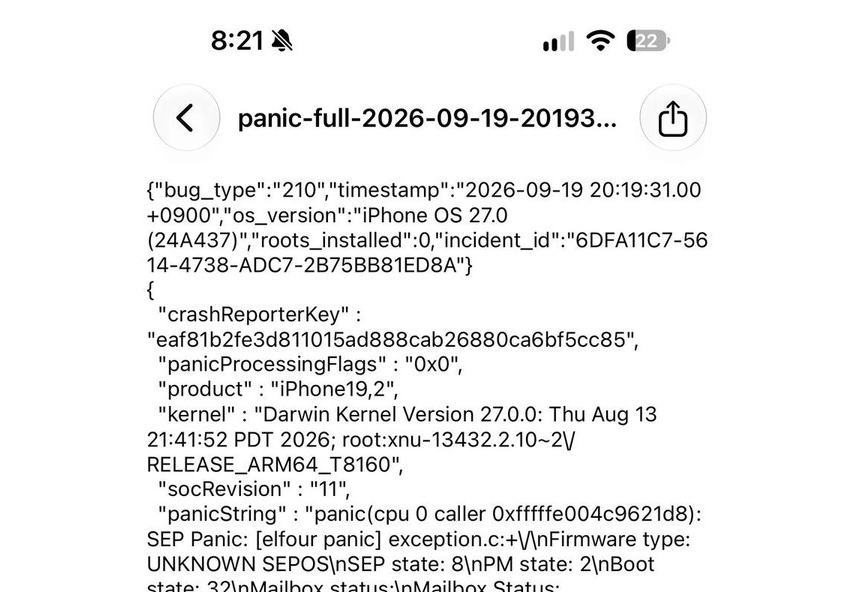

Los nuevos iPhone 18 Pro y iPhone 18 Pro Max vuelven a estar en el centro de las quejas de una parte de sus usuarios. Según recoge el medio chino MyDrivers, en los últimos días se han multiplicado los mensajes en comunidades y foros de usuarios que describen apagados súbitos seguidos de reinicios automáticos, un comportamiento que en el ecosistema de Apple se conoce como «Panic Full».

Conviene fijar desde el principio el estado de la información: **lo que existe son reportes de usuarios, no una confirmación oficial de Apple**. MyDrivers atribuye los testimonios a una comunidad de usuarios de iPhone y a un canal de YouTube, sin citar ningún comunicado de la compañía, por lo que ni la existencia del problema ni el número de equipos afectados están verificados.

## Qué se está reportando

El medio recoge que en una comunidad de usuarios de iPhone citada como Asamo, con alrededor de 2,41 millones de miembros, se han sucedido las publicaciones sobre iPhone 18 Pro y iPhone 18 Pro Max que experimentan el fenómeno.

Uno de los relatos más detallados describe un patrón reproducible: al entrar en una aplicación bancaria que exige autenticación con Face ID, o al abrir la sección «Eliminados recientemente» de la aplicación de Fotos, forzar repetidamente un fallo de reconocimiento facial desemboca en el apagado del teléfono. Ese mismo usuario explica que, al cubrir y descubrir el sensor de Face ID una y otra vez, la pantalla muestra el aviso de volver a intentarlo y, a continuación, el dispositivo se reinicia por su cuenta. Según su testimonio, el resultado se repitió en varias pruebas.

En la misma comunidad aparecen otros mensajes que preguntan si el problema «tiene solución», que anuncian una visita al servicio técnico por el comportamiento del 18 Pro Max o que sitúan el reinicio durante la reproducción de vídeos en YouTube. Se trata, en todos los casos, de experiencias individuales no contrastadas de forma independiente.

## Qué es el «Panic Full» y cómo comprobarlo

El término «Panic Full» describe la situación en la que el iPhone deja de responder, se apaga solo y se reinicia de forma inesperada. No es una avería nueva ni exclusiva de esta generación: es el nombre que reciben los registros que el sistema genera cuando se produce un fallo grave de este tipo.

Apple permite consultar esos registros en el propio teléfono. El usuario puede abrir **Ajustes → Privacidad y seguridad → Análisis y mejoras → Datos de análisis** y buscar entradas cuyo nombre empiece por `panic-full`. Si aparecen, son la huella que deja un reinicio de este tipo, aunque por sí solas no identifican la causa ni implican un defecto de hardware.

El artículo señala que los iPhone 16 ya dejaban registros con ese mismo formato cuando sufrían este comportamiento, lo que sirve como referencia de cómo se manifiesta, pero no como prueba de que la causa sea la misma en los modelos actuales.

## Reportes en otros mercados y el antecedente del iPhone 16

Los testimonios no se limitan a una sola comunidad. El canal de YouTube ZUYONI aseguró haber revisado una unidad después de recibir avisos de usuarios del iPhone 18 Pro y confirmó que el fenómeno se produjo. Según su relato, no aparece con el uso diario, sino en situaciones concretas: al vaciar la papelera del álbum de fotos o al fallar la autenticación con Face ID e intentarlo de inmediato una segunda vez.

En Reddit, un usuario de Estados Unidos afirmó haber sufrido tres reinicios mientras usaba Face ID y uno más al ejecutar Apple Wallet en menos de un día con un iPhone 18 Pro Max recién comprado. Otros propietarios del iPhone 18 Pro dicen haber visto registros de tipo panic durante el reconocimiento facial. De nuevo, son afirmaciones de usuarios que no han sido verificadas de forma independiente.

El precedente que cita MyDrivers es el del iPhone 16. Tras su lanzamiento en 2024, los modelos iPhone 16 Pro y Pro Max acumularon casos de apagado y reinicio automáticos, y Apple acabó corrigiendo el problema de algunos modelos mediante la actualización iOS 18.1. Ese episodio demuestra que el fabricante puede resolver este tipo de fallos por software, pero no anticipa si ocurrirá lo mismo aquí ni cuándo.

## Sin confirmación oficial

En el momento de publicar esta información, **Apple no ha confirmado que exista un problema en el iPhone 18 Pro ni ha anunciado una investigación, una causa o una solución**. El titular que apunta a una investigación de la compañía procede de la atribución del medio a fuentes del sector, no de una declaración oficial. Tampoco hay datos públicos sobre qué porcentaje de unidades estaría afectado ni sobre qué versiones de iOS quedarían implicadas.

Para quien ya tiene uno de estos teléfonos, lo razonable es documentar los reinicios: anotar cuándo ocurren, revisar si quedan registros `panic-full` en los datos de análisis y llevar esa información al soporte de Apple. Para quien esté pensando en comprarlo, los reportes conocidos son anécdotas de usuarios y no un defecto confirmado, así que conviene seguir la evolución del caso antes de sacar conclusiones.
