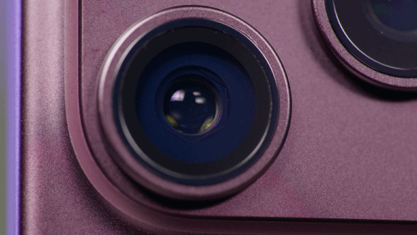

iFixit publicó el 20 de septiembre su desmontaje del iPhone 18 Pro y del iPhone 18 Pro Max, y el veredicto llega con un matiz incómodo. La firma especializada en reparación otorgó a ambos modelos una puntuación **provisional de 7 sobre 10**, la misma que obtuvieron los iPhone 17 Pro y 16 Pro. El problema no está en la nota, sino en un detalle que se repitió durante el proceso: de los cuatro teléfonos que abrieron, el marco plástico que rodea la pantalla se agrietó o se despegó en tres.

## La batería del iPhone 18 Pro: fácil de sustituir, difícil de alcanzar

El desmontaje confirma que Apple mantiene el acierto del año pasado: la batería va montada en una bandeja metálica sujeta con tornillos, en lugar de ir pegada al chasis. Retirar la bandeja y la celda juntas evita la clásica lucha con el adhesivo, y el propio iFixit lo celebra pese a tener que desatornillar trece tornillos. La capacidad también crece respecto a la generación anterior. En las unidades con **eSIM**, el iPhone 18 Pro declara 4.288 mAh (16,76 Wh) y el Pro Max, 5.567 mAh (21,751 Wh); las versiones con bandeja para tarjeta SIM física montan celdas algo más pequeñas para hacer sitio.

El problema aparece antes de llegar a esa batería. Para acceder a ella hay que retirar una pantalla que va pegada, y ahí es donde iFixit encontró el obstáculo. Aunque los paneles sobrevivieron y siguen funcionando, el marco blanco de plástico que forma parte del conjunto de la pantalla se rompió en tres de las cuatro aperturas. Ese marco no se vende por separado: si se daña, la única salida pasa por sustituir el módulo de pantalla completo. Colocarla de nuevo sin la pieza tampoco es una opción, porque no quedaría a ras del cuerpo.

iFixit es prudente con la conclusión. Con solo cuatro teléfonos no se puede hablar de una tasa de fallos, y apunta que la fuerza del adhesivo, el calor aplicado, la técnica o una diferencia en el propio plástico podrían influir. El marco existe desde el iPhone 15 Pro y en años anteriores no había dado tantos problemas, así que la firma sospecha que el nuevo sistema de refrigeración podría estar retirando demasiado calor de la junta y dificultando que el adhesivo se ablande. Como posible solución, menciona el uso de alcohol isopropílico, aunque admite que hará falta más pruebas para confirmarlo.

## La apertura variable: seis láminas que no se reparan

El otro gran protagonista del desmontaje es el nuevo objetivo principal con apertura variable, presente tanto en el Pro como en el Pro Max. En su interior hay seis láminas de un compuesto de polímero, tan finas como un cabello humano, que se solapan y se mueven por magnetismo para regular cuánta luz entra. Es un ejercicio de precisión notable, pero también suma puntos de fallo a un conjunto que, por diseño, ya se sustituye entero.

La conclusión de iFixit es tajante: reparar solo la apertura no es viable con las herramientas y técnicas habituales. Si una de esas láminas se atasca, el usuario se enfrenta al reemplazo de todo el módulo de la cámara principal. La buena noticia es que ese módulo es modular y relativamente accesible, así que el cambio en sí no es complicado; el problema es el coste de la pieza. Como referencia, el conjunto de cámara del iPhone 17 Pro se vendía por 249 dólares, y el nuevo mecanismo solo puede encarecerlo.

*Las seis láminas de la apertura variable en movimiento. Imagen: iFixit.*

## Qué cambia para quien compra o repara

El desmontaje deja dos lecturas útiles para el comprador. La primera es que el iPhone 18 Pro mejora en lo que más se rompe con el tiempo: una batería accesible con tornillos y un módulo de cámara fácil de extraer son victorias reales de reparabilidad. La segunda es que casi cualquier intervención obliga a pasar por la pantalla, y eso convierte cada arreglo en una operación más lenta y con riesgo añadido. Esa es, precisamente, la razón por la que la nota se queda en 7 sobre 10.

Para el mercado español, el contexto de posventa también pesa. El [precio del cambio de batería del iPhone 18 Pro subió a 129 dólares en Estados Unidos](/noticias/iphone-18-pro-battery-replacement-price/), una tarifa que sirve como referencia de hacia dónde van los costes fuera de garantía. Y si la apertura variable es lo que atrae la compra, conviene recordar que [su utilidad real está lejos de la de una cámara dedicada](/noticias/iphone-18-pro-variable-aperture-hands-on/): el mecanismo añade control, pero no convierte al móvil en una réflex. La reparabilidad, en cambio, no es una función de ficha técnica, sino algo que el usuario descubre justo cuando el teléfono se rompe.
