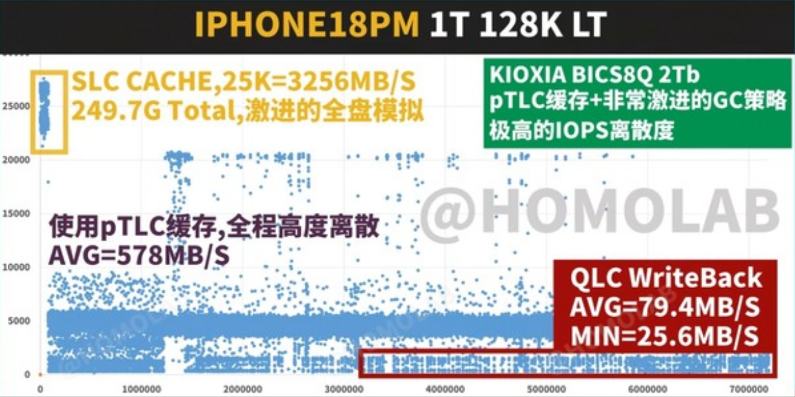

El laboratorio independiente HOMOLAB ha sometido a prueba el almacenamiento del **iPhone 18 Pro Max de 1 TB** y el resultado dibuja una curva incómoda: el teléfono es rapidísimo en ráfagas y en lectura, pero cuando la escritura se prolonga y se agotan sus colchones de caché, la velocidad se derrumba hasta quedar **por debajo de muchas tarjetas microSD baratas**. La conclusión encaja con la polémica abierta la semana pasada sobre el uso de memoria [QLC en la versión de 1 TB](/noticias/iphone-18-pro-1tb-qlc/), aunque esta vez no se discute qué chip lleva, sino cómo se comporta bajo carga real.

HOMOLAB comparó el modelo de 1 TB, con memoria QLC, con un **iPhone 18 Pro de 512 GB con memoria TLC**. Es decir, puso frente a frente las dos tecnologías de almacenamiento que Apple combina según la capacidad del equipo: la QLC guarda cuatro bits por celda y la TLC, tres, una diferencia que permite más capacidad en el mismo espacio físico a cambio de menos velocidad y menos resistencia.

## Qué encontró HOMOLAB en el iPhone 18 Pro Max

En la prueba ponderada de lectura 4K, los dos teléfonos quedaron cerca: el modelo QLC obtuvo **46.045 puntos** frente a los **51.282** del TLC. La distancia se abre cuando se mezclan lecturas y escrituras. Con colas poco profundas, el TLC se adelanta alrededor de un **38 %**; a medida que la carga sube, la ventaja se estrecha hasta quedar en torno al **12 %**. Para el uso cotidiano, ese tramo es el menos preocupante.

El problema aparece en otro escenario. Como la mayoría de los móviles modernos, el iPhone 18 Pro Max reserva una **caché SLC** de alta velocidad para absorber las escrituras repentinas: mientras hay margen, supera los **3.000 MB/s**. Esa cifra es la que se ve en un test corto con el teléfono recién estrenado, y no representa lo que ocurre cuando el archivo es grande.

## Los tres escalones de la escritura

La prueba deja ver una escalera de rendimiento con tres niveles bien diferenciados:

1. **Caché SLC.** Es la fase rápida, por encima de los 3.000 MB/s. Su tamaño es limitado y se consume enseguida con escrituras grandes.
2. **Búfer pTLC.** Cuando la caché se agota, el teléfono recurre a una segunda zona que simula TLC. La media cae a **578 MB/s**, con una dispersión muy alta.
3. **Escritura directa a QLC.** Cuando también se llena ese búfer, los datos van a la memoria en su modo nativo de cuatro bits: **79,4 MB/s de media y un mínimo de 25,6 MB/s**.

Ese último escalón es el que HOMOLAB señala como el más problemático, porque queda al nivel o por debajo de tarjetas de almacenamiento extraíble muy económicas. La gráfica de la prueba también identifica el componente analizado como una memoria **Kioxia BICS8Q de 2 Tb** y describe su estrategia de recolección de basura como especialmente agresiva, con una dispersión de IOPS muy elevada.

## El disco lleno agrava la caída

El segundo hallazgo es que el rendimiento no es constante: depende de cuánto espacio libre quede. Con el teléfono al **60 % de ocupación**, la caché SLC disponible se reduce de unos **250 GB** en vacío a solo **58 GB**. El búfer pTLC baja a **396 MB/s de media** y la escritura nativa en QLC cae a **45 MB/s de media**, con un mínimo de **1,1 MB/s**. En ese punto, la comparación con los SSD **UFS 4.0 con TLC** que montan otros teléfonos de gama alta es claramente desfavorable.

El patrón es conocido en el mundo de la memoria flash: cuanto menos espacio libre hay, menos bandas puede reasignar el controlador, menos margen existe para reservar caché y peor se comporta la amplificación de escritura. La novedad aquí es que se pone cifra a ese efecto en un teléfono de gama alta y con la capacidad más cara.

## Qué cambia para el usuario

Para quien usa el móvil para mensajería, navegación y fotos sueltas, la diferencia es difícil de notar: son escrituras cortas que la caché absorbe sin que el usuario llegue a ver el escalón lento. El escenario cambia con **grabación de vídeo 4K o ProRes durante varios minutos, transferencias de archivos grandes o copias de seguridad y restauraciones**, justo las tareas para las que se suele comprar un modelo de 1 TB o más.

Dos matices evitan sacar conclusiones de más. El primero es que todos los datos proceden de un único laboratorio; Apple no publica las cifras de velocidad sostenida ni el tipo de NAND por capacidad. El segundo es que la prueba no dice que el teléfono vaya a fallar, sino que su rendimiento en escrituras sostenidas está por detrás del de equipos con TLC. Quien priorice transferir y grabar mucho sobre el propio dispositivo tiene motivos para mirar con atención el modelo de 512 GB o, al menos, para no llenar el de 1 TB hasta el límite.
