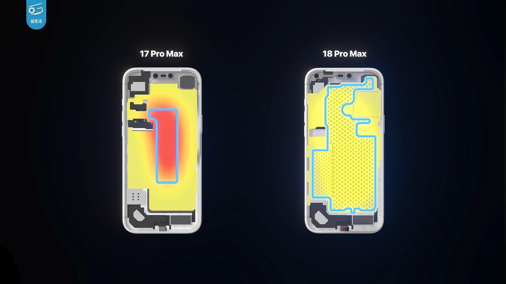
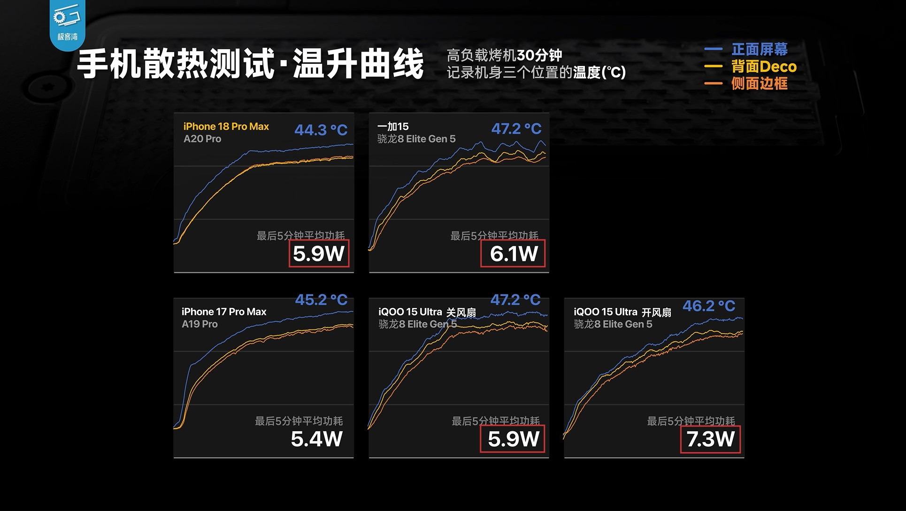

La cámara de vapor dejó de ser una novedad en la gama alta de Apple y empieza a mostrar resultados medibles. Un análisis térmico del canal Geekerwan ha puesto al iPhone 18 Pro Max frente a varios rivales Android, y la conclusión es que el buque insignia de Apple sostiene un nivel de potencia parecido al de los teléfonos gaming con refrigeración dedicada, pero lo hace a una temperatura más baja y sin necesidad de un ventilador.

## Qué mide exactamente esta prueba

El test no se limita a comprobar cuánto corre un juego, sino cuánta energía puede mantener el teléfono y a qué temperatura lo hace. Para ello, Geekerwan colocó sensores térmicos sobre el iPhone 18 Pro Max y sobre una lista de rivales que incluía el iPhone 17 Pro Max de la generación anterior, el OnePlus 15 y el iQOO 15 Ultra. Los tres dispositivos Android montaban el mismo procesador, el Snapdragon 8 Elite Gen 5, de modo que la comparación aísla en buena medida el efecto del sistema de refrigeración y del chip de cada fabricante.

Conviene tener presente que la potencia sostenida y la temperatura son dos caras de la misma moneda: un teléfono puede mantener más vatios, pero si lo paga con un calor excesivo acaba limitando el rendimiento antes. Medir ambas cifras a la vez es lo que permite separar una refrigeración eficaz de una que solo aguanta el tipo.

## Los números: menos calor con una potencia similar

Los resultados colocan al iPhone 18 Pro Max en 5,9 W de potencia sostenida y 44,3 °C de temperatura. Su predecesor, el iPhone 17 Pro Max, se quedó en 5,4 W y subió hasta los 45,2 °C: es decir, el modelo nuevo entrega más potencia y, aun así, se calienta menos. El contraste más llamativo llega al compararlo con sus rivales Android.

| Dispositivo | Potencia sostenida | Temperatura |
| --- | --- | --- |
| iPhone 18 Pro Max | 5,9 W | 44,3 °C |
| iPhone 17 Pro Max | 5,4 W | 45,2 °C |
| OnePlus 15 | 6,1 W | 47,2 °C |
| iQOO 15 Ultra (ventilador apagado) | 5,9 W | 47,2 °C |
| iQOO 15 Ultra (ventilador al máximo) | 7,3 W | 46,2 °C |

El OnePlus 15 apenas supera al iPhone en potencia —6,1 W frente a 5,9 W—, pero lo hace casi tres grados más caliente. El caso del iQOO 15 Ultra es el más revelador: con el ventilador apagado iguala los 5,9 W del iPhone 18 Pro Max, aunque a 47,2 °C. Solo cuando activa su ventilador a máxima velocidad logra elevar el límite hasta los 7,3 W, y aun así se mantiene en 46,2 °C, por encima del teléfono de Apple.

En otras palabras: el único Android que supera en potencia sostenida al iPhone 18 Pro Max es un modelo con refrigeración activa, y lo consigue calentándose más. El iPhone alcanza una posición intermedia sin piezas móviles ni ruido.

## Por qué importa la cámara de vapor

La refrigeración ha pasado de ser un detalle de ficha técnica a un factor que decide la experiencia. En un móvil, el calor no solo molesta al sujetarlo: cuando el sistema se acerca a sus límites térmicos, reduce la frecuencia del procesador para protegerse, y eso se traduce en caídas de fotogramas, menos brillo de pantalla o cargas más lentas. Un sistema de disipación eficaz permite sostener el rendimiento durante más tiempo, que es justo lo que busca quien juega o graba vídeo en sesiones largas.

La cámara de vapor cumple ahí un papel clave porque reparte el calor por una superficie mayor en lugar de concentrarlo. Apple la incorporó en la generación anterior y este año la ha reforzado en el iPhone 18 Pro Max, que además estrena el chip A20 Pro. La combinación de un procesador más eficiente con una disipación más capaz es la que explica que el teléfono gane vatios sin ganar grados.

El dato que matiza la comparación es que los rivales probados pertenecen a la generación actual de Android, con el Snapdragon 8 Elite Gen 5. Sus sucesores, con el Snapdragon 8 Elite Gen 6 Pro, podrían mejorar estas cifras, de modo que la distancia que muestra este test es una fotografía del momento y no una sentencia definitiva.

## Qué cambia para el lector hispanohablante

Para quien esté pensando en comprar un móvil de gama alta, este tipo de pruebas aporta algo que la ficha técnica no dice: no importa solo cuánto rinde el procesador en el mejor de los casos, sino cuánto aguanta cuando el teléfono se calienta de verdad. Y ahí el iPhone 18 Pro Max se coloca al nivel de teléfonos diseñados específicamente para jugar, sin recurrir a soluciones ruidosas como un ventilador.

La lectura práctica es que la refrigeración vuelve a ser un argumento de compra, sobre todo para quien exige sesiones largas de juego, edición o grabación. También relativiza la carrera por los vatios: mantener una potencia algo menor a una temperatura más baja puede ofrecer una experiencia más estable que exprimir el chip hasta que el sistema tenga que frenarlo. En un mercado donde casi todos los buques insignia rinden parecido de salida, la diferencia se decide en los minutos siguientes.
