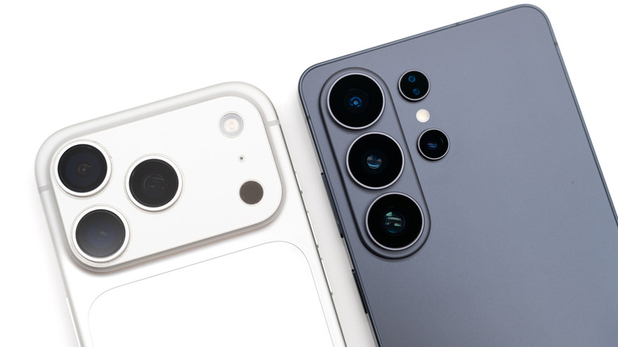
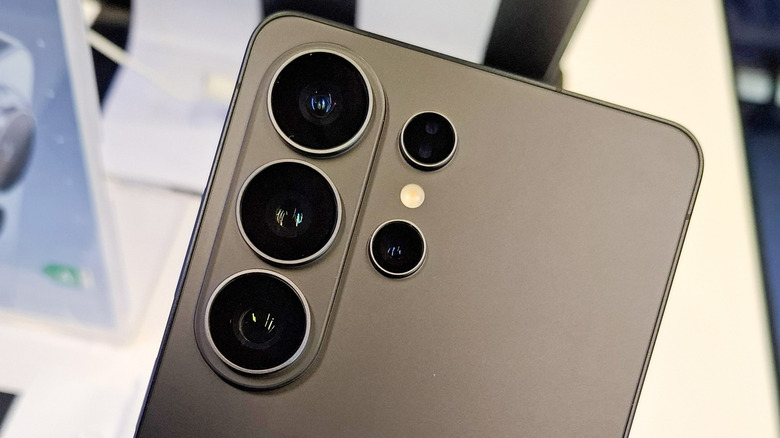
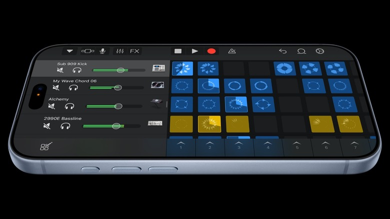

Apple y Samsung vuelven a medirse en el segmento más caro del mercado. El iPhone 18 Pro Max y el Galaxy S26 Ultra son los dos teléfonos no plegables más ambiciosos que cada compañía pone sobre la mesa, y la comparación es inevitable: ambos parten de un formato clásico de barra, comparten pantalla de 6,9 pulgadas y arrancan al mismo precio en Estados Unidos. Aun así, cada uno esconde sus propias prioridades, y elegir entre ellos tiene menos que ver con una ficha técnica que con la forma en que cada persona usa el móvil.

## Diseño y pantalla: parecidos con matices que se notan en la mano

En lo visual no hay grandes sorpresas. El iPhone 18 Pro Max mantiene la silueta de las últimas generaciones, con esquinas algo más redondeadas y una parte trasera que combina aluminio y cristal. Samsung apuesta por una forma más recta y un acabado íntegramente de cristal. La diferencia más tangible aparece cuando se sostienen: el S26 Ultra pesa 214 gramos frente a los 249 gramos del iPhone, y además es más delgado, con 7,9 milímetros por los 8,75 del teléfono de Apple. Con funda, esa brecha se agranda y se convierte en un argumento real para quien pasa horas con el dispositivo en la mano.

En pantalla, el iPhone monta un panel OLED de 2.868 x 1.320 píxeles, con tasa de refresco de 120 Hz y un pico de brillo de 3.000 nits. El S26 Ultra responde con un AMOLED de resolución algo mayor, 3.120 x 1.440, también a 120 Hz, pero con un máximo de 2.600 nits. La diferencia de resolución es difícil de percibir a simple vista; la de brillo, en cambio, sí importa a quien usa el móvil a plena luz del día. Samsung añade el S Pen como ventaja diferencial, mientras que en el lado de Apple el lápiz óptico obliga a comprar el caro iPhone Duo.

## Las cámaras, el terreno donde de verdad se separan

Si hay un apartado en el que los dos teléfonos toman caminos distintos, es el fotográfico. Apple mantiene la configuración de tres sensores de 48 megapíxeles —gran angular, ultra gran angular y teleobjetivo— e incorpora este año una apertura variable mecánica, una función poco habitual en telefonía que permite controlar la cantidad de luz que entra al sensor y abre la puerta a un control más creativo de la profundidad de campo.

Samsung responde con otra estrategia: un sensor principal de 200 megapíxeles, un ultra gran angular de 50 megapíxeles y, sobre todo, dos teleobjetivos, uno para zoom óptico de 3 aumentos y otro de 5. El iPhone se queda en un único teleobjetivo de 4 aumentos. En vídeo, Apple sigue fiel al 4K a 120 fotogramas por segundo con HDR y Dolby Vision, mientras que el S26 Ultra llega al 8K, una capacidad más de escaparate que de uso cotidiano para la mayoría.

## Batería, potencia y las pequeñas diferencias

El resto de la comparación es un empate técnico. Ambos rondan los 5.000 mAh y, con un cargador de 60 W, pasan del 0 al 50 % en unos 15 minutos. En rendimiento, el S26 Ultra lleva un Snapdragon 8 Elite Gen 5 de 3 nanómetros, que en algunas pruebas supera al A19 Pro de Apple; el iPhone 18 Pro Max responde con el nuevo A20 Pro, el primer chip de 2 nanómetros de la compañía, teóricamente más rápido y eficiente, aunque habrá que esperar a las pruebas reales para confirmarlo. Samsung ofrece 12 o 16 GB de RAM según el almacenamiento, frente a los 12 GB fijos de Apple.

Las diferencias de uso diario son las de siempre: Face ID frente al lector de huellas bajo pantalla, y la Dynamic Island —ahora más pequeña— frente al orificio simple de Samsung, que ocupa menos espacio. Los dos parten de 1.299 dólares para la versión de 256 GB.

## Qué conviene valorar antes de decidir

Con hardware tan equilibrado, la decisión se reduce al ecosistema y a las prioridades de cada uno. Quien ya vive dentro del universo Apple, con AirPods o un Apple Watch, encontrará en el iPhone 18 Pro Max la opción natural y sin fricciones. Quien prefiera Android, valore el zoom doble del S26 Ultra o quiera el S Pen para tomar notas tendrá motivos sólidos para decantarse por Samsung.

La lectura de fondo es que la batalla de los buques insignia se ha vuelto muy cerrada: ya no hay un teléfono claramente superior, sino dos propuestas maduras que aciertan en lo esencial. Para el comprador hispanohablante, la pregunta útil no es cuál es mejor en abstracto, sino cuál encaja con las aplicaciones, los accesorios y el presupuesto que ya tiene. Y en ese terreno, el precio de partida idéntico en Estados Unidos deja claro que ninguna de las dos marcas tiene intención de competir por abaratarse.
