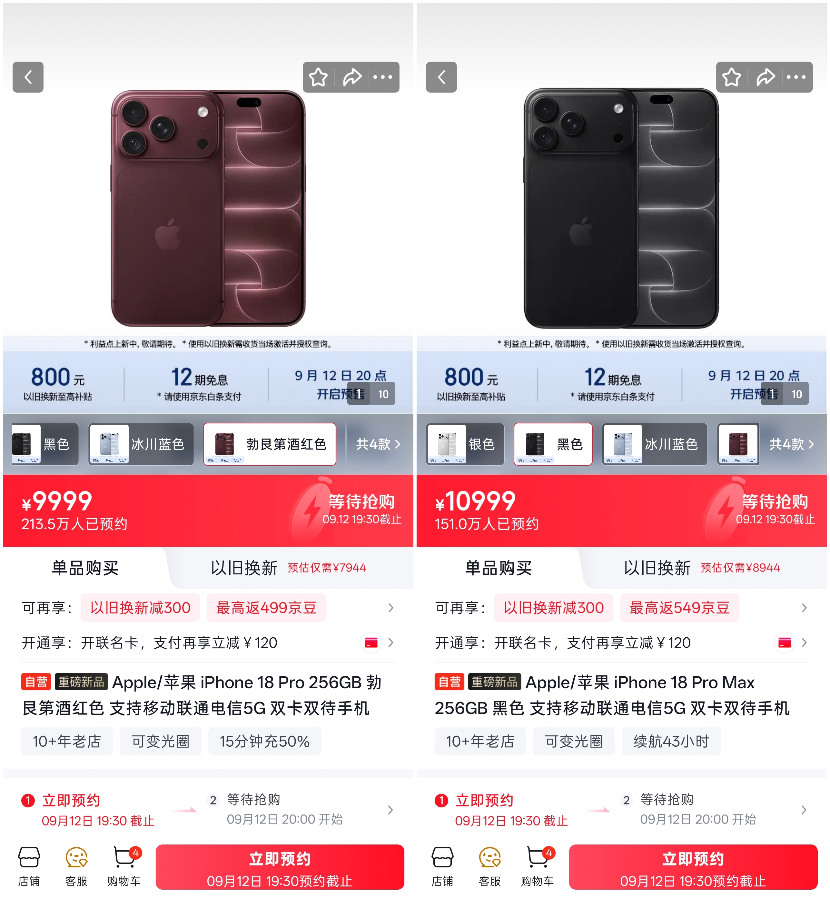

La preventa del iPhone 18 Pro arranca mañana en China y la acogida no parece resentirse por el precio. Según los datos recogidos por el medio chino **MyDrivers** en la tienda oficial de JD, las dos variantes Pro acumulan más de **3,5 millones de reservas** antes incluso de que se abra el plazo de compra, que empezará a las 20:00 hora local (14:00 en la península).

El desglose es llamativo: el iPhone 18 Pro suma alrededor de **2,13 millones de reservas** y el iPhone 18 Pro Max supera los **1,5 millones**. Todo ello con un precio de partida de **9.999 yuanes**, unos **1.000 yuanes más** que el iPhone 17 Pro de la generación anterior (alrededor de 1.200 euros según el cambio aproximado actual, aunque el precio en España no tiene por qué coincidir con el chino).

## Reservas masivas pese a la subida de precio

Lo interesante del caso es que la subida de precio no ha frenado el interés. En un mercado donde la competencia local —Huawei, Xiaomi, vivo u OPPO— aprieta con márgenes agresivos, que Apple mantenga ese volumen de intención de compra dice bastante sobre la fortaleza de su marca entre los usuarios de gama alta.

Conviene leer la cifra con matices: las reservas en JD no son compras confirmadas. Es habitual que una parte se caiga cuando llega el momento de pagar, y también que los revendedores inflen los números con pedidos especulativos. Aun así, el orden de magnitud marca tendencia y anticipa una demanda muy alta para el primer fin de semana.

## A20 Pro, pantallas ProMotion y más autonomía

En el plano técnico, MyDrivers confirma que ambos modelos montan el **A20 Pro** y arrancan con **256 GB** de almacenamiento base. La diferencia entre los dos pasa por el tamaño: **6,3 pulgadas** para el iPhone 18 Pro y **6,9 pulgadas** para el Pro Max, con **120 Hz ProMotion** en los dos casos.

La autonomía es otro de los puntos destacados. Apple declara hasta **34 horas de reproducción de vídeo** en el modelo pequeño y hasta **43 horas** en el Pro Max, lo que refuerza el argumento de quienes prefieren el formato grande: más batería sin renunciar a prestaciones.

## Cámara de apertura variable y una isla dinámica más útil

El salto fotográfico llega con una **cámara principal de 48 megapíxeles** en toda la serie Pro y, sobre todo, con un **diafragma de apertura variable** con cuatro posiciones: **f/1.48, f/1.8, f/2.8 y f/4.0**. Este mecanismo cambia el diámetro de paso de la luz mediante una estructura física, de modo que en escenas oscuras se puede abrir al máximo para captar más luz y reducir el ruido, mientras que en exteriores luminosos conviene cerrarlo para controlar la profundidad de campo.

La otra novedad es la **Dynamic Island**, que ahora puede mostrar **hasta tres actividades en directo simultáneas**. Mantiene el soporte de Face ID para desbloquear el teléfono, validar pagos e iniciar sesión en aplicaciones.

## Qué significa para el comprador español

China es el termómetro que Apple suele mirar antes de encarar el resto de mercados, y estos números apuntan a una demanda sostenida incluso con precios al alza. Para el lector español, la lectura práctica es doble: por un lado, anticipa que las variantes Pro volverán a ser las más difíciles de conseguir en las primeras semanas; por otro, deja la duda de si el aumento aplicado en China se trasladará íntegro a Europa o si Apple lo modulará según la competencia local.

Lo que no cambia es la estrategia: specs incrementales, un salto real en fotografía y una experiencia de software cada vez más integrada. Habrá que ver si ese equilibrio basta para justificar el sobreprecio en un mercado europeo donde el gasto en móviles se ha vuelto más prudente.
