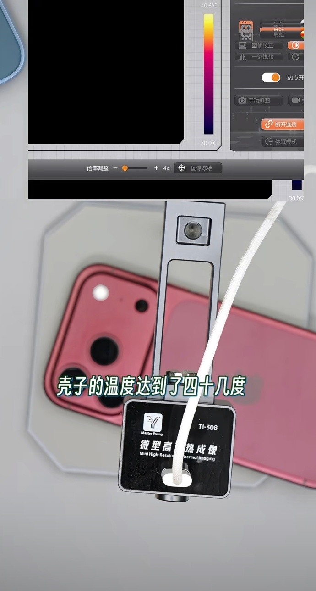
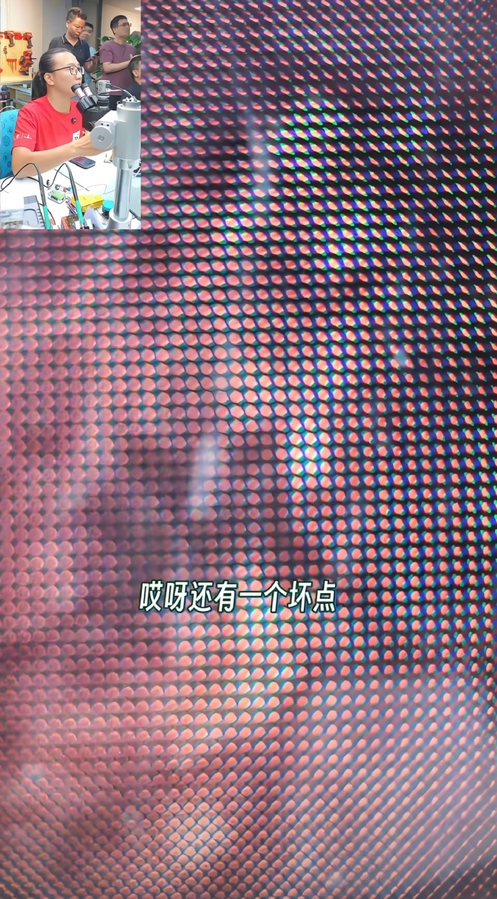
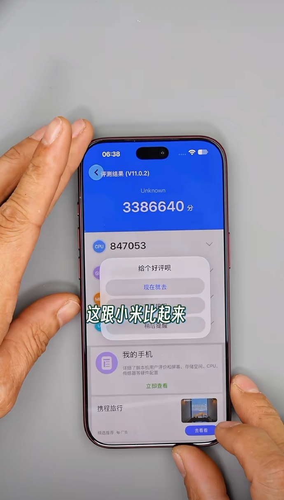

El iPhone 18 Pro acaba de llegar a las tiendas y ya tiene su primer desmontaje público. Lo hizo en directo el reparador chino **Yang Changshun**, un conocido técnico de electrónica de consumo que, además de mostrar a su audiencia cada componente del interior del teléfono, aprovechó la sesión para intentar una ampliación de almacenamiento de 256 GB a 1 TB. El resultado fue un repaso con dos caras: una parte interna que le pareció un salto real y varias críticas sobre la experiencia de uso y el rendimiento.

## Un interior que sí le convenció

Lo que más le llamó la atención fue el sistema de disipación. Según su desmontaje, la cámara de vapor (*VC*) del iPhone 18 Pro ocupa casi toda la superficie interna del chasis, un cambio drástico frente a la generación anterior, cuyo módulo de refrigeración se limitaba a una franja estrecha en la zona central. El reparador describió esta pieza como la mayor que ha visto dentro de un teléfono en toda su trayectoria profesional.

El segundo cambio estructural que destacó afecta al chip **A20 Pro**: por primera vez, Apple separa el empaquetado de la CPU y el de la memoria RAM en lugar de apilarlos. El objetivo es evitar que la memoria quede sometida de forma constante al calor residual del procesador. Con una ruta de evacuación más directa, el técnico consideró que el potencial de este A20 Pro es el mayor que ha visto en un chip de la serie A.

## Apertura variable y un defecto en su pantalla

En el lado de las críticas, Yang señaló que el mecanismo de **apertura variable** de la cámara no se siente igual de fino que el de las soluciones equivalentes de Huawei y Xiaomi: describió un movimiento a saltos durante la apertura y el cierre, menos fluido que el de sus competidores. Es un detalle de tacto y no una afirmación sobre la calidad de las fotos, pero marca una diferencia frente a rivales que llevan más tiempo con este tipo de mecánica.

El hallazgo más incómodo fue un defecto en la pantalla de la unidad que abrió: píxeles muertos de fábrica. Conviene subrayarlo con claridad: se trata de **una sola unidad**, la que le tocó en suerte al reparador, y no de un problema generalizado del modelo. Un desmontaje aislado no permite extrapolar la tasa de fallos de una producción completa; solo documenta lo que le ocurrió a ese ejemplar concreto.

## Menos AnTuTu que el XRING O3 de Xiaomi

La sesión incluyó una prueba de rendimiento con AnTuTu. La unidad desmontada no llegó a los 3,4 millones de puntos, una cifra que queda por debajo de los más de 5 millones que alcanza el **Xiaomi XRING O3**, el chip de diseño propio de Xiaomi que la marca monta en su gama alta. Es decir, en esa prueba sintética el A20 Pro no logra acercarse al máximo exponente del ecosistema Android.

Hay que leer ese dato con cautela. AnTuTu es una prueba sintética y las comparaciones entre plataformas distintas nunca son equivalentes al cien por cien, porque el sistema operativo, la gestión térmica y la propia versión de la herramienta influyen en el resultado. Aun así, la diferencia es lo bastante amplia como para que el propio reparador la señalara como una decepción en términos de rendimiento teórico.

## El reto fallido y la lectura para el comprador

El momento más esperado de la retransmisión era la ampliación de almacenamiento. Yang probó varias vías para llevar un modelo de 256 GB hasta 1 TB, pero ninguna funcionó: según explicó, no consiguió superar el sistema de verificación de cifrado por hardware que Apple ha reforzado en esta generación. El fallo apunta a una tendencia clara en el sector: cada vez resulta más difícil modificar el almacenamiento de un iPhone, lo que empuja al usuario a pagar por la capacidad de fábrica.

En conjunto, este desmontaje es una foto fija, no un veredicto. Deja dos ideas útiles: la refrigeración y el nuevo empaquetado del A20 Pro parecen avances genuinos, mientras que el tacto del mecanismo de apertura y el rendimiento en AnTuTu son los puntos que generan dudas. Y recuerda algo importante en plena temporada de lanzamientos: un defecto detectado en una unidad de prensa o de un técnico es una señal para estar atentos, no una conclusión sobre todo el modelo. Quien esté pensando en comprarlo debería esperar a los análisis de unidades de producción y a los reportes de calidad de los primeros lotes.
