Apple presentó la apertura variable como una de las grandes novedades fotográficas del iPhone 18 Pro y del iPhone 18 Pro Max, y el periodista de TechRadar Lance Ulanoff quiso comprobarla en cuanto tuvo en sus manos el modelo Max en color negro. Su conclusión, después de salir a disparar el primer día, es que la función puede transformar la fotografía con iPhone. Conviene aclarar que se trata de una impresión personal del autor y de una primera toma de contacto, no de un análisis de laboratorio.

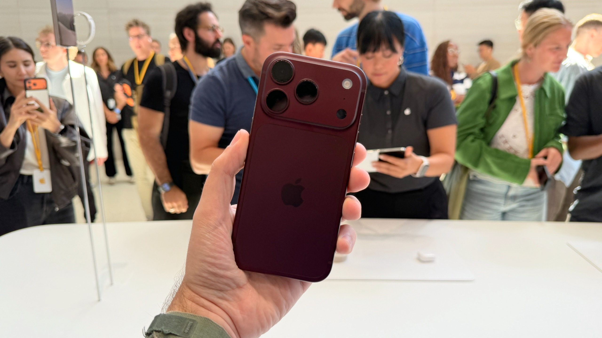

*El iPhone 18 Pro y el iPhone 18 Pro Max. Imagen: Jacob Krol / Future.*

## Qué hace la apertura variable (y por qué importa)

Para entender qué aporta esta función conviene pensar en el ojo. Cuando alguien entrecierra los ojos para leer algo de cerca, está cerrando la pupila: entra menos luz, pero se descarta la luz más dispersa y la imagen gana nitidez. Con la pupila muy abierta ocurre lo contrario: entra mucha más luz, pero esa luz llega dispersa y los objetos lejanos pierden foco.

En una cámara pasa algo muy parecido. Una apertura muy abierta —los números f más bajos— deja entrar mucha luz, pero solo mantiene enfocado lo que está cerca; de ahí nace el desenfoque de fondo, el llamado bokeh. Una apertura más cerrada —números f más altos— reduce la cantidad de luz, pero mantiene enfocados más elementos de la escena a distintas distancias. Ese es, en esencia, el control que gana el usuario: decidir cuánto entra en foco y cuánto se difumina, sin depender solo del software.

En el iPhone 18 Pro Max, según detalla el autor, la apertura variable está presente únicamente en el objetivo principal de 48 MP. El teleobjetivo 4x y el ultra gran angular de 48 MP mantienen apertura fija, ƒ/2.8 y ƒ/2.2 respectivamente. El principal, en cambio, ofrece modo Auto y cuatro valores: ƒ/1.48, ƒ/1.8, ƒ/2.8 y ƒ/4.0. Es un rango amplio, aunque no alcanza el de una cámara réflex, capaz de cerrar hasta ƒ/11 para lograr un foco profundo o para capturar objetos muy brillantes como la Luna en la noche.

No se trata de aperturas simuladas por software: el objetivo principal monta un conjunto de láminas entrelazadas más finas que un cabello humano que se deslizan unas sobre otras cuando la apertura se abre o se cierra. El autor lo describe como una maravilla de la ingeniería y señala que, con la luz adecuada, es posible verlas ajustarse.

## Software contra hardware: la hoja que lo convenció

La duda razonable es para qué hace falta un mecanismo físico si los iPhone incorporan modo Retrato desde hace años. El autor recuerda que, en sus inicios, ese modo combinaba información de los objetivos gran angular y teleobjetivo para crear el efecto de desenfoque, y que con el tiempo Apple pasó a analizar la imagen por software para lograrlo con un solo objetivo. El resultado, en su opinión, es vistoso y suficiente para la mayoría.

Su objetivo fue precisamente comparar ese modo Retrato con la fotografía de apertura variable, es decir, software contra hardware. Su ajuste preferido fue ƒ/1.48. También probó otros valores, aunque advierte que, a plena luz del día, el efecto de desenfoque en ƒ/1.8 y ƒ/2.8 resulta bastante sutil. Para acceder a la función hay que abrir el menú de cuadrícula en la aplicación de cámara, elegir Aperture y seleccionar la apertura deseada.

El autor fotografió a sí mismo, a estatuas y a una hoja seca. Fue la comparación de esa hoja con la misma toma en modo Retrato lo que lo convenció. En sus palabras, el modo Retrato tuvo problemas con la hoja curvada: el tallo casi desaparecía. En la toma con apertura variable, en cambio, la hoja aparecía completa y la imagen se veía natural, sin que el teléfono intentara separar el sujeto del fondo mediante software. El fondo queda desenfocado, aunque no tanto como con los ajustes predeterminados del modo Retrato.

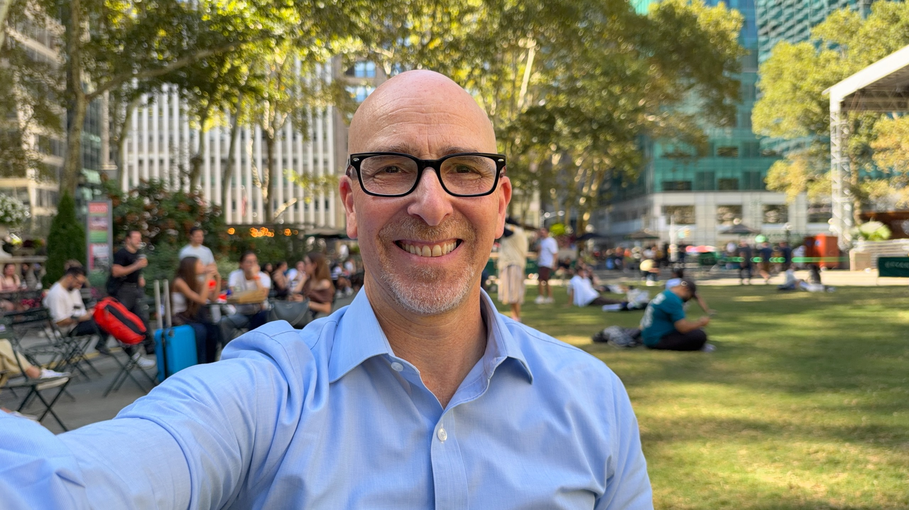

*Apertura variable en el iPhone 18 Pro Max. Imagen: Lance Ulanoff / Future.*

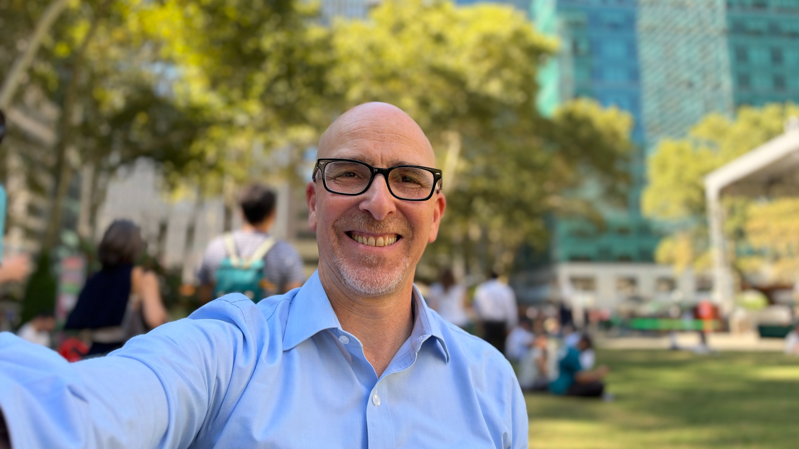

*Modo Retrato del mismo motivo. Imagen: Lance Ulanoff / Future.*

Con los autorretratos observó algo similar: el modo Retrato insiste más en el desenfoque del fondo, pero al ser en buena parte computacional deja artefactos. En concreto, señala que el espacio entre la varilla derecha de sus gafas y la cabeza quedaba curiosamente nítido, y que el nivel de desenfoque predeterminado lo separaba del entorno. En el caso de la estatua de Gertrude Stein, el modo Retrato favorece algo más a la figura, aunque el autor sigue prefiriendo el desenfoque más realista de la apertura variable.

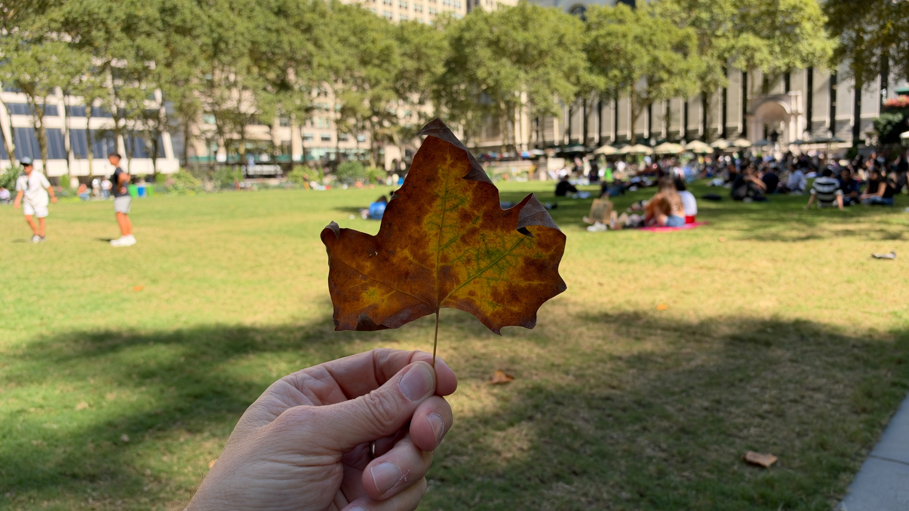

*Apertura variable. Imagen: Lance Ulanoff / Future.*

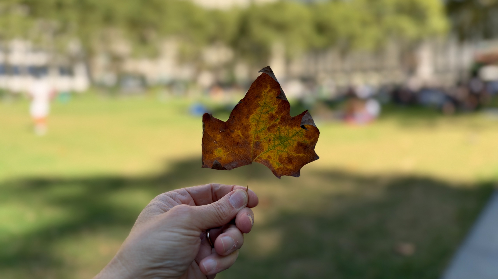

*Modo Retrato. Imagen: Lance Ulanoff / Future.*

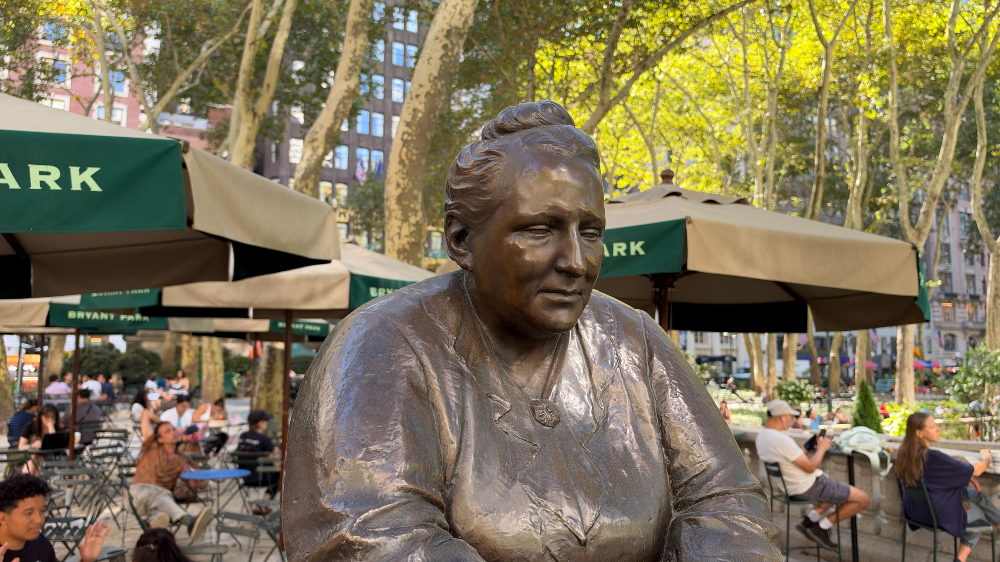

*Apertura variable. Imagen: Lance Ulanoff / Future.*

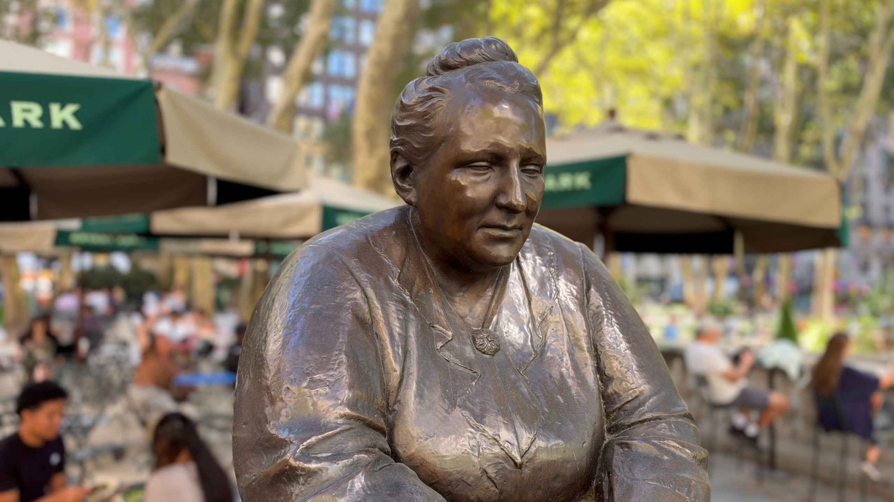

*Modo Retrato. Imagen: Lance Ulanoff / Future.*

## Controles de nivel Pro y los límites del formato

Más tarde, el autor combinó la apertura con el resto de controles manuales: velocidad de obturación, exposición y enfoque. Existen límites en todas esas herramientas, pero, como explica, son los propios de una cámara de móvil. Sin un sensor mucho más grande y sin más espacio entre el objetivo, la apertura, el obturador y el sensor, hay un techo para lo que se puede conseguir.

Aun así, se declara impresionado: sus tomas con apertura variable se acercan más que nunca a la fotografía de nivel profesional, y los controles adicionales le resultaron muy entretenidos de usar. Estas son algunas de las imágenes que capturó combinando ajustes:

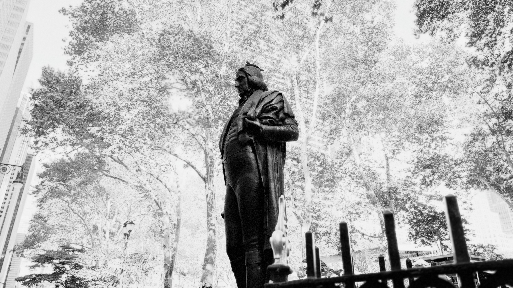

*Velocidad 1/223 s con f/1.8. Imagen: Lance Ulanoff / Future.*

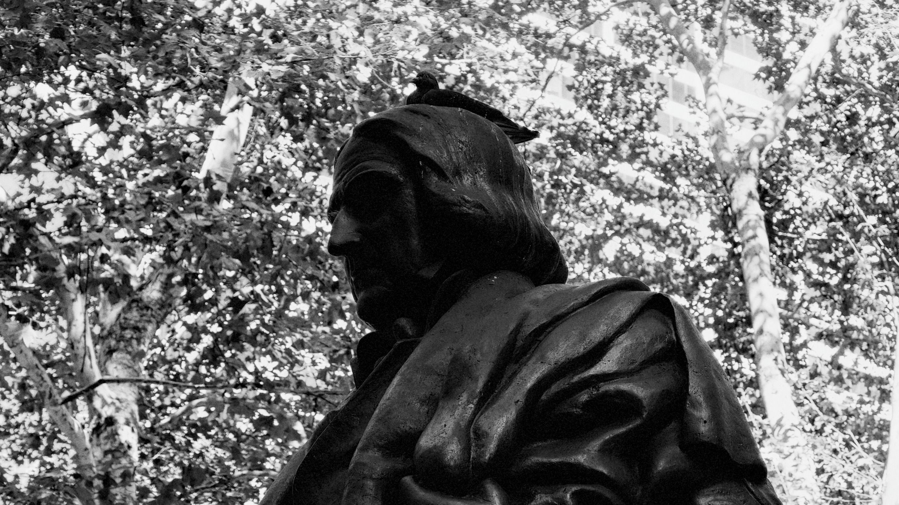

*Velocidad 1/121 s con f/2.8. Imagen: Lance Ulanoff / Future.*

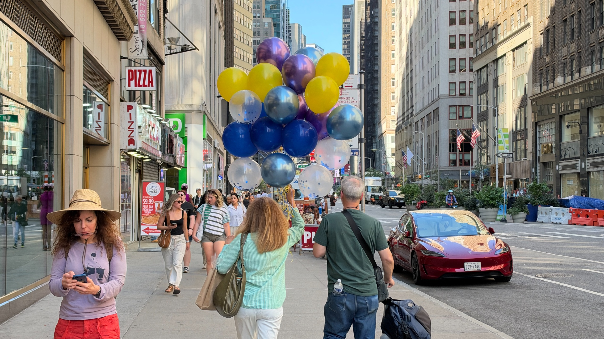

*Velocidad 1/602 s con f/1.8. Imagen: Lance Ulanoff / Future.*

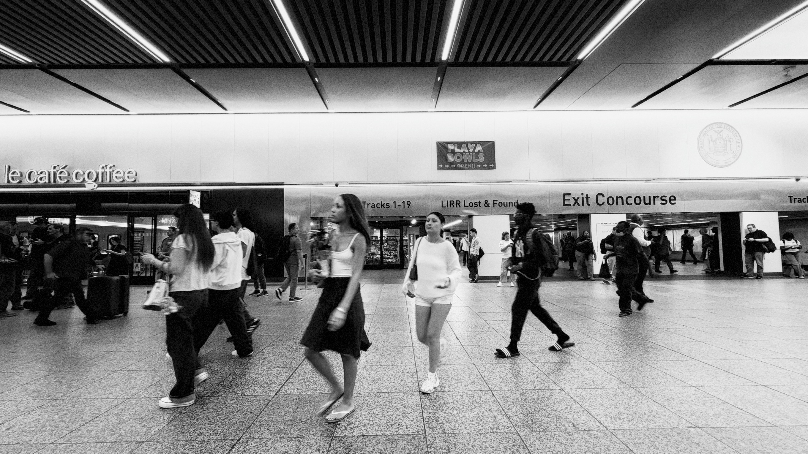

*f/2.2 con una velocidad lenta de 1/60 s. Imagen: Lance Ulanoff / Future.*

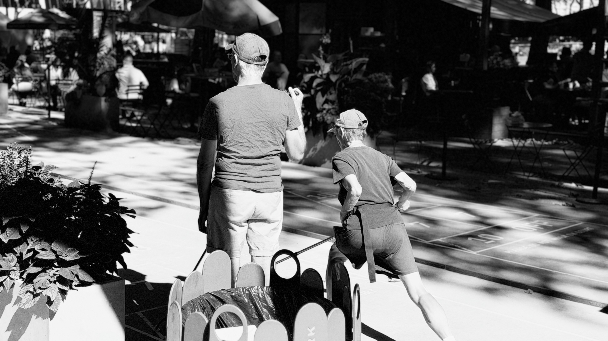

*Alta velocidad: 1/2088 s con f/1.48. Imagen: Lance Ulanoff / Future.*

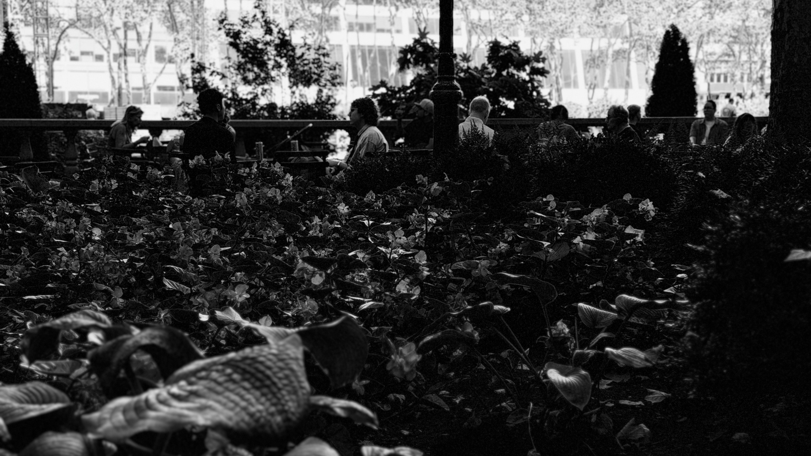

*Con mucha sombra, 1/693 s y f/1.48. Imagen: Lance Ulanoff / Future.*

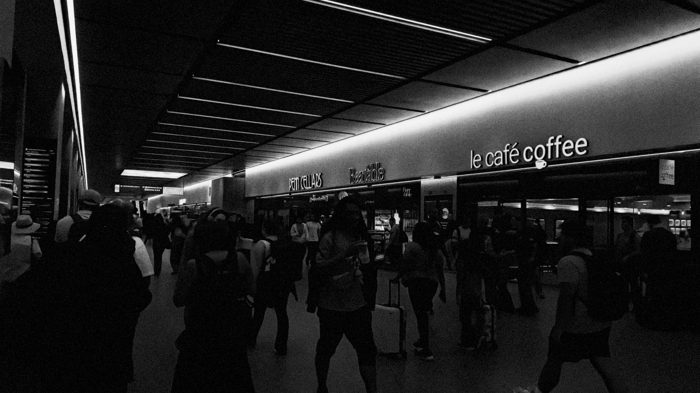

*f/1.48 con una velocidad muy alta de 1/14286 s. Imagen: Lance Ulanoff / Future.*

## Qué cambia para el fotógrafo de móvil

La conclusión del autor es que la apertura variable no es un adorno de ficha técnica, sino una herramienta que devuelve al móvil algo que hasta ahora se resolvía por software: el control físico de la profundidad de campo. En sujetos con bordes complejos, como una hoja curvada o el contorno de unas gafas, ese control marca la diferencia entre un recorte artificial y un resultado natural.

El matiz, y el propio autor lo señala, es que la función tiene un alcance limitado: hay una sola apertura variable y está solo en el objetivo principal. Le habría gustado disponer de más valores f en el teleobjetivo para exprimir el retrato a distancia. Se trata, en todo caso, de una valoración personal basada en un primer día de uso, no de una medición objetiva; sirve como referencia de hacia dónde apunta la fotografía móvil, pero no sustituye a una prueba a fondo.
