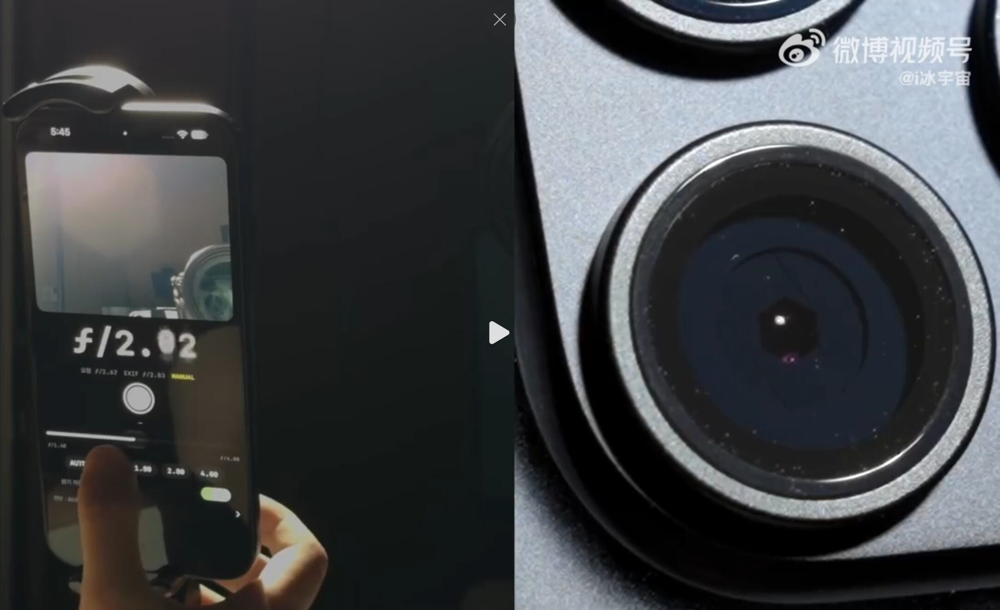
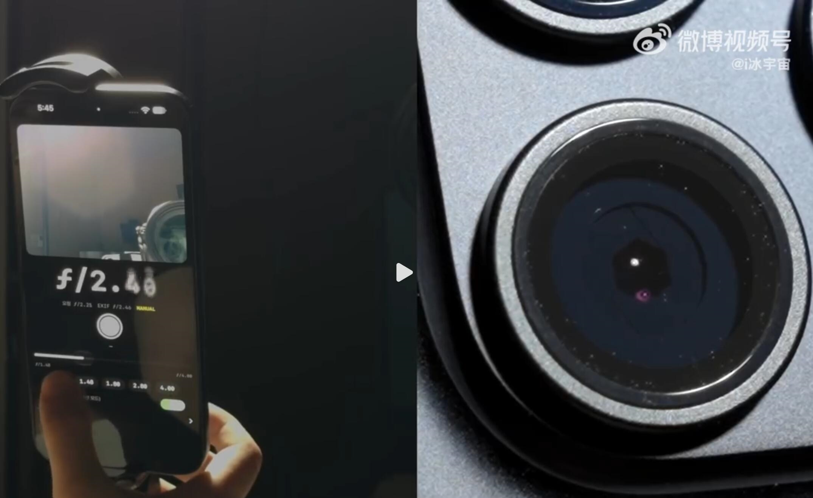
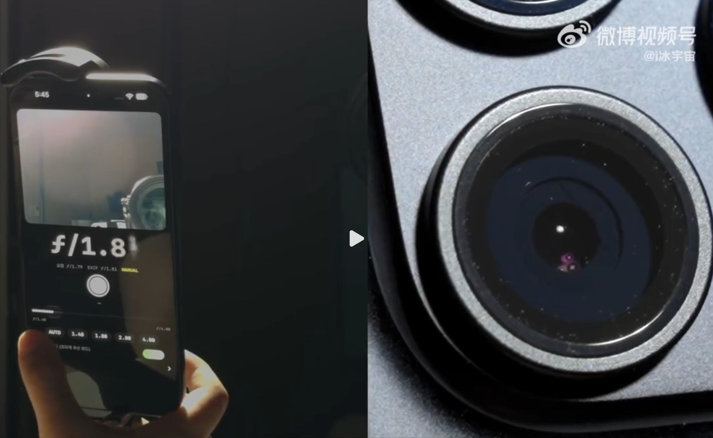
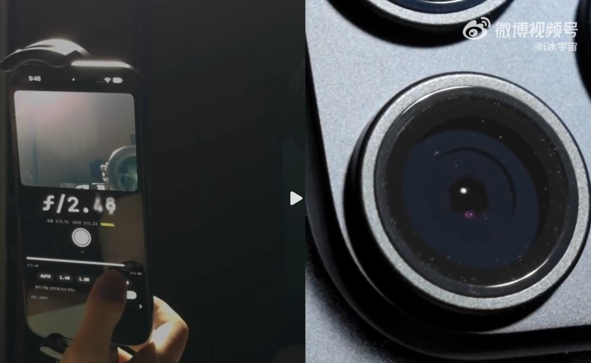

La apertura variable ha sido uno de los grandes reclamos del iPhone 18 Pro y del iPhone 18 Pro Max. Es la primera vez que un iPhone incorpora un diafragma mecánico de seis palas que se abre y se cierra para dejar pasar más o menos luz hasta el sensor de la cámara principal. La cámara del sistema, sin embargo, solo permite elegir entre cuatro valores fijos: f/1.48, f/1.8, f/2.8 y f/4.0. Un mod de terceros ha ido un paso más allá y ha abierto la puerta a un ajuste manual más fino.

## Una app de terceros, no una función oficial

Apple puso a disposición de los desarrolladores una API para controlar la apertura del iPhone 18 Pro y, según la compañía, esa interfaz da acceso a todo el rango del diafragma, no solo a los cuatro valores que muestra su cámara. La primera aplicación que ha aprovechado esa capacidad es **Blackmagic Camera**, la app gratuita de captura de vídeo de Blackmagic Design, la compañía detrás de DaVinci Resolve. Su versión 3.5, publicada el 18 de septiembre, añadió compatibilidad con los iPhone 18 Pro y Pro Max junto a una función que sus notas describen de forma literal: controlar la apertura variable de la cámara Fusion principal de 48 MP para ajustar la profundidad de campo y la exposición.

Conviene aclarar que no se trata de un jailbreak ni de una modificación del sistema operativo. La app se apoya en una interfaz pública que Apple habilitó para los desarrolladores, y es precisamente ese acceso lo que permite a un programa de terceros ofrecer valores intermedios entre los cuatro escalones de la cámara nativa.

El resultado se ha visto en una demostración en vídeo difundida en Weibo por la cuenta @冰宇宙 (Ice Universe), en la que el usuario mueve un control deslizante de apertura y obtiene valores como f/2.02, f/2.46 o f/2.48, además de comprobar cómo las palas del diafragma se desplazan físicamente al cambiar el ajuste.

La demostración confirma que el ajuste manual es posible, pero no resuelve todas las dudas. Blackmagic no precisa en sus notas si su aplicación permite valores continuos entre los cuatro escalones ni si la apertura puede cambiarse durante una grabación, y Apple tampoco ha documentado ninguno de esos dos puntos. Lo que sí está claro es que la función existe, que es una app de terceros —y no una opción del sistema— quien la ofrece, y que el vídeo muestra valores que la cámara nativa no expone.

## Qué aporta controlar la apertura a mano

El diafragma funciona de forma parecida al iris de un ojo: cuanto más se abre, más luz entra y menor es la profundidad de campo; cuanto más se cierra, menos luz pasa y más zonas de la escena quedan enfocadas. Poder elegir ese valor a mano cambia el resultado en varios escenarios.

- **Con poca luz, abrir a f/1.48** deja entrar más luz, lo que permite bajar el ISO y reducir el ruido en las imágenes nocturnas o en interiores con luz escasa.
- **Con mucha luz, cerrar a f/4.0** ayuda a evitar la sobreexposición y mejora la resolución en los bordes del encuadre.
- **Con el diafragma abierto** el desenfoque del fondo es más acusado y natural, sin el efecto de recorte que a veces produce el desenfoque simulado por algoritmos en los retratos.
- **Con el diafragma cerrado** aumenta la profundidad de campo, útil para fotografiar documentos o grupos en los que las personas situadas en distintas filas deben quedar nítidas.

A eso se suma que el valor de apertura puede combinarse con otros controles manuales, como la velocidad de obturación o el balance de blancos, para decidir el aspecto final de la foto. Para el aficionado a la fotografía, el interés está en recuperar un control óptico que hasta ahora en el iPhone quedaba en manos del procesamiento automático.

## Qué cambia para el lector hispanohablante

Lo primero es acotar el alcance: esta función depende de un hardware concreto. Solo la cámara principal de 48 MP del iPhone 18 Pro y del iPhone 18 Pro Max tiene apertura variable; la ultra gran angular se queda en f/2.2 y el teleobjetivo en f/2.8, ambas fijas, así que el control manual se aplica únicamente con el objetivo principal seleccionado.

También conviene moderar las expectativas. El rango completo va de f/1.48 a f/4.0, poco menos de tres pasos, de modo que los valores intermedios son graduaciones más finas dentro de ese margen, no un abanico infinito de posibilidades. Para la mayoría de usuarios, la cámara nativa con sus cuatro valores —o directamente el modo automático— seguirá siendo suficiente. El atractivo de este mod es de nicho: quien quiera un control más preciso en vídeo o en situaciones de luz difíciles lo agradecerá, pero no convierte al iPhone en una cámara con diafragma continuo como el de una cámara sin espejo.

El episodio, en todo caso, apunta a una tendencia: con Huawei y Apple adoptando el diafragma mecánico en sus teléfonos, la apertura variable gana peso como dirección del sector de la imagen móvil. Que Apple haya abierto la API significa que Blackmagic Camera probablemente no será la última aplicación en aprovecharla. No hay que esperar, sin embargo, una función del sistema: mientras el gigante de Cupertino no la incorpore a su cámara, el ajuste fino seguirá siendo cosa de apps de terceros.
