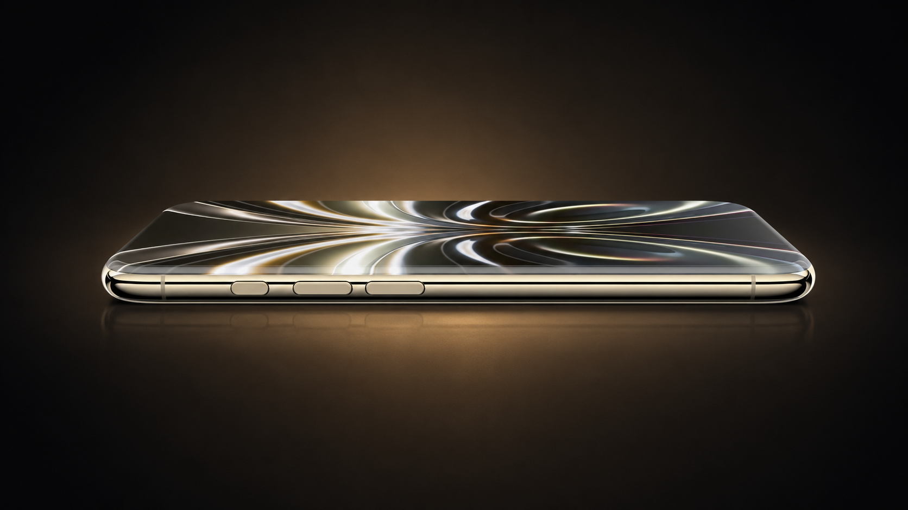

El filtrador chino Digital Chat Station (数码闲聊站) ha publicado las que serían las primeras especificaciones de pantalla de la serie iPhone 20 Pro, la generación que Apple prepararía para 2027. Según su mensaje en Weibo, la compañía estaría probando dos tamaños de panel y un acabado sin bordes que cambiaría de forma notable el frontal del teléfono.

Conviene subrayarlo desde el principio: se trata de información de un filtrador, no de Apple. La propia fuente sitúa los datos en una fase temprana de pruebas, así que las cifras todavía pueden moverse antes de que exista un producto final.

## Las pantallas del iPhone 20 Pro que se estarían probando

El filtrador detalla dos modelos con sus diagonales y resoluciones aproximadas:

| Modelo | Diagonal | Resolución |
| --- | --- | --- |
| iPhone 20 Pro | 6,41" (±) | 2686 × 1236 (±) |
| iPhone 20 Pro Max | 6,96" (±) | 2912 × 1340 (±) |

El símbolo «±» que acompaña a cada valor no es un adorno: indica que las cifras aún tienen margen de variación. Si se confirman, el modelo pequeño crecería respecto al iPhone 18 Pro, que se queda en 6,3 pulgadas, y el grande rozaría el umbral de las 7 pulgadas.

Precisamente sobre ese límite habló Digital Chat Station en los comentarios de su publicación. Según explicó, el iPhone 18 Pro Max tiene un panel físico de 6,86 pulgadas que Apple vende como 6,9; el futuro iPhone 20 Pro Max mediría 6,96 pulgadas, de modo que la compañía podría anunciarlo directamente como un teléfono de 7 pulgadas.

## Un frontal sin bordes que no es una pantalla curva al uso

El cambio de forma es, quizá, la parte más llamativa del filtro. La serie iPhone 20 Pro estaría probando un diseño «sin bordes de cuatro curvas», es decir, con los cuatro lados del frontal fundidos con el chasis. La fuente aclara que eso no implica volver a las pantallas curvas de generaciones pasadas: la apuesta sería un panel plano 2D cubierto por un cristal especial, cuya forma y refracción óptica generarían la sensación de que la pantalla llega hasta el borde físico.

A ese efecto se sumaría la interfaz «Liquid Glass» que Apple ha ido extendiendo por sus sistemas, pensada para reforzar la idea de una superficie de cristal continua. El resultado buscado sería un frontal que se lee como una sola pieza, sin marcos visibles y con la cámara frontal reducida a un orificio cada vez más pequeño: la llamada isla dinámica reducida, o «mini Dynamic Island».

## Por qué Apple se saltaría el iPhone 19

Otra de las preguntas que surgieron en la publicación fue el nombre del dispositivo. Un usuario preguntó por el iPhone 19 y el filtrador respondió que la información procedente de la cadena de suministro apunta a que Apple se saltará esa generación: los iPhone de 2027 se llamarían directamente 20. La coincidencia no es casual, porque 2027 marca el vigésimo aniversario del primer iPhone y una cifra redonda encaja mejor con una campaña de aniversario que un 19 de transición.

## Qué falta por confirmar

Todo esto sigue siendo material de laboratorio. Digital Chat Station insiste en que los paneles están en fase de prueba y en que el tamaño final, la resolución y la forma pueden cambiar. No es un detalle menor: en generaciones anteriores ya se habló de pantallas más grandes hasta poco antes del anuncio. Para el lector, la conclusión práctica es que estamos ante una hoja de ruta y no ante una ficha técnica cerrada.

El iPhone 18 Pro, [presentado el 10 de septiembre de 2026 con el chip A20 Pro de 2 nm](/noticias/apple-a20-pro-iphone-18-pro-benchmark/), sigue siendo la referencia con la que comparar estas filtraciones. Si la hoja de ruta se cumple, quien renueve en 2027 se encontraría con uno de los mayores cambios de frontal en años, a la espera de saber hasta dónde llega la apuesta de Apple por el plegable [iPhone Duo](/noticias/apple-vp-iphone-duo/).
