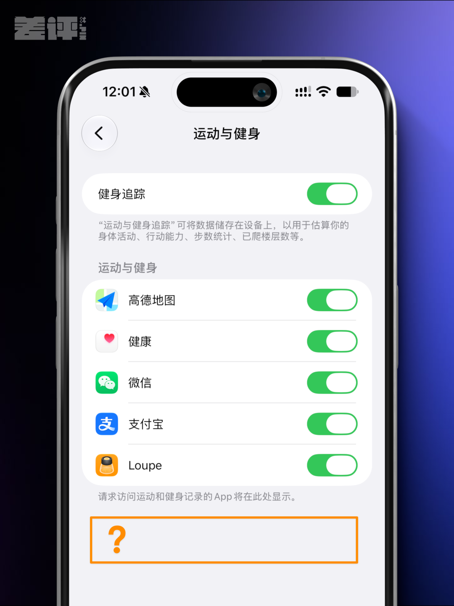
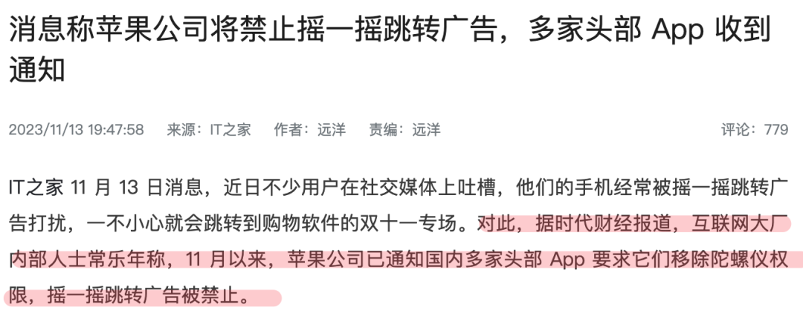
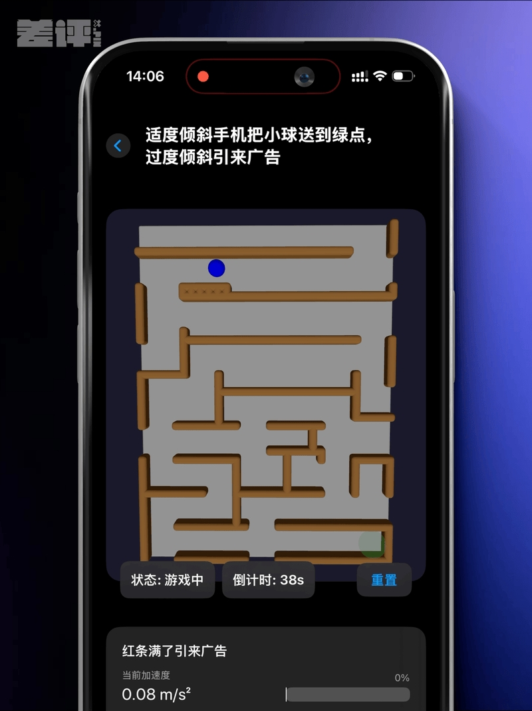
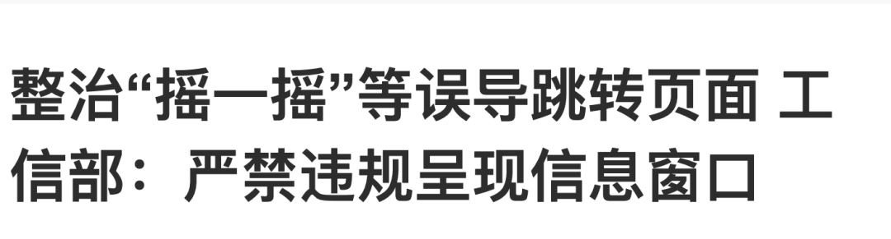
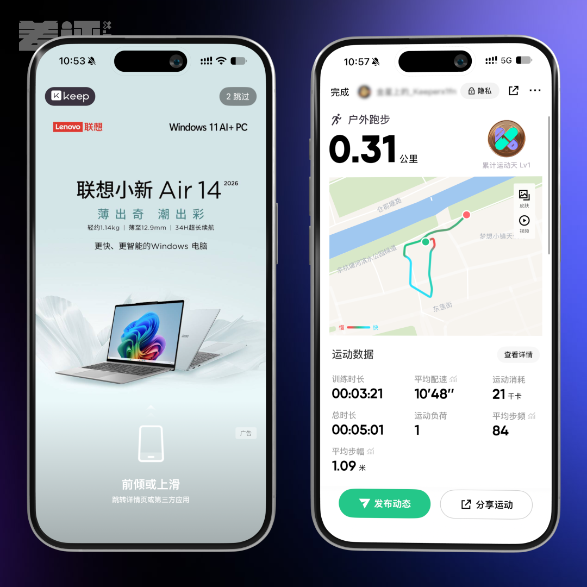

Apple ha introducido en la segunda beta de **iOS 27.2** para desarrolladores un interruptor llamado **Restrict Motion Data**. Se encuentra en Ajustes, dentro de Privacidad y seguridad, en la sección de movimiento y actividad física (Motion & Fitness), y la propia pantalla del sistema lo explica sin rodeos: las apps que se añaden a esa lista dejan de tener acceso a los datos de movimiento del teléfono. El efecto que interesa a millones de usuarios llega por la vía indirecta: sin acelerómetro ni giroscopio, una aplicación ya no puede saber que has agitado el dispositivo, así que la publicidad que salta al mover el móvil se queda sin su señal. La novedad llegó en la misma tanda de betas que ya cubrimos al hablar de la [segunda ola de iOS 27.2](/noticias/apple-beta-2-wave-watchos-27-2/).

## Qué cambia al activar Restrict Motion Data

La mecánica es sencilla: se abre una lista y se van añadiendo aplicaciones una a una. El texto de acompañamiento del sistema es explícito —«Apps added to this list will not have access to motion data»— y conviene subrayar una diferencia importante respecto a los permisos convencionales. No hay una ventana de tiempo ni una excepción por tipo de uso: si la app entra en la lista, deja de recibir los datos del sensor mientras siga ahí.

Los anuncios que nos ocupan, conocidos en China como «摇一摇» (literalmente, «agitar y agitar»), funcionan justo al revés. Al abrir la aplicación aparecen unos pocos segundos de pantalla de presentación y basta un movimiento muy leve —un giro de muñeca, el traqueteo de un autobús o el temblor del metro— para que el sistema interprete una intención de «abrir» y salte a una tienda, a un vídeo o a una web promocional. Al cortar el acceso a los sensores de movimiento, ese gesto deja de existir en términos de datos y el salto no se produce. En España este formato de publicidad es menos habitual que en el mercado asiático, pero la mecánica existe y el cambio de Apple apunta directamente a ella.

## Una función que, de momento, solo aparece en China

La comprobación publicada por MyDrivers apunta a que no se trata de un ajuste global. Al cambiar la región de la App Store a Estados Unidos, el nuevo apartado desaparece de los ajustes, lo que sugiere una función de localización pensada para el mercado chino y no una ampliación general del control de privacidad. Conviene recordar el estado del que hablamos: es una beta para desarrolladores, Apple no ha presentado la función de forma oficial y no hay garantía de que llegue tal cual a la versión estable.

El nombre del ajuste se mantiene en inglés, «Restrict Motion Data», incluso con la interfaz del sistema en chino, un detalle habitual en funciones que empiezan a probarse en un solo idioma y una sola región.

## Cinco años de anuncios shake y de presión regulatoria

En China, el problema lleva años sin resolverse del todo. Los fabricantes de Android se adelantaron con permisos específicos: Xiaomi añadió en 2023 un control sobre el sensor de aceleración en sus versiones de desarrollo, y después Huawei, vivo y OPPO incorporaron opciones equivalentes. La de vivo, llamada «prohibir solo en la pantalla de apertura», era especialmente quirúrgica: retiraba el sensor durante los primeros segundos y lo devolvía después. La solución de Apple es más contundente, porque la app entra en una lista negra y pierde el dato de forma permanente mientras siga en ella.

La vía de la presión externa tampoco dio un resultado estable. A mediados de noviembre de 2023 circuló la noticia de que Apple había avisado a varias aplicaciones chinas de primer nivel para que retiraran el permiso del giroscopio y evitaran así el salto publicitario. Las compañías señaladas negaron haber recibido el aviso y Apple no respondió a las consultas, de modo que el episodio quedó en un rumor que se apagó en cuestión de días.

Hubo también quien convirtió el problema en un juego. Una aplicación satírica llamada 摇了么 —pensada para medir lo firme que es el pulso del usuario con la lectura de la aceleración del teléfono— servía para visualizar hasta qué punto el gesto más leve bastaba para disparar la publicidad.

En paralelo, la regulación china fue sumando capas. En 2022 se publicó una norma sectorial que fijaba umbrales de activación para los anuncios de tipo «shake»; en 2023 el Ministerio de Industria y Tecnología de la Información prohibió inducir al salto con movimientos de alta sensibilidad, y este año, antes de la campaña de compras del 18 de junio, volvió a reunir a plataformas y fabricantes para exigir que no se muestren ventanas emergentes de forma indebida. Los anuncios desaparecieron durante un tiempo, pero regresaron cuando bajó el escrutinio.

## Qué ocurre con las apps que sí necesitan los sensores

La duda razonable es qué pasa con las aplicaciones que dependen de verdad del movimiento. La prueba publicada con una conocida app de ejercicio sugiere un impacto limitado: tras incluirla en la lista, el anuncio de apertura dejó de activarse y las métricas de la carrera —ritmo y cadencia— siguieron mostrándose, presumiblemente calculadas a partir de la distancia y el tiempo. Es un indicio, no una garantía: cada aplicación decide qué hace con los sensores que se le conceden y cuál es su plan cuando se los retiran.

Queda por ver si la función llega a la versión estable y si lo hace a tiempo para la próxima gran campaña de compras china. El calendario oficial no está confirmado, y tratándose de una beta conviene no dar por hecho ni el alcance ni el momento en que aterrizará en los iPhone de todo el mundo.
