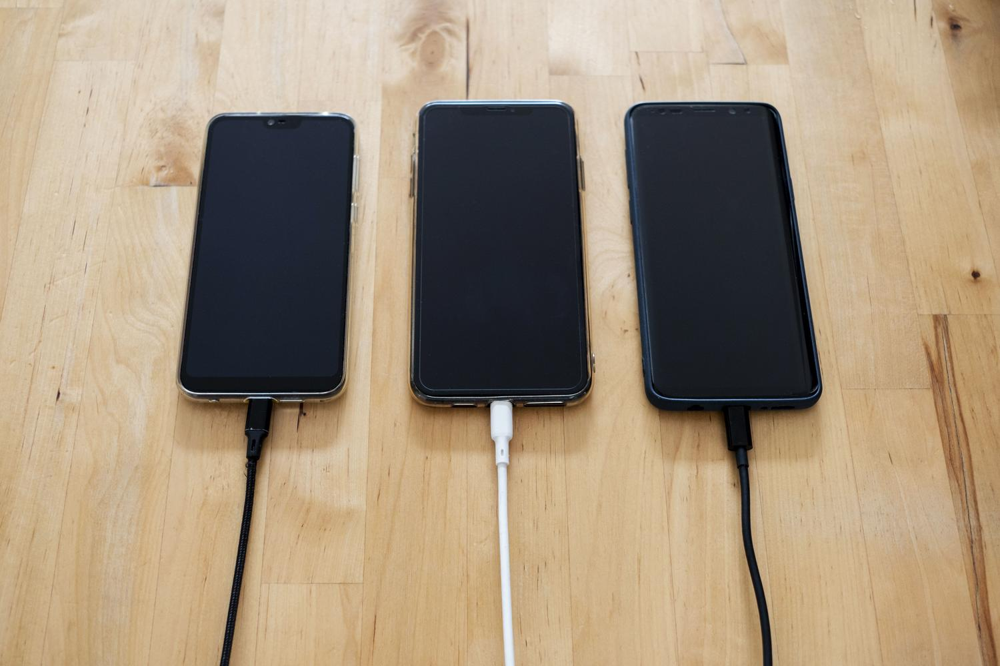
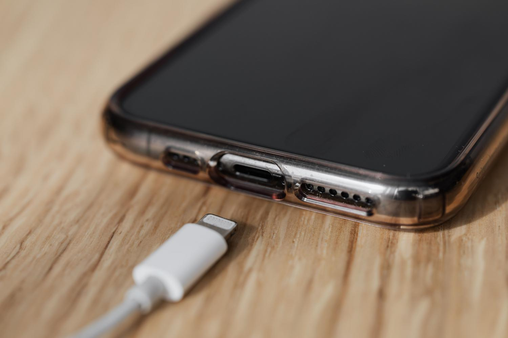
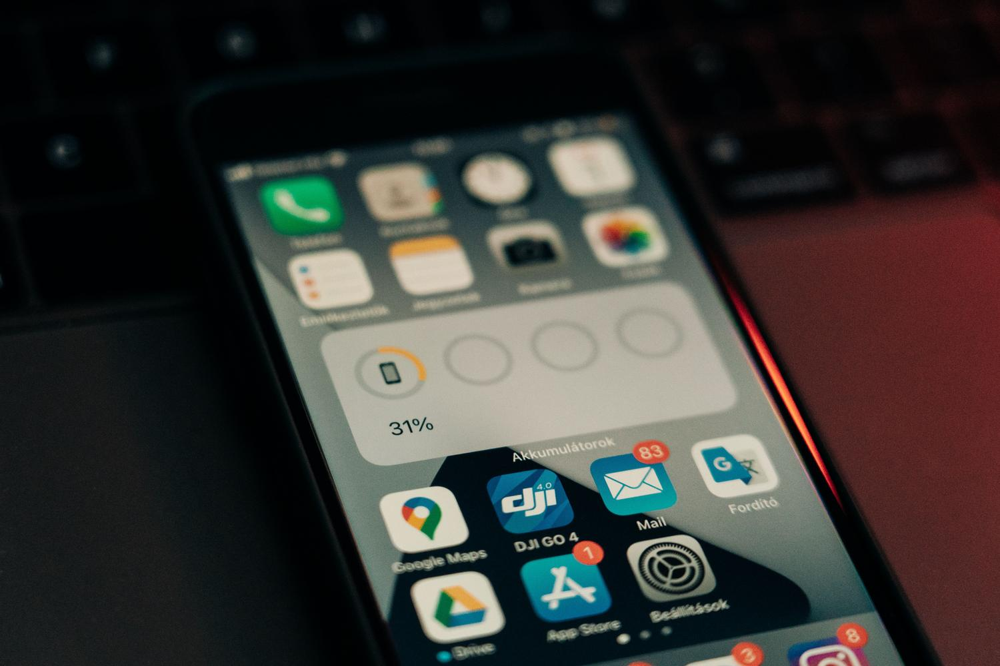

Llegar a media tarde y comprobar que la batería del iPhone ya va por la mitad es una de las frustraciones más habituales con un móvil, porque el teléfono se ha convertido en el centro de mando del día a día. Aunque los modelos recientes incorporan celdas más grandes, la forma en que usamos y cargamos el dispositivo marca la diferencia entre llegar a la noche o quedarse sin energía a las cinco de la tarde.

Todas las baterías de iones de litio son consumibles y pierden eficacia con el tiempo por su envejecimiento químico: no depende solo de cuánto hace que compraste el iPhone, sino de su historial de temperatura y de los patrones de carga que hayas seguido. Esta guía reúne, paso a paso, cómo atacar el problema desde dos frentes: reducir el consumo diario y cuidar la salud del componente a largo plazo.

## Antes de empezar

No hace falta ningún accesorio especial: la mayoría de ajustes se aplican desde el propio iPhone. Ten en cuenta que algunas funciones dependen del modelo o de la versión de iOS:

- El **límite de carga personalizado** está disponible en equipos recientes, como el iPhone 15 y posteriores.
- El **Ahorro adaptativo** requiere iOS 18 o superior.
- El **Always On Display** solo existe en modelos Pro con pantalla siempre activa.

## Paso 1: Cargar entre el 20 % y el 80 %

Si quieres que la salud de la batería se mantenga por encima del 90 % durante más tiempo, evita cargar el móvil al azar y procura que el nivel oscile entre el 20 % y el 80 %. Que el dispositivo llegue al 0 % con frecuencia y dejarlo clavado al 100 % durante horas son dos hábitos que aumentan el estrés químico de la celda.

## Paso 2: Activar la carga optimizada y el límite personalizado

Apple incluye la **Carga optimizada de la batería**, una función que aprende tus rutinas para que el móvil no esté al máximo todo el tiempo y complete el último tramo justo antes de que lo desenchufes. En modelos recientes, como el iPhone 15 y posteriores, además puedes fijar un **límite de carga personalizado** (por ejemplo, al 80 % o al 95 %) para prolongar la vida útil del hardware.

## Paso 3: Usar cables y adaptadores certificados

El equipo con el que das energía al iPhone también importa. Conviene usar **cables certificados y adaptadores originales** y evitar cargadores de baja calidad: un voltaje inestable puede resultar fatal a medio plazo. La carga rápida es cómoda, pero genera más calor, así que si dispones de tiempo, un **cargador estándar** por la noche es una decisión más inteligente para la salud del dispositivo.

## Paso 4: Vigilar la temperatura

El calor es el gran enemigo de la batería. El rango ideal para que el litio trabaje está entre los 16 y los 22 grados. Dejar el móvil al sol o cargarlo debajo de la almohada son errores graves que pueden llegar a hinchar la batería, algo peligroso que incluso puede desplazar la pantalla.

También conviene evitar darle un uso intensivo mientras está enchufado, como jugar a juegos pesados o editar vídeo. Ese **estrés térmico combinado** acelera la degradación química y reduce el rendimiento pico, hasta el punto de que el iPhone puede volverse más lento o apagarse de forma inesperada cuando aún le queda un 20 %.

## Paso 5: Revisar los servicios de localización

Para que la batería dure más cada día hay que revisar qué procesos consumen energía en segundo plano. Uno de los mayores culpables son los **servicios de localización**: no todas las apps necesitan saber dónde estás en cada segundo. Configura su acceso a la ubicación en «Al usarse» o «Nunca» y desactiva los **Lugares importantes** en los ajustes de privacidad. Puedes apoyarte en nuestra guía para [comprobar qué apps del iPhone acceden a tu ubicación](/noticias/iphone-apps-location-access-check/).

## Paso 6: Reducir el consumo de la pantalla

La pantalla es el componente que más gasta. Si tienes un modelo Pro con pantalla siempre activa, considera **desactivar el Always On Display** cuando no le des mucho uso. En pantallas OLED también ayuda usar el **modo oscuro**, ya que los píxeles negros permanecen apagados y no consumen. Ajustar el brillo al nivel más bajo que resulte cómodo o activar el **brillo automático** aporta un ahorro adicional.

## Paso 7: Desactivar funciones que mantienen el equipo despierto

Hay varios ajustes que gastan energía de forma innecesaria y que conviene repasar:

- **Actualizaciones en segundo plano:** desactívalas en las apps que no necesiten refrescar datos constantemente.
- **Oye Siri** y **Levantar para activar:** ambas mantienen el dispositivo en alerta y consumen batería.
- **Conectividad:** el Wi-Fi gasta menos que los datos móviles; con señal débil el móvil se esfuerza más, así que el **modo avión** es un buen aliado en esas situaciones.
- **Notificaciones Push:** configura el correo electrónico en modo manual en lugar de Push para que el dispositivo no consulte el servidor cada pocos segundos.

## Paso 8: Aprovechar el 5G automático y el Ahorro adaptativo

En modelos recientes, activar el **5G automático** permite que el sistema cambie a LTE cuando la velocidad del 5G no aporta una mejora real, con el consiguiente ahorro de energía. Además, con iOS 18 o superior puedes usar el **Ahorro adaptativo**, que predice cuándo necesitarás más batería y ajusta el rendimiento de forma automática.

## Paso 9: Mantener iOS actualizado

Mantener el software al día no es solo cuestión de nuevas funciones, sino de eficiencia. Las **actualizaciones de iOS** suelen incluir parches que optimizan la gestión de la energía y corrigen errores que podrían estar drenando la batería. Si notas que el móvil dura menos justo después de actualizar, ten paciencia: el sistema suele realizar **tareas de indexación en segundo plano** durante unos días antes de estabilizarse.

## Paso 10: Valorar la sustitución de la batería

Si la salud de la batería cae por debajo del 80 %, es probable que empieces a notar que el rendimiento baja. En lugar de cambiar de móvil, **sustituir la batería** es una opción económica y sostenible que puede devolverle la vida al dispositivo durante dos o tres años más, sobre todo teniendo en cuenta el largo soporte de software que ofrece Apple. Como referencia reciente, el precio del cambio de batería fuera de garantía del iPhone 18 Pro [subió a 129 dólares en Estados Unidos](/noticias/iphone-18-pro-battery-replacement-price/).

## Cómo verificar que funcionó

La autonomía mejora de forma acumulativa, así que la comprobación es comparativa y a lo largo de varios días:

- Revisa la **salud de la batería** en los ajustes del iPhone: por encima del 80 % el rendimiento no debería degradarse.
- Compara cuánto aguanta el teléfono con los mismos hábitos antes y después de aplicar los ajustes.
- Activa el **modo avión** en zonas de señal débil y observa si el consumo en reposo baja.
- Tras desactivar las actualizaciones en segundo plano de las apps pesadas, comprueba si el gasto en espera disminuye.

## Advertencias y limitaciones

- El **calor extremo** es peligroso para la batería: no dejes el móvil al sol ni lo cargues bajo la almohada. Una celda hinchada puede desplazar la pantalla.
- Cargar y, a la vez, someter el equipo a un **uso intensivo** acelera la degradación química y puede provocar apagados inesperados.
- La **carga rápida** genera más calor que una estándar; úsala solo cuando la necesites.
- Tras una **actualización de iOS**, es normal que la autonomía se resienta unos días por las tareas de indexación en segundo plano.
- Los ajustes no hacen milagros: cada pequeño cambio suma, pero el desgaste por envejecimiento químico es inevitable y, por debajo del 80 % de salud, la sustitución de la celda es la vía más razonable.
