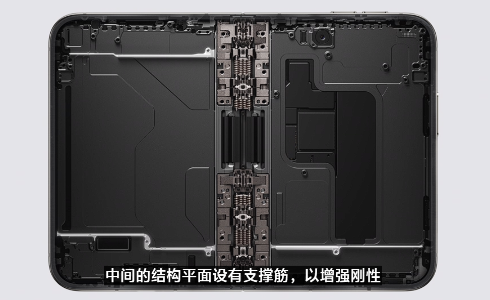
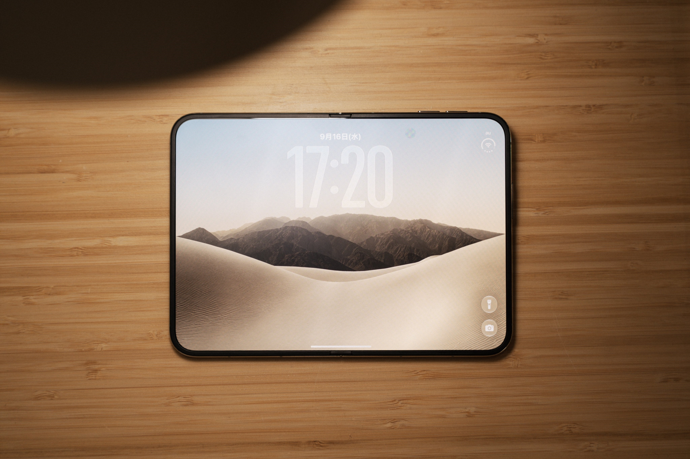

El iPhone Duo ya se presentó, pero su llegada a las tiendas sigue envuelta en dudas. Según el medio chino MyDrivers, a un mes escaso de la fecha de lanzamiento prevista —el 23 de octubre— la producción en serie del primer plegable de Apple todavía no ha alcanzado su ritmo y la tasa de éxito del ensamblaje final en las plantas de Foxconn apenas supera el 60 %. La consecuencia inmediata es que el primer lote de unidades llegará al mercado en cantidades reducidas.

El dato procede de fuentes de la cadena de suministro citadas por el medio, que además sitúan la madurez del proceso muy lejos todavía: según los estándares de calidad que maneja Apple, alcanzar una tasa de producción estable podría llevar entre medio año y un año más.

## Una línea de montaje que aún se está ajustando

Conviene matizar qué significa ese 60 %. No se trata de que exista un problema técnico concreto sin resolver, sino de que Apple se enfrenta por primera vez a la fabricación a gran escala de un teléfono con bisagra. En un producto nuevo, la línea de montaje necesita ajustar equipos, secuencias de trabajo y parámetros a base de prueba y error, y ese proceso no se puede acelerar por decreto.

Según MyDrivers, los proveedores esperan ahora una decisión de Apple sobre si rebaja temporalmente sus exigencias de calidad para facilitar el avance de la producción. Es un dilema clásico en un lanzamiento de alto perfil: sostener el estándar implica menos unidades, y aflojarlo permite llegar antes a las estanterías a costa de asumir más riesgo en el control de calidad.

## Por qué el iPhone Duo se tomó un mes extra

Apple ya anticipó que este lanzamiento sería distinto y se reservó más tiempo del habitual entre la presentación y la venta. El medio repasa la estadística: en los últimos cinco años, el iPhone pasó de su puesta de largo a la apertura de reservas en unos tres días de media, y de ahí a la disponibilidad en tiendas en unos diez días. En el caso del iPhone Duo, esos dos intervalos se han estirado hasta los 36 y los 43 días respectivamente, alrededor de un mes más de margen.

El motivo está en dos componentes que otros fabricantes llevan años perfeccionando y que Apple estrena ahora. Por un lado, el panel OLED plegable, que según MyDrivers suministra en exclusiva Samsung Display y cuyos plazos de entrega se retrasaron respecto a lo previsto. Por otro, la bisagra: la compañía llegó a probar el uso de metal líquido en algunas piezas, una vía que se reevaluó antes de la producción en serie y que obligó a otros proveedores a repetir muestras, validaciones y fabricación. Ese trabajo de ingeniería fue justamente el que el responsable de hardware de Apple defendió hace unos días, cuando explicó por qué [la bisagra del iPhone Duo es la pieza de la que más orgulloso se siente](/noticias/apple-vp-iphone-duo/).

## Precio, reservas y riesgo de reventa

El calendario oficial se mantiene: las reservas se abren el 16 de octubre a las 20:00 y el teléfono se pone a la venta el 23 de octubre. En China, el iPhone Duo parte de 15 999 yuanes en su versión de 256 GB y alcanza los 26 499 yuanes en la variante tope de 2 TB.

Con una oferta inicial corta y una demanda alta, MyDrivers advierte de que algunos canales de distribución ya ofrecen reservas a precios disparados, hasta decenas de miles de yuanes por encima de la tarifa oficial. Para quien tenga intención de comprarlo, el mensaje es claro: el primer lote se disputará y probablemente se agote rápido.

## Qué significa para el comprador

La escasez inicial encaja con un producto que Apple ha colocado en la gama más alta y que, como ya apuntan los rumores sobre [una futura familia de plegables con más formatos](/noticias/iphone-duo-max-larger-foldable/), no está pensado para reemplazar al iPhone convencional a corto plazo. Los problemas de fabricación tampoco deberían traducirse en unidades defectuosas: una tasa de éxito baja encarece el proceso y reduce el volumen, pero las unidades que superan el control de calidad salen con el mismo estándar que cualquier otro iPhone.

Otras coberturas de la misma información, como la de IT之家 (ITHome), que cita a Jiemian News, añaden un dato de escala que ayuda a dimensionar el lanzamiento: el objetivo de aprovisionamiento global del iPhone Duo para este año estaría entre 6 y 8 millones de unidades, frente a los 20 o 30 millones que suele mover una generación Pro o Pro Max en todo su ciclo. Son cifras de fuentes de la cadena de suministro, no confirmadas por Apple, y encajan con un primer plegable concebido como producto de nicho. Quien espere a la segunda remesa, o quiera comprobar cómo se comporta el terminal con [el iOS 27.1 que traerá de fábrica](/noticias/iphone-duo-ios-27-1-launch/), tendrá más margen para decidir sin la presión del primer día.
