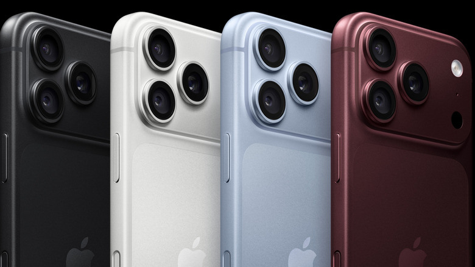

**iPhone Handoff** es una función nueva de iOS 27 que permite usar el mismo número de teléfono en dos iPhone sin necesidad de mantener dos cuentas de operador separadas. Apple la mencionó brevemente en la WWDC y la explicó con más detalle durante su evento Surprise and Shine del 9 de septiembre. Una vez configurada, basta con desbloquear el iPhone que quieras usar y el número queda operativo en ambos equipos.

La función está pensada para quien reparte su día entre dos teléfonos: quien pasa de un iPhone antiguo a uno nuevo durante unos días, quien viaja con un segundo equipo más barato en lugar del principal, o quien separa el teléfono del trabajo y el personal. Esta guía recoge los requisitos, los pasos de configuración y las limitaciones que conviene conocer antes de activarla.

## Requisitos previos

- **Dos iPhone con iOS 27 o posterior.** La función no está disponible en versiones anteriores del sistema.
- **Ambos equipos en la misma red Wi-Fi.** La configuración guiada pide que los dos teléfonos estén conectados a la misma red.
- **La misma cuenta de Apple.** Los dos iPhone deben estar identificados con la misma cuenta de Apple para iCloud, FaceTime y Mensajes.
- **Un operador compatible.** El operador debe dar soporte a iPhone Handoff. Hasta ahora solo han confirmado compatibilidad T-Mobile en Estados Unidos y Telekom en Alemania, y T-Mobile aplica un cargo adicional de 5 dólares al mes.
- **Definir un iPhone principal y otro secundario.** El dispositivo principal guarda la eSIM principal y gestiona la configuración del operador, aunque también se puede usar la eSIM de cada teléfono siempre que ambas procedan de operadores compatibles.

## Pasos para configurar iPhone Handoff

1. **Coloca los dos iPhone uno junto al otro y desbloquea uno de ellos.** La configuración se hace con los dos equipos cerca y al menos uno de ellos desbloqueado.

2. **Abre los ajustes de datos móviles.** Entra en **Ajustes > Datos móviles** (en inglés, *Settings > Cellular*). Allí toca **Añadir eSIM** o **Configurar datos móviles**; si el dispositivo ya tiene un número configurado, la opción que verás será directamente **iPhone Handoff**.

3. **Elige usar el número en este iPhone y en otro.** Selecciona **Usar número en este iPhone y otro**, toca **Continuar** y sigue las indicaciones que aparecen en pantalla para asignar uno de los dos dispositivos como iPhone principal.

## Cómo usar iPhone Handoff en el día a día

El uso posterior es tan sencillo como desbloquear el teléfono. Solo hay que desbloquear el iPhone que quieras utilizar y el equipo queda operativo con el número compartido. Para confirmarlo, aparece una notificación pequeña en la **Dynamic Island**, justo debajo del indicador de Wi-Fi, que avisa de que el dispositivo está activado para iPhone Handoff.

Con la función activa, los dos teléfonos pueden hacer y recibir llamadas y mensajes con el mismo número. Además, las tarjetas de pago añadidas en uno de los dispositivos funcionan en ambos, y la mayoría de las aplicaciones y de los datos de iCloud se comportan de forma transparente entre los dos equipos.

## Cómo verificar que funcionó

- Al desbloquear el iPhone, aparece la notificación de iPhone Handoff en la Dynamic Island, bajo el indicador de Wi-Fi.
- Puedes hacer y recibir llamadas y mensajes desde el mismo número en los dos teléfonos.
- Una tarjeta de pago añadida en uno de los equipos está disponible también en el otro.
- Las aplicaciones y los datos de iCloud se mantienen sincronizados en ambos dispositivos.

## Advertencias y limitaciones

- **El operador debe ser compatible.** Sin soporte por parte del operador, iPhone Handoff no se puede activar. Por ahora solo lo han confirmado T-Mobile en Estados Unidos y Telekom en Alemania.
- **T-Mobile cobra un extra.** El operador estadounidense aplica un cargo adicional de 5 dólares al mes por la función.
- **No cambia el Apple Watch emparejado.** La función no mueve el reloj vinculado de un iPhone al otro.
- **Algunos elementos de la cartera no funcionan.** Documentos de identidad y pases guardados en la cartera no están disponibles en ambos dispositivos.
- **Al cambiar de iPhone hay que transferir la eSIM.** Cuando sustituyas uno de los dos teléfonos, tendrás que pasar la eSIM al equipo nuevo.
- **Para desactivarla del todo hay que contactar con el operador.** Apple indica que la desactivación completa de iPhone Handoff se gestiona a través del operador.

Si además compartes el coche y quieres cambiar fácilmente qué iPhone controla la pantalla, puedes consultar la guía para [cambiar entre dos teléfonos en CarPlay paso a paso](/noticias/carplay-two-phones/). Y si te interesa el plegable de Apple, aquí tienes los detalles del [iPhone Duo](/noticias/apple-vp-iphone-duo/).
