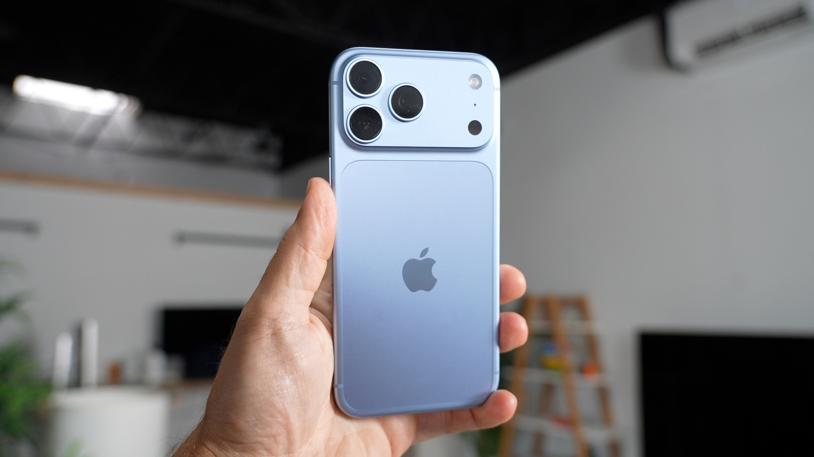

Que una persona salga con el rostro más redondeado, la nariz más grande y el cuerpo más ancho de lo que es en realidad no suele ser culpa del iPhone, sino de la distancia focal con la que se dispara. Esta guía explica por qué ocurre y cómo elegir entre 0,5×, 1×, 2× y 4× para conseguir retratos más naturales al fotografiar a alguien.

## Por qué el 0,5× deforma los retratos

El gran angular permite abarcar mucho más escena, pero obliga a acercar el teléfono al sujeto para que la persona ocupe el encuadre. Al reducir la distancia, la perspectiva se vuelve más agresiva y las zonas más próximas a la lente —la nariz y los pómulos— ganan protagonismo. El resultado es la sensación de "cara más grande y cuerpo más ancho" que aparece en muchos autorretratos.

## Qué distancia focal elegir según el tipo de foto

La elección depende de cuánto quieras incluir en el encuadre:

- **1× para cuerpo entero y escenas.** En fotos de cuerpo completo o de viaje, donde interesa que la persona aparezca junto al entorno, el 1× suele ofrecer una proporción más natural.
- **2× para medio cuerpo.** Si el retrato es de medio cuerpo, conviene probar el 2×. En el iPhone 17 Pro Max, el autor del reportaje original señala que la cámara principal admite 24 mm y 48 mm, es decir, 1× y 2× con calidad óptica. Con el 2× puedes situarte algo más lejos: la proporción del rostro mejora y el fondo gana cierta compresión.
- **4× para primeros planos con ambiente.** Para un primer plano más atmosférico se puede recurrir al 4×. En el iPhone 17 Pro Max ese multiplicador equivale a un teleobjetivo de 100 mm, una distancia que encaja bien con el retrato.

## La distancia al sujeto cuenta tanto como el zoom

No basta con cambiar de distancia focal: también hay que ajustar la distancia física al modelo. Un mismo 2× da proporciones y relaciones con el fondo distintas según se esté muy cerca o un poco más lejos. Desplazarse unos pasos cambia el resultado sin tocar ningún ajuste.

## Cómo elegir la distancia focal correcta

Como regla rápida, el autor de la pieza original resume la decisión en una fórmula sencilla:

| Tipo de retrato | Distancia focal sugerida |
| --- | --- |
| Retrato con entorno | 1× |
| Medio cuerpo | 2× |
| Primer plano | 4× |
| Cualquier caso | Evitar el 0,5× pegado al rostro |

Antes de disparar, conviene dar un paso atrás y probar otra distancia focal en lugar de apretar el obturador de inmediato.

## Limitaciones y advertencias

Las distancias de 24 mm, 48 mm y 100 mm corresponden al iPhone 17 Pro Max descrito en el original y no tienen por qué coincidir con las de otros modelos. Además, el propio autor advierte de que, cuando el sujeto queda demasiado lejos o la luz es escasa, no merece la pena forzar el teleobjetivo solo por buscar un efecto "premium": el 4× exige más distancia y más luz que los multiplicadores cortos.

Para seguir profundizando en cómo afectan los ajustes de cámara del iPhone al resultado, conviene revisar también pruebas como la de la [apertura variable del iPhone 18 Pro](/noticias/iphone-18-pro-variable-aperture-hands-on/), donde se comprueba cómo los cambios ópticos alteran la foto final.
