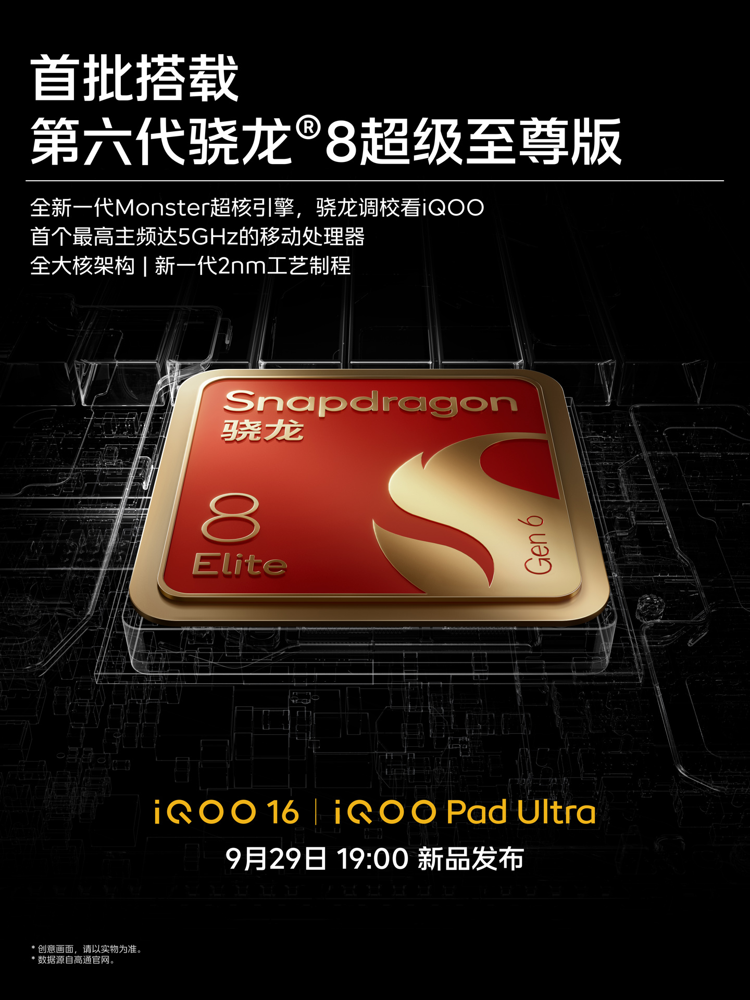
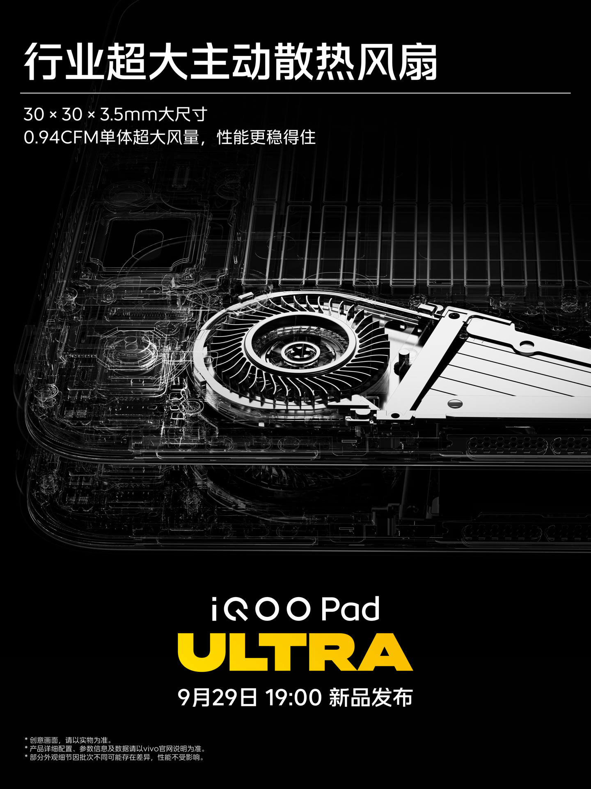
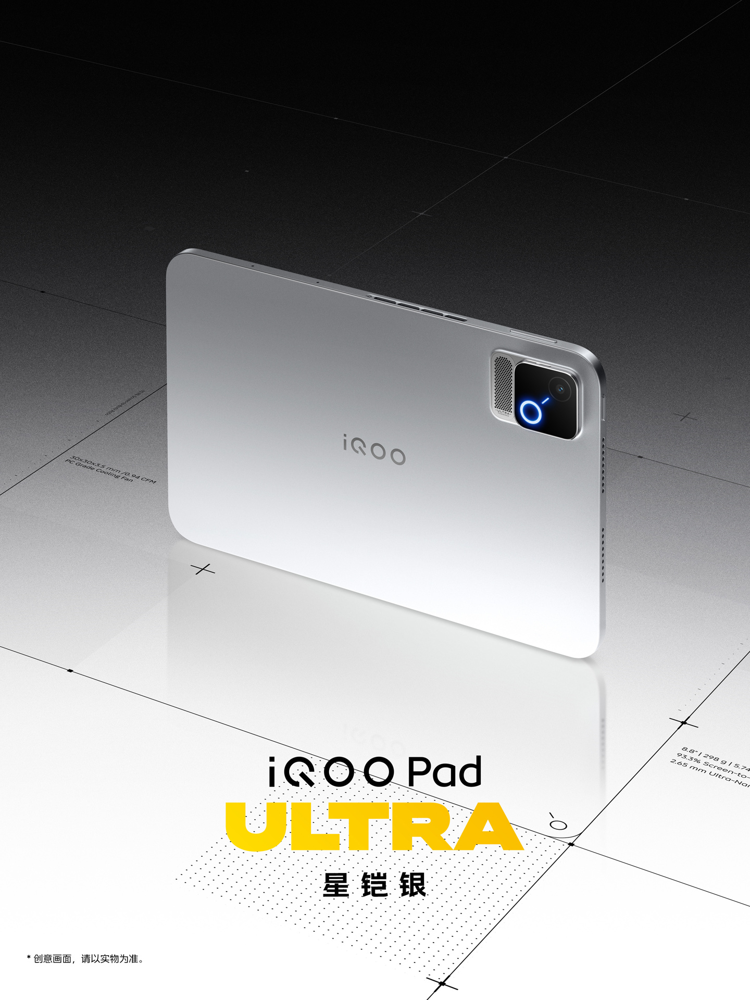
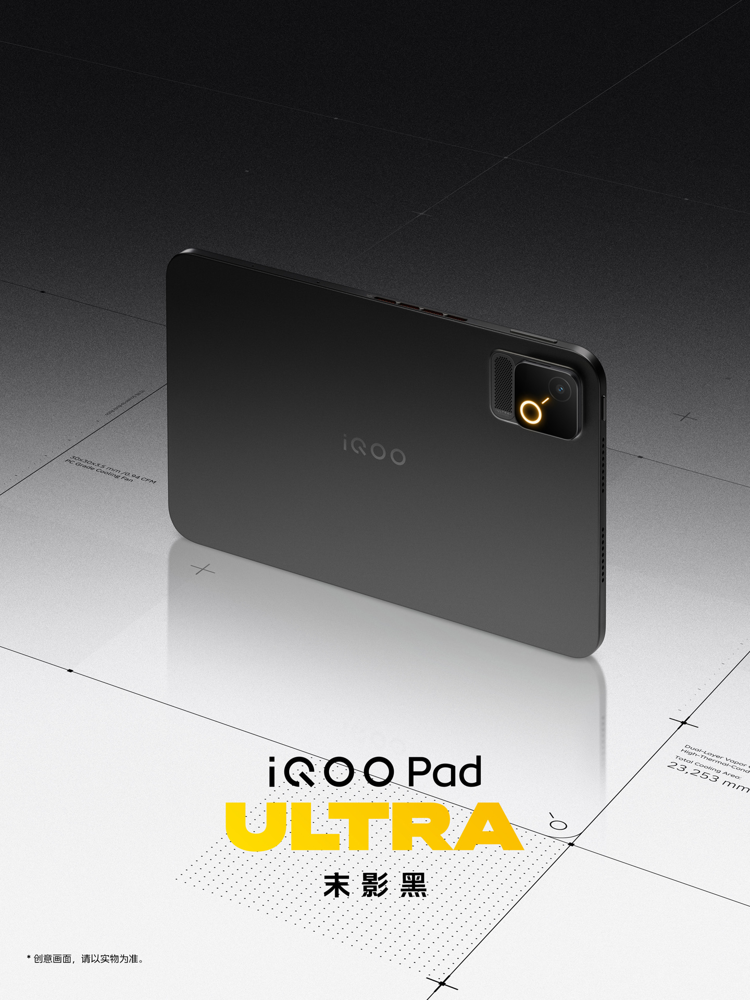

El **iQOO Pad Ultra** ya tiene fecha de presentación: el 29 de septiembre a las 19:00, hora local de China. La marca ha empezado a calentar el lanzamiento desvelando las claves de su nueva tableta, planteada para el juego, y entre ellas destaca una pantalla OLED de 8,8 pulgadas con una frecuencia de refresco de 165 Hz.

## La pantalla del iQOO Pad Ultra: 165 Hz y hasta 4500 nits

Según el material oficial difundido por iQOO, la tableta monta un panel OLED de 8,8 pulgadas con marcos de 2,65 mm iguales en los cuatro lados. La compañía destaca un pico de brillo local de hasta 4500 nits y un tiempo de respuesta inferior a 1 ms, dos cifras que sitúan al dispositivo en la liga de los paneles orientados a juegos rápidos. El aprovechamiento frontal llega al 93,3 %.

## Snapdragon 8 Elite Gen 6 y refrigeración activa

El iQOO Pad Ultra será uno de los primeros equipos en estrenar la sexta generación del Snapdragon 8 en su variante tope de gama, un chip que la compañía identifica en su cartel como Snapdragon 8 Elite Gen 6. Ese mismo material promocional añade que se trata del primer procesador móvil en alcanzar los 5 GHz de frecuencia máxima, con una arquitectura de núcleos grandes y un proceso de fabricación de 2 nm.

Para sostener ese rendimiento sin que el equipo se ahogue, iQOO recurre a un sistema de refrigeración activa: un ventilador de 30 × 30 × 3,5 mm integrado en el cuerpo, con un caudal de 0,94 CFM según la marca. El material del modelo negro cifra además la superficie total de disipación en 25.253 mm².

## Cuerpo metálico de 5,74 mm y 298 gramos

En el plano del diseño, el Pad Ultra apuesta por un chasis de metal de 5,74 mm de grosor y 298 gramos de peso. iQOO menciona altavoces estéreo simétricos y dos motores lineales en el eje X, pensados para ofrecer respuesta háptica en los juegos. La tableta llegará en dos acabados: plateado Star Armor Silver y negro Ender Black.

El anuncio llega en un momento de renovación intensa en el segmento de las tabletas: Xiaomi presentó hace unos días su [familia Pad 9 Pro](/noticias/xiaomi-pad-9-pro/) con pantallas de 144 Hz, y Samsung prepara su [Galaxy Tab S12 Ultra](/noticias/galaxy-tab-s12-ultra-design/), que de momento solo ha aparecido en filtraciones. Con el Pad Ultra, iQOO entra en esa conversación desde el ángulo del rendimiento y la refrigeración, un enfoque poco habitual en tabletas y más propio de los portátiles gaming. Queda por ver el precio y la disponibilidad fuera de China, dos datos que la compañía todavía no ha desvelado.
