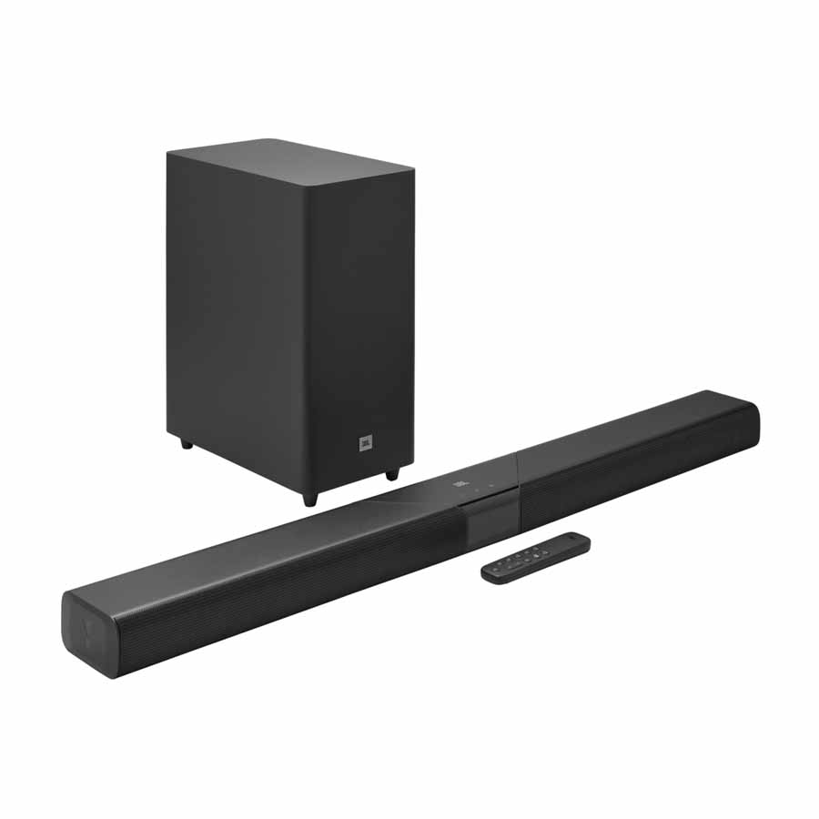

JBL ha presentado la gama **Cinema SB MK2**, formada por cuatro barras de sonido de 3.1 canales que comparten una novedad central: por primera vez, las barras de la marca pueden conectarse de forma inalámbrica a un par de altavoces portátiles compatibles para usarlos como canales traseros. La serie llegará a mercados seleccionados a partir del 1 de octubre de 2026.

## SurroundPlay: la novedad de la gama JBL Cinema SB MK2

La tecnología propietaria **SurroundPlay** convierte dos altavoces portátiles compatibles en los canales izquierdo y derecho traseros, de modo que el usuario obtiene un efecto envolvente sin tender cables por la sala. La conexión se apoya en Bluetooth y en Auracast, el sistema de difusión de audio de Bluetooth.

JBL precisa que, en el momento del lanzamiento, el único modelo compatible es el **Flip 7**: no sirve cualquier altavoz Bluetooth, aunque sea de la propia marca. La propuesta está pensada como una vía de ampliación progresiva: se puede empezar solo con la barra y añadir el par trasero más adelante, si la sala y el presupuesto lo permiten.

## Cuatro modelos para distintos presupuestos

Las cuatro barras comparten un canal central dedicado —pensado para que los diálogos se entiendan mejor que con los altavoces integrados de un televisor—, además de Bluetooth y Auracast. Se diferencian en potencia, subwoofer y compatibilidad con Dolby:

| Modelo | Potencia | Subwoofer | Audio | Conexión |
| --- | --- | --- | --- | --- |
| SB510MK2 | 200 W | Integrado | Dolby Audio | HDMI ARC |
| SB550MK2 | 360 W | Inalámbrico de 5,25" | Dolby Audio | HDMI ARC |
| SB580MK2 | 440 W | Inalámbrico de 6,5" | Dolby Atmos con procesado virtual | HDMI eARC + entrada HDMI |
| SB595MK2 | 440 W | Inalámbrico de 6,5" | Dolby Atmos con dos drivers de emisión superior | HDMI eARC + entrada HDMI |

El SB510MK2 es el modelo de entrada, un sistema todo en uno con el subwoofer integrado. El SB550MK2 añade un subwoofer inalámbrico independiente de 5,25 pulgadas. Los SB580MK2 y SB595MK2 suben hasta los 440 W y a un subwoofer inalámbrico de 6,5 pulgadas; el SB595MK2 es además el único de la gama con dos drivers que emiten hacia arriba para hacer rebotar la información de altura en el techo. El SB580MK2, por su parte, genera el efecto Atmos mediante procesado, sin drivers de altura.

Los modelos SB550MK2, SB580MK2 y SB595MK2 se pliegan en forma de U para el transporte y el embalaje, una solución que, según la compañía, reduce el volumen empaquetado hasta un 20 %. Se trata de una función de envío, no de escucha: la barra debe desplegarse antes de usarla.

## Precio y disponibilidad

La gama Cinema SB MK2 estará disponible en mercados seleccionados a partir del 1 de octubre de 2026. Los precios europeos parten de 199,99 € para el SB510MK2 y continúan con 249,99 € para el SB550MK2, 349,99 € para el SB580MK2 y 449,99 € para el SB595MK2. En el Reino Unido, los precios anunciados son de 300 libras para el SB580MK2 y 350 libras para el SB595MK2; conviene comprobar el precio local antes de comprar.

El anuncio se suma a un mes con bastante movimiento en el audio de consumo: a finales de septiembre, Xiaomi desveló [los Redmi Buds 8S](/noticias/redmi-buds-8s/), un ejemplo de cómo los fabricantes renuevan sus catálogos de audio de cara a la campaña de otoño.
