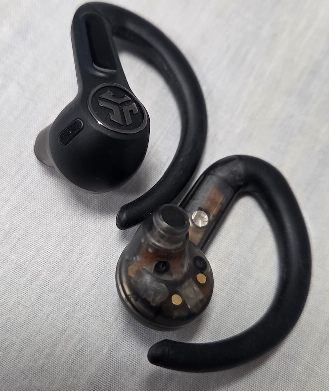
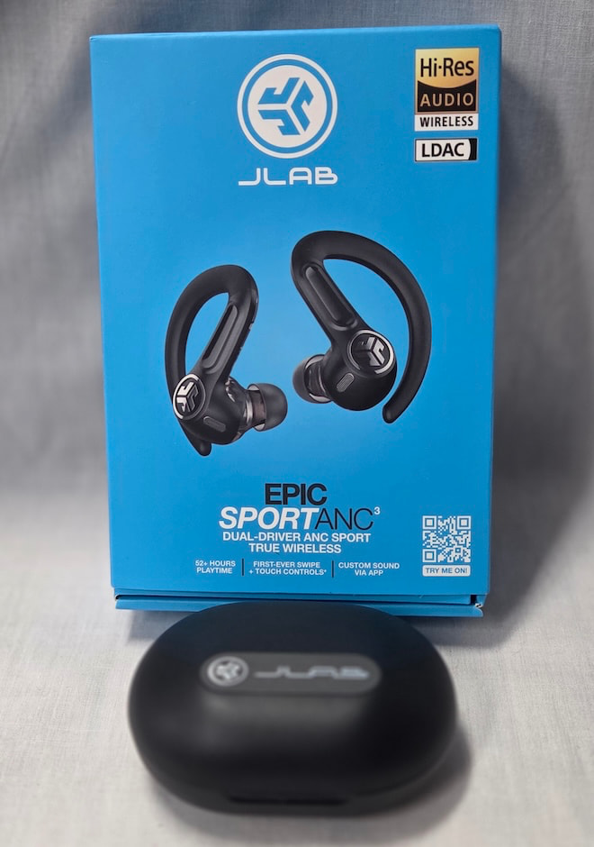

Los **JLab Epic Sport ANC 3** son la nueva apuesta de JLab para un público muy concreto: quienes destrozan auriculares baratos con regularidad. Por 104,99 dólares, este modelo combina un enganche de oreja fijo, doble driver, cancelación activa de ruido (ANC) híbrida y resistencia al polvo y al agua IP66, según el análisis que ha publicado [eCoustics](https://www.ecoustics.com/reviews/jlab-epic-sport-anc-3-earbuds/).

El planteamiento es claro. En la gama alta, Apple, Bose y Sony han construido ecosistemas cerrados, aplicaciones maduras y cancelación de ruido cada vez más eficaz. En la gama económica, casi todos los productos prometen sonido de estudio, batería para todo el día y ANC, a un precio cada vez menor. JLab no intenta competir en ninguno de esos dos frentes: apunta a corredores, ciclistas y usuarios de gimnasio que necesitan que los auriculares no se muevan y sobrevivan al sudor, la lluvia o una sesión intensa.

## El JLab Epic Sport ANC 3, diseñado para no moverse

La decisión de diseño más visible es el enganche de oreja. No son unos auriculares discretos pensados para pasar desapercibidos: el gancho rodea la parte externa de la oreja y añade un segundo punto de apoyo más allá de la almohadilla. Esa sujeción extra es justamente lo que buscan quienes hacen deporte, aunque tiene contrapartidas.

El enganche no es desmontable y compite por el mismo espacio que las patillas de las gafas, un detalle incómodo para quienes usan gafas a diario. Además, ocupa más que los modelos con varilla, así que resulta menos práctico como auricular de bolsillo para el resto del día. JLab incluye tres tamaños de almohadillas de silicona, y acertar con la talla importa: el sellado determina el aislamiento pasivo, la respuesta de graves, la comodidad y el rendimiento de la ANC.

La carcasa es de plástico, coherente con el precio, pero con una construcción que eCoustics describe como robusta. La funda de carga es más grande que la de muchos rivales —algo esperable por los ganchos y la batería— e integra un cable USB-C incorporado, un puerto USB-C adicional para cables más largos y carga inalámbrica.

## Dos drivers, LDAC y hasta 56 horas

En el apartado técnico, JLab ha metido bastante hardware en cada auricular. El Epic Sport ANC 3 usa una configuración de doble driver: un altavoz dinámico de 10 mm para las frecuencias bajas y un driver de armadura balanceada de Knowles para las altas. La ventaja es la especialización —los graves necesitan mover más aire y los agudos exigen movimientos más rápidos y pequeños—, aunque dividir el trabajo no garantiza por sí solo mejor sonido: el cruce de frecuencias, la cámara acústica y el ajuste final siguen pesando igual.

El modelo incluye Bluetooth 5.3 con soporte para SBC, AAC y LDAC, además de multipunto. El LDAC es la inclusión más destacada en este rango de precio, porque da a los usuarios de Android compatibles acceso a una conexión de mayor velocidad de bits. También suma audio espacial, emparejamiento rápido de Google y una aplicación con cuatro perfiles de ecualización: JLab Signature, Knowles Preferred, Bass Boost y Custom.

La autonomía declarada es de hasta 56 horas con la funda y hasta 12 horas en los propios auriculares con la ANC desactivada. Con ANC y LDAC activados, la cifra cae hasta cerca de 7,5 horas. Como ocurre con casi todos los auriculares inalámbricos, son números medidos en condiciones favorables: con ANC, LDAC, multipunto y volumen normal conviene esperar menos.

## Lo que gana y lo que pierde

El punto fuerte es la sujeción. Los ganchos flexibles mantienen los auriculares firmes sin volverse incómodos, incluso usando gafas, y la certificación IP66 los protege frente al polvo, el sudor y la lluvia —aunque no frente a la inmersión: quien nade debería buscar otra cosa—. La cancelación de ruido cumple para reducir sonidos constantes como la maquinaria del gimnasio, el aire acondicionado o el ruido de tráfico, pero no crea la misma burbuja de silencio que los mejores modelos de Bose o Sony. Al aire libre, el viento sigue siendo un rival difícil de controlar, y el modo Be Aware resulta más sensato para mantener la conciencia del entorno.

En sonido, el ajuste de fábrica es claramente cálido, con graves realzados que dan energía a listas de entrenamiento, a costa de que las voces puedan sonar algo retrasadas y las mezclas densas se saturen en los medios-bajos. Los auriculares no pretenden ser audiófilos, pero la ecualización Custom permite equilibrar la firma si se busca algo más neutro. En llamadas, la calidad es aceptable en interiores, mientras que con viento, tráfico o ruido de fondo los micrófonos se quedan cortos y la reducción de ruido recorta en ocasiones parte de la propia voz.

Un aviso para quien compare con alternativas: la categoría de audio se está moviendo rápido en conectividad y plataformas. Buen ejemplo es la propuesta de [Qualcomm Snapdragon Sound Elite Gen 2](/noticias/qualcomm-snapdragon-sound-elite-gen-2/), que apunta precisamente a mejorar el audio inalámbrico y la gestión de la cancelación de ruido en los próximos auriculares.

## Qué cambia para el lector

Sobre el papel, el Epic Sport ANC 3 acierta en lo que más importa en unos auriculares de entrenamiento: no se caen. A cambio de esa sujeción, renuncia a la compacidad, a la cancelación de ruido de gama alta y a un sonido refinado. Para quien prioriza aguante, una lista de funciones amplia y un precio cercano a los 100 dólares, entra de lleno en la lista de candidatos; quien busque máxima comodidad, ANC de referencia o llamadas frecuentes en exteriores tendrá que subir de presupuesto.

La comparación con otros auriculares deportivos reseñados en este medio ayuda a situarlos. Frente a alternativas más orientadas al juego, como los [Arctis GameBuds](/noticias/arctis-gamebuds-xbox-review/), el enfoque de JLab es claramente el ejercicio físico: menos ecosistema y más resistencia. La decisión, como casi siempre, depende de para qué se vayan a usar.
