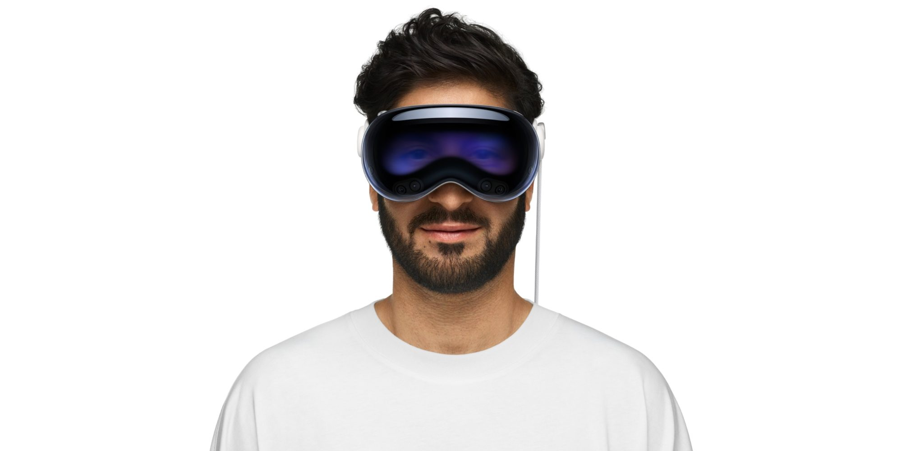

El nuevo consejero delegado de Apple, John Ternus, comparó el Vision Pro con los primeros ordenadores personales durante una entrevista con el medio francés *Clique TV*. La analogía, recogida por 9to5Mac en un análisis firmado por Ryan Christoffel, es para ese medio la mejor defensa del visor hasta la fecha: no promete que vaya a venderse de forma masiva, sino que lo sitúa en una etapa temprana de un recorrido largo.

Según el relato de la entrevista, el entrevistador Mouloud Achour planteó la pregunta en términos duros —si el dispositivo es una prueba, un fracaso o el primer paso hacia un futuro ordenador— y Ternus respondió con una tesis temporal, no con cifras de ventas:

> Vision Pro, para mí, es un dispositivo asombroso. Es un dispositivo absolutamente asombroso. Pero lo pienso como los primeros días de los ordenadores. Es el comienzo de un largo viaje.

## De la etiqueta al marco histórico

La diferencia con la defensa anterior es de enfoque. En 2024, Tim Cook justificó el rendimiento comercial discreto del visor describiéndolo como un «producto para pioneros», una etiqueta que reconoce el público reducido pero no explica gran cosa sobre su razón de ser. Ternus, en cambio, recurre a una comparación histórica: los primeros ordenadores eran caros y tenían usos muy limitados, y fueron ganando aplicaciones con el tiempo hasta habilitar cosas que entonces apenas podían imaginarse. El propio Ternus puso como ejemplo la autoedición, el uso que convirtió al Mac en una herramienta clave para un sector concreto antes de que el ordenador se generalizara.

Para 9to5Mac, ese paralelismo es más satisfactorio que la etiqueta de Cook porque no se apoya en el volumen de ventas para justificar la existencia del producto. Es una tesis editorial del medio, no un dato comprobable: nadie puede demostrar hoy que el Vision Pro recorra la misma curva que el ordenador personal.

## Los casos de uso del Vision Pro que Apple enseña hoy

El argumento de Ternus se sostiene sobre aplicaciones profesionales, no sobre el consumo masivo. En la entrevista menciona a los cirujanos que empiezan a usar el visor en quirófano porque, a su juicio, es una herramienta mejor que un monitor colocado al lado, y a la producción cinematográfica, donde se emplea para desarrollar decorados y escenarios. A ello suma a los primeros compradores que ya lo disfrutan, y concluye que Apple seguirá buscando casos de uso cada vez más atractivos.

Que Apple centre su discurso público en la cirugía y el cine dice bastante sobre dónde espera encontrar tracción a corto plazo. No es un mensaje pensado para el gran público, sino para justificar la inversión en una categoría que hoy sigue siendo minoritaria frente al iPhone, el iPad, el Mac, el Apple Watch y los AirPods.

## Qué cambia para el lector hispanohablante

La lectura práctica es que el futuro del visor que Apple describe no es el de un producto barato y masivo en el corto plazo. El propio análisis de 9to5Mac señala que la idea de unas gafas ligeras con funciones plenas de computación espacial puede tardar todavía varios años en llegar. Quien espere una versión asequible y ligera debería mirar ese calendario, no el anuncio de hoy.

Mientras tanto, el resto del mercado de wearables sí se mueve rápido. En el segmento de las [gafas inteligentes sin pantalla, los envíos se multiplicaron en el último semestre](/noticias/smart-glasses-market-doubles-meta/), y el propio Ternus lidera una Apple en la que ya se estrenó al frente del lanzamiento del [iPhone 18 y de una nueva etapa al mando](/noticias/apple-new-ceo-iphone-18-launch/). La defensa del Vision Pro encaja en esa misma estrategia: presentar la apuesta como una carrera de fondo y no como un resultado trimestral.
