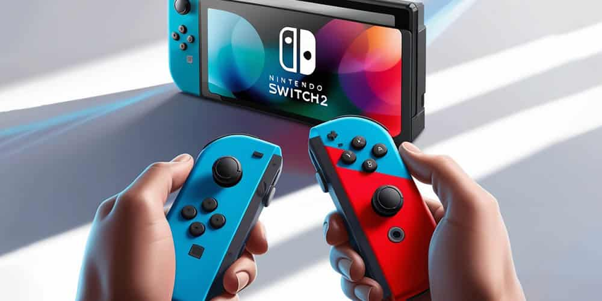

El drift de los Joy-Con fue uno de los episodios de hardware más comentados de la primera Switch, y con la llegada de la Switch 2 la pregunta era obligada: ¿había aprendido Nintendo de aquel error? Un técnico estadounidense que ha desmontado, reparado, modificado y probado más de 1.000 mandos de la nueva consola a lo largo de un año ha publicado sus conclusiones en un artículo invitado en Nintendo Life. Su veredicto es matizado: los sticks han mejorado de forma apreciable, pero el drift no ha desaparecido y ha aparecido un problema distinto que se repite más.

## Menos drift y más consistencia entre unidades

El autor del análisis es Gal Silver, fundador de GameTraderZero, una tienda en línea estadounidense especializada en mandos y consolas portátiles personalizadas. Según su experiencia, los sticks analógicos de fábrica de la Switch 2 han resistido mejor de lo que esperaba: su estimación aproximada es que la durabilidad ha mejorado alrededor de un 50 % de media respecto a los Joy-Con de la primera generación. También ha observado diferencias de calidad más pequeñas entre unidades y asegura que, entre los mandos que ha revisado, no ha encontrado ni un solo stick con drift recién salido de la caja.

El propio técnico advierte de que se trata de una estimación, no de una medición de ciclo de vida controlada. Todo stick analógico es un componente mecánico con una vida útil finita, y ni siquiera las soluciones de efecto Hall o TMR están exentas de desgaste: el interruptor táctil interno, conocido como L3 o R3, puede fallar con el tiempo. Dicho de otro modo, la mejora es real según lo observado, pero no equivale a una garantía de que el drift no vaya a aparecer nunca.

## El punto débil que ahora destaca: desconexiones del Joy-Con derecho

El fallo que Silver dice encontrar con más frecuencia en la Switch 2 no es el drift, sino cortes breves de conexión en el Joy-Con derecho. Al comparar unidades de las primeras tandas de producción con otras más recientes, detectó que Nintendo añadió en secreto una almohadilla de espuma junto al conector interno. La compañía no ha explicado públicamente qué función cumple; la hipótesis del técnico es que ese componente, de bajo coste, sirve para estabilizar el conector y reducir las desconexiones intermitentes provocadas por pequeños movimientos o presión sobre el mando derecho. No es la primera vez que Nintendo recurre a este tipo de ajustes discretos: ya lo hizo durante la vida de la Switch original.

Silver también apunta que no todas las desconexiones se deben al mando. En sus pruebas, el mismo Joy-Con se comportaba de forma distinta según la consola a la que se conectara, y algunos accesorios de terceros —fundas y agarres— pueden ejercer presión en la zona de unión y contribuir al problema. Pide, por tanto, no dar por defectuoso un mando sin antes probarlo sin accesorios y, si es posible, en otra Switch 2.

## Reparabilidad y alternativas: qué cambia para el jugador

Nintendo mantuvo una decisión de diseño que el técnico considera acertada: los sticks de la Switch 2 no van soldados a la placa, sino que son módulos completos reemplazables. Eso abarata y simplifica la reparación en comparación con mandos de otras plataformas y reduce el riesgo de convertir el mando en residuo electrónico cuando el stick se desgasta. Además, el mercado de recambios se ha desarrollado con rapidez y ya ofrece módulos de efecto Hall y TMR de fabricantes como Favor Union, K-Silver, Gulikit o Hallpi; Silver destaca especialmente los JP20 de Hallpi por su tacto y consistencia. También señala que el Pro Controller de Switch 2 ha pasado a usar módulos de stick reemplazables, lo que facilita futuras reparaciones.

En la práctica, esto significa que un jugador con problemas de desgaste no está obligado a comprar un mando nuevo: puede sustituir el módulo por uno de contacto no mecánico. De hecho, el técnico observa que muchos clientes piden instalar sticks TMR en mandos nuevos por simple prevención, condicionados por la mala reputación que arrastra el Joy-Con original.

## Lo que todavía no se sabe

No hay una tasa de fallo ni una probabilidad concreta de drift para la Switch 2; el dato del 50 % es una estimación aproximada del técnico, no una cifra medida en laboratorio. Tampoco está confirmado el propósito de la almohadilla de espuma, ya que Nintendo no se ha pronunciado al respecto. La conclusión de Silver es que la Switch 2 no es simplemente un Joy-Con reciclado, sino una evolución con mejoras sustanciales, y se muestra "cautelosamente optimista" a la espera de comprobar cómo envejecen los mandos con el tiempo.
