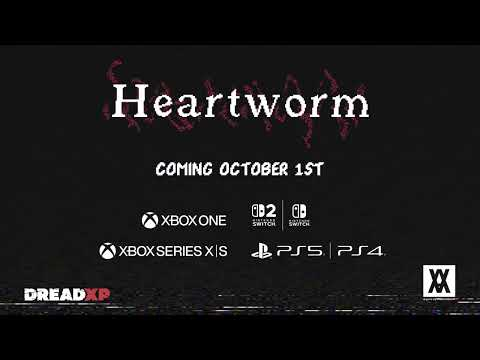
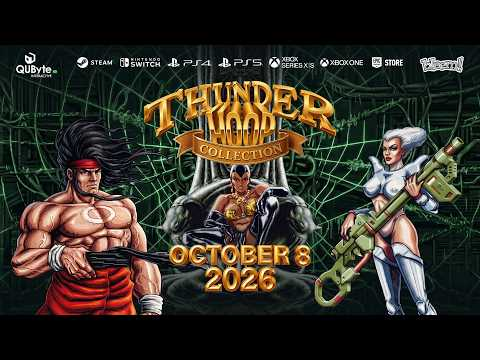
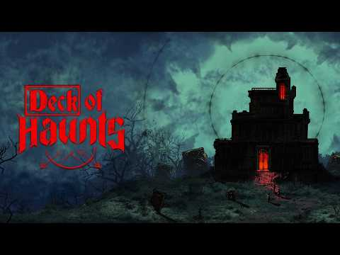
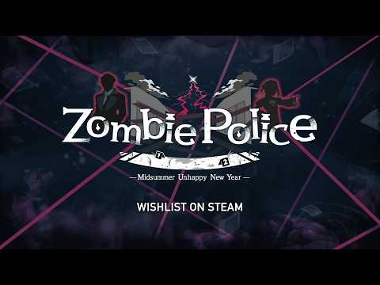
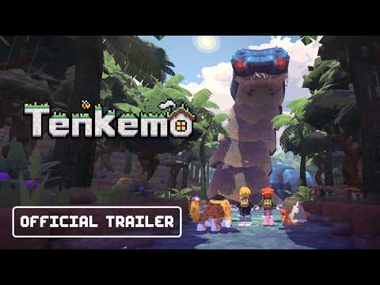
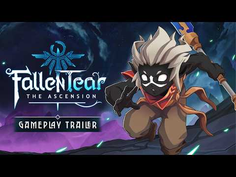

La agenda de Nintendo Switch y Nintendo Switch 2 ha sumado una nueva tanda de títulos con fecha. El nombre que más miradas concentra es **Fallen Tear: The Ascension**, un metroidvania dibujado a mano que ya ha concretado su llegada a consolas para 2027, pero no es el único: otros seis juegos independientes han fijado su estreno en los próximos meses. La información procede de la recopilación publicada por Nintenderos a partir de la cobertura de Gematsu.

## Las fechas confirmadas

Buena parte de los anuncios se concentra en octubre y noviembre, mientras que dos propuestas todavía no tienen día cerrado. Estos son los lanzamientos y sus datos conocidos:

| Juego | Fecha | Precio | Plataformas |
| --- | --- | --- | --- |
| Heartworm | 1 de octubre de 2026 | No especificado | Switch 2, Switch, PS5, PS4, Xbox Series y Xbox One |
| Thunder Hoop Collection | 8 de octubre de 2026 | 9,99 $ | Switch |
| Deck of Haunts | 8 de octubre de 2026 | No especificado | Switch 2 y Switch |
| The Zibbo Show | 29 de octubre de 2026 | No especificado | Switch |
| Zombie Police: Midsummer Unhappy New Year | Por determinar | 10,99 $ | Switch |
| Tenkemo | Por determinar | No especificado | Switch |
| Fallen Tear: The Ascension | 2027 | No especificado | Switch y Switch 2 |

## Los otros seis lanzamientos

**Heartworm** será el primero en llegar. Inspirado en el survival horror de los años 90, combina exploración, puzles y combates limitados con cámara fija y en tercera persona. La protagonista, Sam, usa una cámara como arma mientras investiga sucesos sobrenaturales ligados a la muerte de su abuelo. Sus responsables estiman una duración de entre cuatro y seis horas y prometen múltiples finales, escenas pre-renderizadas y controles modernos junto a un modo de movimiento clásico tipo tanque.

**Thunder Hoop Collection** recupera el arcade de 1992 y su secuela de 1994, *TH Strikes Back*. La propuesta invita a derrotar al ejército de mutantes del profesor Genbreak a base de saltos y combate, con mejoras de armas y jefes de gran tamaño. Incluye multijugador local y funciones modernas como rebobinado, estados de guardado y filtros de vídeo CRT.

**Deck of Haunts** apuesta por el roguelike de construcción de mazos desde un enfoque poco habitual: el jugador encarna una mansión embrujada. De día se diseña la casa y se colocan trampas para proteger la Sala del Corazón; de noche se usan cartas de terror para invocar espíritus que llevan a los exploradores a la locura o a la muerte.

**The Zibbo Show** traslada a Switch la estructura de un programa de televisión sobre un tablero de 3×3 en el que hay que colocar dados, crear combinaciones, sabotear al rival y apostar las ganancias. La partida se reparte en 12 rondas de dificultad creciente y 48 cartas desbloqueables, con mejoras de dados y la opción Spin of Luck para repetir un enfrentamiento.

**Zombie Police: Midsummer Unhappy New Year** es una aventura detectivesca con formato de novela visual que mezcla comedia y elementos sobrenaturales. La detective zombi Akemi Kabane investiga un caso relacionado con una VTuber y su habilidad Zombie Dive le permite adentrarse en personas y objetos para descubrir pistas ocultas. Llegará a Switch por 10,99 $, aunque aún sin fecha.

**Tenkemo** propone una supervivencia acogedora para jugar en solitario o en compañía. Sus responsables prometen un mundo abierto con bosques, cuevas y montañas donde reunir recursos, fabricar herramientas y construir desde casas hasta fábricas, con ciclo de día y noche, cambios meteorológicos y animales rescatables que podrán combatir contra los robots de una IA que intenta conquistar el reino. Tampoco tiene fecha por el momento.

## Fallen Tear: The Ascension, el gran reclamo para 2027

El título más ambicioso de la lista es, sin embargo, el que más tendrá que esperar. Fallen Tear: The Ascension sigue a Hira, una misteriosa niña destinada a enfrentarse a antiguos dioses en el mundo de fantasía de Raoah. Su propuesta mezcla la exploración libre del metroidvania con la construcción de grupo y el desarrollo de personajes de los JRPG clásicos, además de un punto de dificultad cercano a los juegos tipo *souls*.

Todo ello se desarrolla en un mundo interconectado dibujado a mano y al borde del colapso. Su llegada a Switch y Switch 2 está prevista para 2027.

## Qué cambia para el jugador

Para quien sigue la consola de cerca, esta tanda confirma que el catálogo independiente de Switch y Switch 2 mantiene el ritmo incluso antes de la campaña navideña. Octubre se perfila como un mes cargado, con Heartworm, Thunder Hoop Collection, Deck of Haunts y The Zibbo Show en apenas cuatro semanas, mientras que los dos títulos sin fecha —Zombie Police y Tenkemo— dejan margen para anuncios en próximas citas del sector. La gran incógnita es Fallen Tear: The Ascension, que se reserva para 2027.

Quien quiera seguir el hilo de los anuncios recientes puede repasar [otra tanda de anuncios para Switch y Switch 2](/noticias/polician-fazbear-fanverse-switch-anuncios/), publicada esta misma semana.
