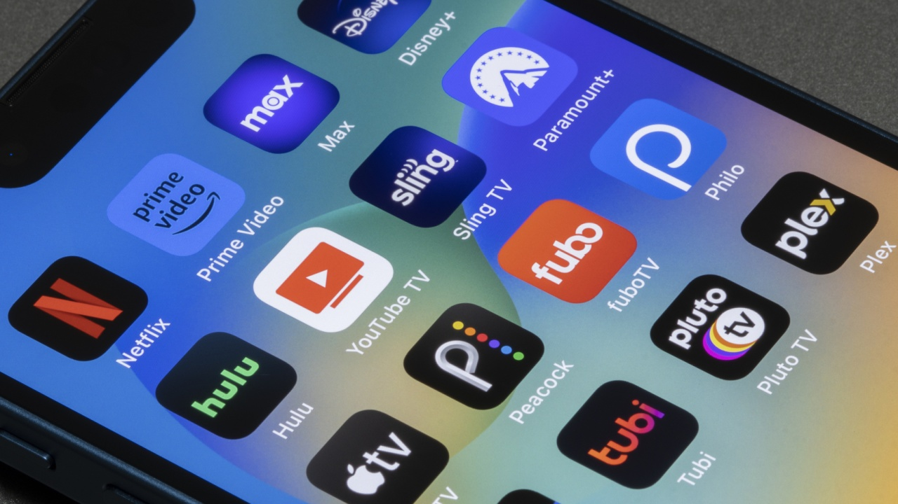

JustWatch es conocido por ayudar al espectador a encontrar dónde se puede ver una película o una serie: se introduce un título y la herramienta indica en qué plataformas está disponible. Ahora esa compañía da un paso más y se convierte en plataforma: JustWatch TV, un servicio propio de streaming que combinará opciones gratuitas y de pago.

## Qué es JustWatch TV

Se trata de un servicio de streaming propio de JustWatch, la guía de entretenimiento fundada en 2014. El anuncio se realizó durante el Festival Internacional de Cine de Toronto, el martes 15 de septiembre, y la compañía no ha detallado todavía el precio de su plan de pago.

Un dato importante para los usuarios actuales: la herramienta de búsqueda no desaparece. La guía seguirá funcionando y, si un título no está disponible en JustWatch TV, seguirá indicando en qué otras plataformas se puede ver. JustWatch TV tendrá su propio catálogo, pero conserva su función de localizador de contenido.

## Cómo funcionará y cuándo llega

Según la información publicada, JustWatch TV estará disponible en octubre, aunque la fecha exacta todavía no se ha revelado. El servicio se integrará en la aplicación y en la web de JustWatch.

El modelo combinará tres vías, algo que lo aleja de las suscripciones tradicionales:

- Una capa **gratuita con anuncios**.
- Una **suscripción de pago**, cuyo precio aún no se ha anunciado.
- La opción de **alquilar títulos** sueltos, de forma similar a como funciona Prime Video.

El lanzamiento inicial abarcará Estados Unidos, Canadá, Reino Unido, Irlanda, Alemania, Austria, Suiza, Francia, Italia, **España**, Australia y Nueva Zelanda. La compañía ha señalado que prevé expandirse a otras regiones más adelante.

## Catálogo y socios de lanzamiento

El servicio arranca con el respaldo de seis socios de contenido, entre los que destacan Paramount y New Regency. Este último aporta películas galardonadas con el Óscar como *12 años de esclavitud* (2013) y *Birdman* (2014), además de series conocidas como *Malcolm in the Middle*. A esa lista se suman títulos de Fremantle, Bleecker Street y Vortex Media.

En el análisis del medio original se compara este punto de partida con Tubi, el servicio gratuito con anuncios más consolidado del mercado. Tubi cuenta con una trayectoria más larga, con Paramount entre sus socios y distribuidoras como Lionsgate, además de formar parte del grupo Fox, lo que le permite reunir un amplio catálogo de películas, series, deportes y actualidad. La lectura del autor es que JustWatch TV parte con distribuidoras de peso, lo que podría ayudarle a atraer nuevos socios en el futuro.

## Lo que opina el autor

Conviene separar los datos anteriores de la valoración del artículo, que es marcadamente opinativa y está escrita en primera persona:

- El autor sostiene que el movimiento es natural para JustWatch y que ofrecer opciones gratuitas y de pago a la vez la diferenciará de sus competidoras y dará más alternativas al usuario.
- En su opinión, la versión gratuita ya está a la altura de Tubi y de otros servicios gratuitos, y lo justifica por un motivo concreto: sus socios de distribución.
- Sobre el plan de pago, especula con que podría incluir ventajas como la eliminación de anuncios y, posiblemente, mejor calidad de transmisión. Es una suposición del autor, no un dato confirmado por la compañía, que no ha desvelado el precio.
- Su conclusión es que se trata de un arranque sólido y que JustWatch TV podría convertirse en uno de los mejores servicios gratuitos.

## Qué implica para el usuario

Para el espectador hispanohablante, la noticia relevante es que España figura entre los países del lanzamiento inicial en octubre, de modo que el servicio llegará aquí desde el primer momento. La incógnita principal sigue siendo cuánto costará la suscripción, algo que la compañía no ha concretado, y qué catálogo real estará disponible más allá de los socios anunciados.

Hasta entonces, la recomendación práctica es la misma que ofrece el propio servicio: JustWatch sigue siendo una herramienta útil para saber dónde ver cada título, incluidos aquellos que no formen parte del nuevo catálogo.
