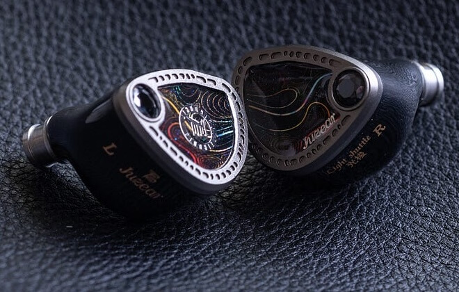
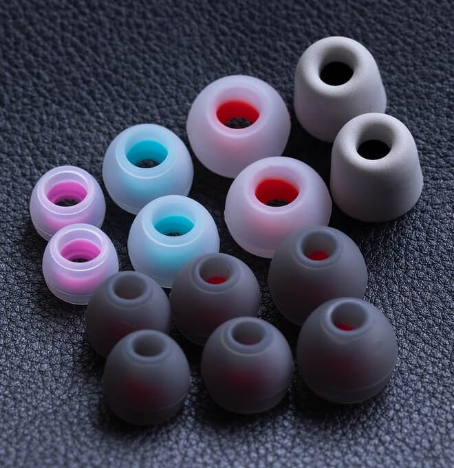
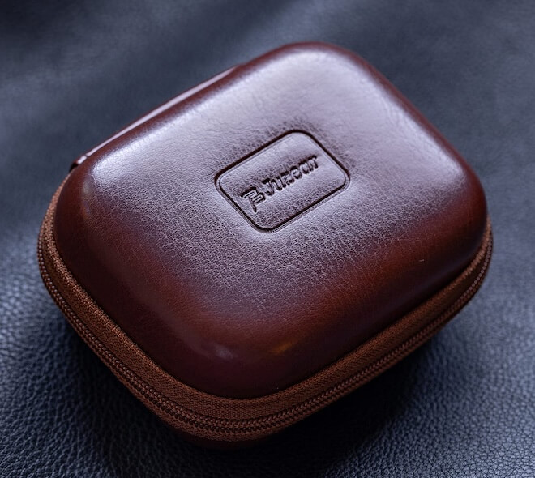
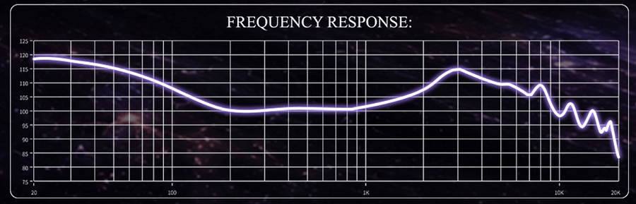
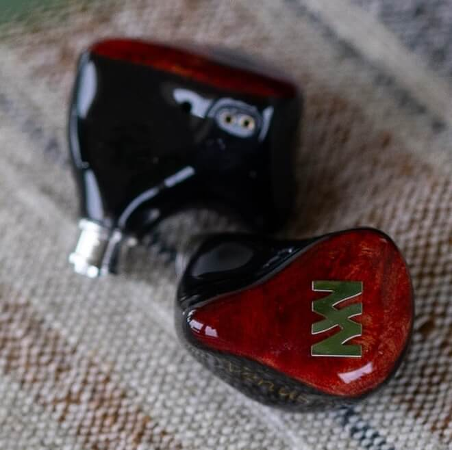
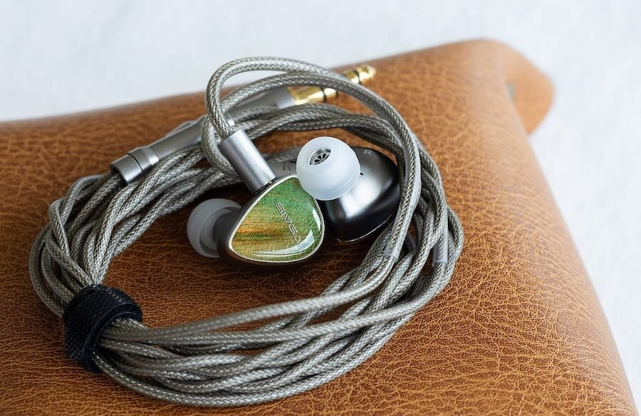

Juzear, firma china de alta fidelidad fundada en 2016 y con experiencia en monitores personalizados y de escenario, ha puesto a la venta el Light Shuttle, un IEM (monitor en oído) con configuración tribrida de siete drivers por auricular que se queda por debajo de los 200 dólares. La compañía ha encadenado lanzamientos en los últimos meses —el Fiesta, el Nimbus, el Nebula y una edición especial del Defiant—, y el Light Shuttle es su propuesta más reciente. El medio especializado eCoustics ya ha publicado su análisis.

## Siete drivers por menos de 200 dólares

El principal argumento del Light Shuttle está en su interior. Cada auricular monta siete drivers repartidos en tres tecnologías: un driver dinámico de 10 mm con diafragma MACCD (compuesto de carbono amorfo multicapa) encargado de los graves, cuatro drivers balanced armature —dos para medios y dos para agudos— y dos micro planar para la parte alta del espectro. El conjunto se organiza con un crossover físico de cuatro vías y cuatro tubos acústicos independientes apoyados en la tecnología de guía de ondas ATI-SW de la marca.

| Especificación | Valor |
| --- | --- |
| Configuración | 7 drivers por auricular: 1 dinámico de 10 mm, 4 balanced armature y 2 micro planar |
| Reparto | Dinámico para graves; 2 BA para medios; 2 BA para agudos; 2 micro planar para agudos altos |
| Crossover | Físico de 4 vías |
| Arquitectura acústica | 4 tubos independientes con guía de ondas Juzear ATI-SW |
| Respuesta en frecuencia | 20 Hz – 20 kHz |
| Sensibilidad | 113 dB ±1 dB SPL/mW |
| Impedancia | 32 ohmios |
| Distorsión armónica total | ≤0,2 % a 1 kHz |
| Aislamiento pasivo | Hasta 26 dB |
| Carcasa | Resina impresa en 3D de alta precisión (DLP) |
| Placa frontal | Aleación de aluminio mecanizada en cinco ejes con acabado iridiscente |
| Peso | Unos 6,4 gramos por auricular |
| Conector | 2 pines de 0,78 mm |
| Cable | 4 conductores, 400 hebras de cobre OCC plateado 6N |
| Terminación | 3,5 mm single-ended y 4,4 mm balanceada, intercambiables |

## Construcción y accesorios

La carcasa de resina sigue un diseño convencional, mientras que la placa frontal, más elaborada, cumple una función decorativa y no estructural. Los conectores de 2 pines quedan al ras de la parte superior y las boquillas metálicas integran filtros de suciedad, con un mecanizado que eCoustics describe como sólido y preciso.

El cable, de grosor medio, emplea una terminación modular íntegramente metálica con rosca de bloqueo. En la caja se incluyen los conectores de 3,5 mm y de 4,4 mm balanceado, pero no hay opción de 2,5 mm ni de USB tipo C: quien los necesite tendrá que recurrir a un adaptador o a un cable alternativo.

El paquete de accesorios incluye una funda semirrígida, un paño de microfibra, un par de almohadillas de espuma, seis pares de almohadillas de silicona, el cable de 2 pines y los dos conectores. El análisis lo considera completo y suficiente para usar los auriculares desde el primer momento.

## Cómo suena el Light Shuttle

En escucha, el Light Shuttle ofrece una afinación cohesionada y con una curva suave en V. Los agudos altos se elevan con cuidado por encima de unos agudos bajos contenidos, y el conjunto enlaza con un realce natural de los medios-agudos. La zona baja de los medios queda ligeramente retrasada antes de ganar algo de calidez alrededor de los 200 Hz; los medios-graves aparecen algo recortados, aunque sin llegar a notarse ausentes. Por debajo de los 100 Hz los graves cobran protagonismo, con una extensión que baja de los 20 Hz.

Según el análisis, el Light Shuttle prioriza los subgraves y mantiene a raya los medios-graves: el resultado es un grave contenido pero no escaso, con pegada suficiente en la batería y cierta pérdida de definición en pasajes electrónicos muy densos. En medios, la calidez medida da cuerpo a las voces graves y a los instrumentos de registro bajo, mientras que el realce de la región de 2–3 kHz aporta energía y separación. En agudos, eCoustics no detecta sibilancia ni aspereza: los hi-hats y platillos se distinguen con claridad y las capas densas se resuelven sin emborronarse. La sensación espacial es correcta, aunque los temas con más presencia de agudos altos se benefician más de ella.

## Comparativa y veredicto

El Light Shuttle aterriza en un segmento muy poblado, donde compite con propuestas igualmente capaces. Frente al Juzear Harrier, de 329 dólares, el nuevo modelo ofrece algo más de subgraves, medios-agudos más adelantados y agudos más aireados, mientras que el Harrier conserva mejor la separación en pistas muy complejas y un acabado más robusto. Contra el Binary Acoustics 1900, de 235 dólares, el Light Shuttle empuja con más fuerza la región de 2–3 kHz y baja más en los subgraves, a cambio de un timbre menos contrastado.

En los tramos más económicos, el Melody Wings Venus (168 dólares) y el SIVGA Lyrebird (165 dólares) apuestan por perfiles más brillantes y resolutivos arriba, mientras que el Light Shuttle mantiene un tono más cálido y un grave más presente. El análisis concluye que las diferencias de disfrute son pequeñas y que la elección depende sobre todo del tipo de sonido que prefiera cada oyente.

Para eCoustics, el Light Shuttle es un IEM muy bueno por debajo de los 200 dólares, aunque en una categoría llena de alternativas su atractivo depende de si su equilibrio entre calidez, claridad y contención encaja con el oyente. El repaso de ventajas e inconvenientes resume esa idea.

### Ventajas

- Afinación en V cohesionada y atractiva.
- Excelente claridad en medios y voces.
- Subgraves fuertes y bien controlados.
- Agudos detallados sin aspereza excesiva.
- Buen paquete de accesorios con cable modular.

### Inconvenientes

- Pegada e impacto de los medios-graves algo contenidos.
- Los agudos pueden quedarse cortos de aire y apertura.
- El rendimiento técnico no se separa con claridad de los rivales más fuertes.
- Las carcasas de resina se sienten menos sólidas que las de algunos competidores.
- Las almohadillas de espuma claras se ensucian con rapidez.

## Precio y disponibilidad

El Juzear Light Shuttle se vende por 189,99 dólares tanto en Amazon como en HiFiGo. Es una opción a tener en cuenta para quien busque un IEM tribrido de siete drivers con un perfil equilibrado y un presupuesto contenido, y una muestra del ritmo con el que la marca china renueva su catálogo, en la línea de otros fabricantes que apuestan por drivers planares en productos cada vez más asequibles, como los [auriculares Pulse de Sony](/noticias/playstation-pulse-headsets/).
