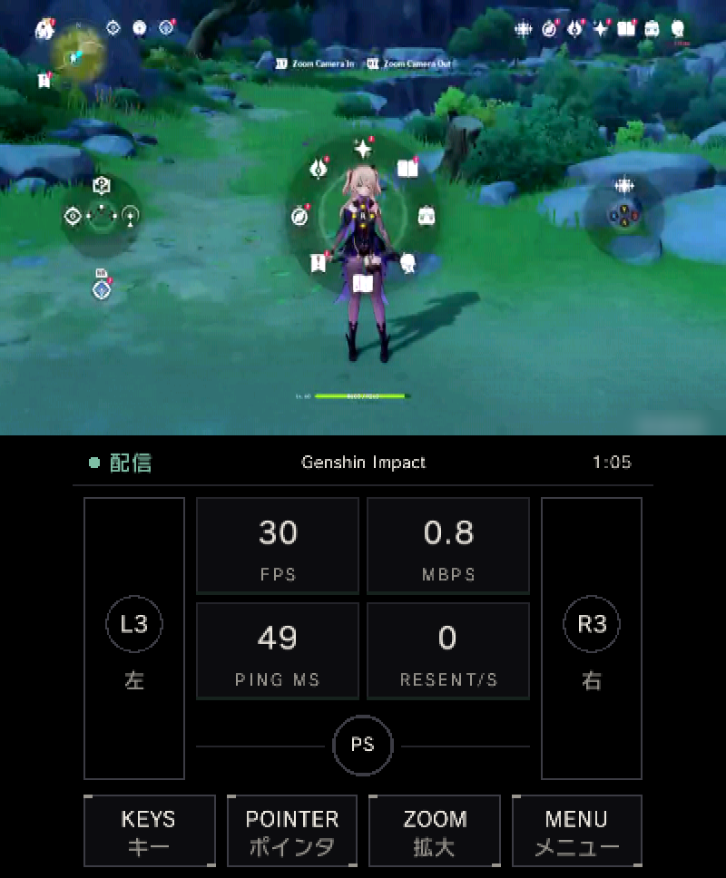
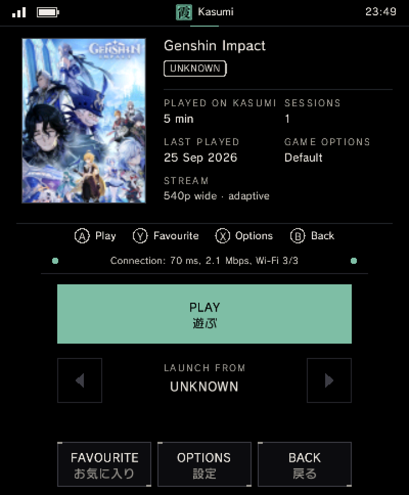
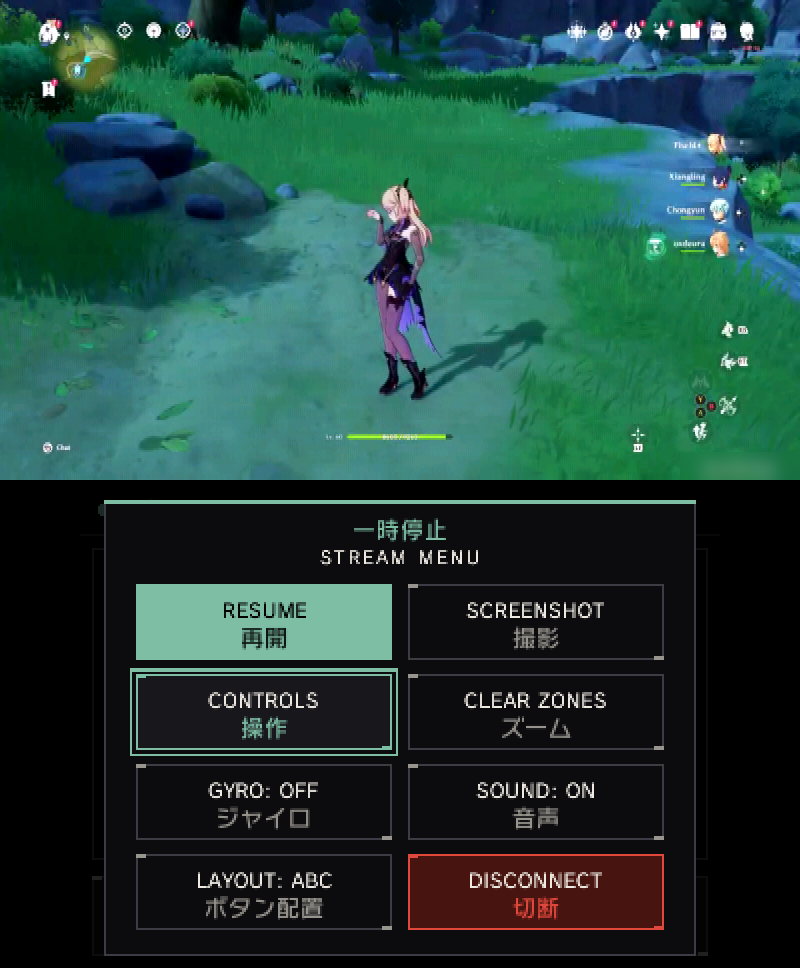

La New 3DS se convierte en pantalla del juego en la nube de NVIDIA: **Kasumi** (霞, «niebla» en japonés) es un cliente no oficial de GeForce NOW, gratuito y de código abierto, que acaba de salir en beta pública. El autor del proyecto, p0mpurin, presentó la aplicación en el foro de GBAtemp; se descarga desde GitHub e instala en la consola como cualquier otro homebrew.

GeForce NOW ejecuta los juegos en los servidores de NVIDIA y devuelve el vídeo al dispositivo que toque —hasta ahora un PC, un móvil, una tableta o una tele—; con Kasumi, quien decodifica ese flujo es la propia New 3DS, sin PC de por medio. El servicio ya había dado pasos recientes en otros frentes, como [los once títulos que se sumaron a su catálogo en septiembre](/noticias/geforce-now-new-games-september-2026/).

## Qué es Kasumi y cómo se instala

Kasumi se presenta en el hilo de GBAtemp como un cliente libre que transmite la biblioteca de GeForce NOW a la New 3DS, la New 3DS XL y la New 2DS XL. La instalación pasa por [descargar el archivo `Kasumi.cia` desde GitHub](https://github.com/p0mpurin/Kasumi) y cargarlo con FBI mediante **Remote Install → Scan QR Code**; a partir de ahí la propia aplicación se actualiza desde su menú de Ajustes.

Los requisitos son los habituales de la escena 3DS, y ahí está la primera limitación:

- **Modelos «New»**: la New 3DS, la New 3DS XL o la New 2DS XL. La consola original no sirve porque carece del decodificador de vídeo por hardware que Kasumi aprovecha.
- **Firmware personalizado** (Luma3DS), necesario para cualquier homebrew.
- **Cuenta de GeForce NOW**, incluida la gratuita, con su cola de espera y sus sesiones de una hora.
- **Wi-Fi de 2,4 GHz** con buena señal, la banda para la que está ajustada la aplicación.

El acceso a la cuenta se hace desde el móvil o el PC: en la consola solo aparece un código que hay que introducir en la página de inicio de sesión de NVIDIA, de modo que ninguna contraseña se teclea nunca en la 3DS.

## GeForce NOW a 30 fps en la pantalla de la New 3DS

El proyecto declara **30 fps a 960×540** con audio estéreo, aprovechando el decodificador por hardware de la consola. La biblioteca se guarda en la tarjeta SD con sus carátulas y se organiza en pestañas de favoritos y jugados recientemente; cada juego admite además opciones propias de bitrate, disposición de botones y mapeo personalizado.

El repertorio de funciones pensado para jugar portátil incluye apuntado con giroscopio, ratón de touchpad, teclado remoto para pantallas de inicio de sesión y zoom para el texto pequeño. Quien juegue con la cuenta gratuita espera su turno en la cola: Kasumi muestra una estimación de espera y avisa con un sonido y con el piloto de la consola cuando el equipo está listo, de manera que se puede cerrar la tapa mientras tanto.

## Los límites de la beta y del servicio

El propio autor avisa de que es una beta en desarrollo activo: los fallos se reportan abriendo un issue en GitHub con el archivo `sd:/3ds/kasumi/kasumi-diagnostic.txt`, que según el proyecto nunca contiene datos de inicio de sesión. Kasumi subraya además que **no está afiliado a NVIDIA ni a Nintendo**.

La experiencia tiene techo conocido. En las pruebas del proyecto, el ida y vuelta de red hasta los servidores quedó en torno a 60-80 ms, a los que se suman uno o dos fotogramas que la aplicación retiene para mantener la imagen estable: cómodo para aventuras, RPG y acción en general, menos recomendable para los shooters competitivos. El ajuste de 30 fps y en torno a 1 Mbps responde a un límite físico: el Wi-Fi de 2,4 GHz de la consola empieza a perder paquetes por encima de unos 1,2 Mbps.

Hay dos barreras de servicio que ninguna actualización del cliente resolverá. En los países donde GeForce NOW opera a través de un socio local de la alianza del servicio, con sus propias cuentas y servidores, Kasumi aún no funciona, una queja que ya aparece en los propios comentarios del hilo. Y la aplicación no corre en emuladores como Citra o Azahar: necesita el decodificador de hardware de una consola real.

Con todo, la beta encaja en una escena 3DS que sigue dando sorpresas, como demostró [Dekopon, el port de Azahar que lleva la emulación de 3DS a Nintendo Switch](/noticias/dekopon-3ds-emulation-switch/). La diferencia aquí es que la consola no emula nada: solo recibe vídeo de otra parte.
