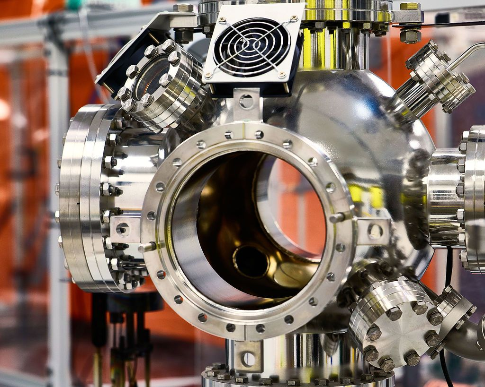
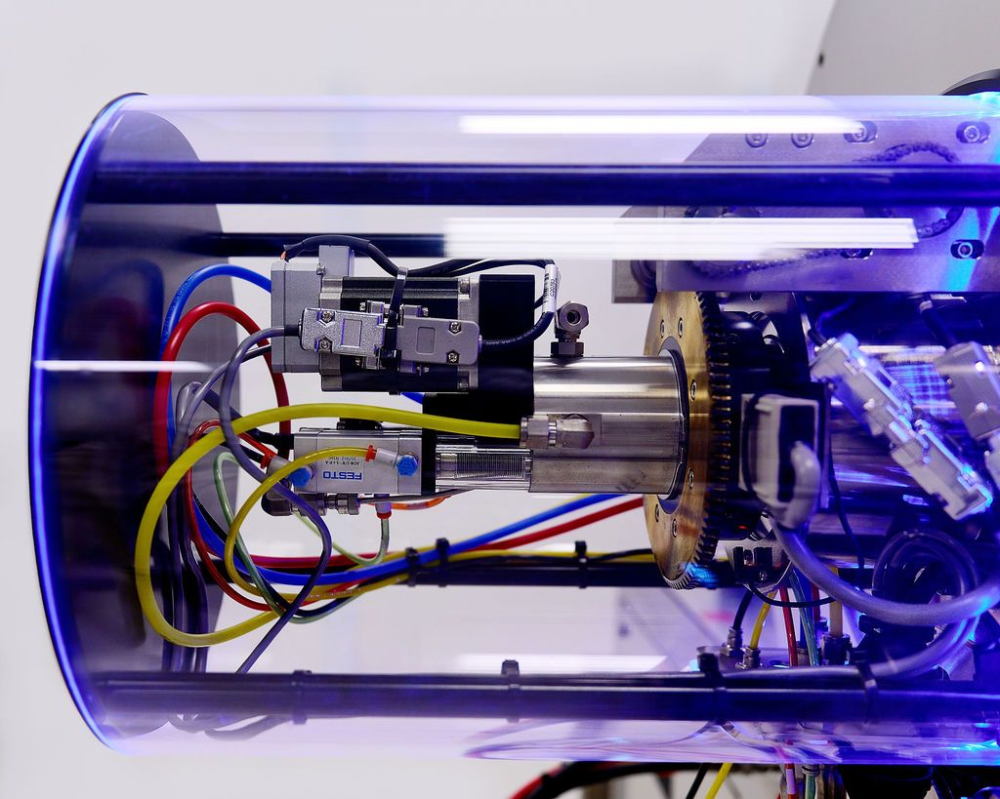
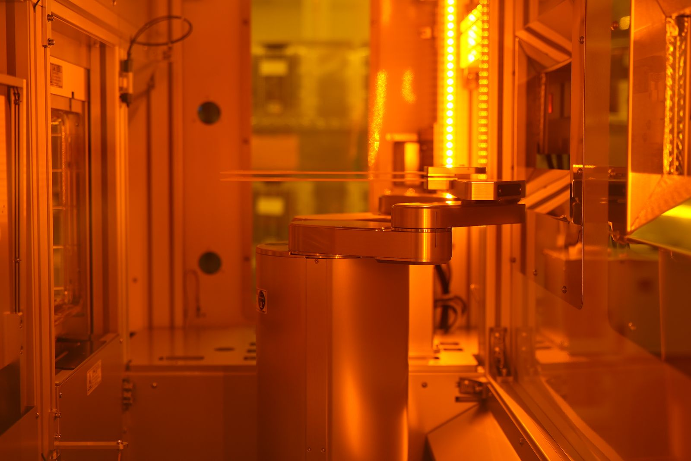

Después de más de siete años trabajando en silencio, Kepler Computing ha salido del modo sigiloso con una propuesta que apunta directo a uno de los cuellos de botella más dolorosos de la industria: la memoria de alto ancho de banda (HBM) que consumen los aceleradores de inteligencia artificial. La empresa, con sede en San José (California) y fundada en 2018 por un equipo de físicos y científicos de la computación, asegura haber diseñado una arquitectura alternativa que no depende de la litografía ultravioleta extrema (EUV) ni de fábricas nuevas.

## Una HBM que esquiva la litografía EUV

La idea central es doble. Por un lado, Kepler afirma haber desarrollado una técnica de apilado 3D que permite encajar más chips de memoria en una misma superficie, de modo que la lógica de cómputo quede más cerca de la memoria y los datos recorran menos distancia, con el consiguiente ahorro energético. Por otro, la compañía dice haber mejorado la densidad de la SRAM —la caché rápida integrada en CPU, GPU y XPU— mediante ferroeléctricos, un enfoque que permite leer y escribir a voltajes más bajos.

El ingrediente clave es un material compuesto propio, afinado a lo largo de 35 iteraciones hasta dar con una clase que, según la empresa, facilita y abarata la fabricación. Con él, Kepler sostiene que puede alcanzar densidades comparables a las de nodos de 2 y 3 nanómetros sin invertir en equipos de EUV, y producir HBM y SRAM en plantas maduras. En sus primeros trabajos con GlobalFoundries, la startup asegura haber convertido una instalación estándar de 28 nm en una fábrica de memoria en solo ocho meses, frente a los 24 meses que suele requerir una línea de DRAM convencional.

Hasta la fecha, Kepler ha procesado unas 2.000 obleas con esta tecnología. El plan declarado es enviar las primeras muestras de HBM a finales de este año, arrancar la producción en Singapur durante el próximo y empezar a fabricar en Estados Unidos en 2028.

## El respaldo: 468 millones y el interés de Washington

La compañía no está sola. Kepler ha reunido unos 468 millones de dólares en financiación a lo largo de los últimos años, con nombres que llaman la atención: GlobalFoundries, Intel Capital, AMD Ventures, el fondo británico Baillie Gifford y Bill Gates a través de su vehículo Gates Frontier. La presencia de Intel y AMD resulta especialmente significativa, porque son candidatos naturales a convertirse en clientes si la tecnología madura.

A ese respaldo privado se suma el público. En julio, el Departamento de Comercio de Estados Unidos se comprometió a aportar hasta 245 millones de dólares para que Kepler desarrolle en el país una nueva clase de memoria de alto rendimiento habilitada por tecnologías 3D y ferroeléctricas. La mayor parte de las pruebas se realiza por ahora en Singapur, donde GlobalFoundries —socio industrial e inversor con 50 millones— tiene instalaciones; la empresa también ha hecho pruebas en Burlington (Vermont).

## Qué falta y por qué importa

El escepticismo es razonable. La historia de la industria está llena de startups de memoria que prometieron revoluciones y naufragaron en el rendimiento de fabricación. El propio socio manufacturero lo reconoce: uno de los retos del material de Kepler es que incorpora hierro en su composición, un contaminante difícil de manejar en una planta de producción, lo que obliga a usar equipos dedicados o a encapsularlo por completo. La diferencia entre demostrar un avance en el laboratorio y lograrlo en miles de obleas y millones de dispositivos sigue siendo enorme.

Para el lector hispanohablante, la relevancia es concreta. La escasez de memoria ha disparado los precios de la DRAM y ha encarecido portátiles, tarjetas gráficas y equipos de sobremesa. Si el enfoque de Kepler funciona a escala, la promesa no es solo más HBM para los centros de datos: es liberar capacidad en las líneas maduras y, con suerte, aliviar la presión sobre el resto del mercado. Conviene tomarlo, por ahora, como una promesa bien financiada y no como un hecho consumado. Habrá que ver las primeras muestras y, sobre todo, sus cifras de densidad, ancho de banda y coste real.

