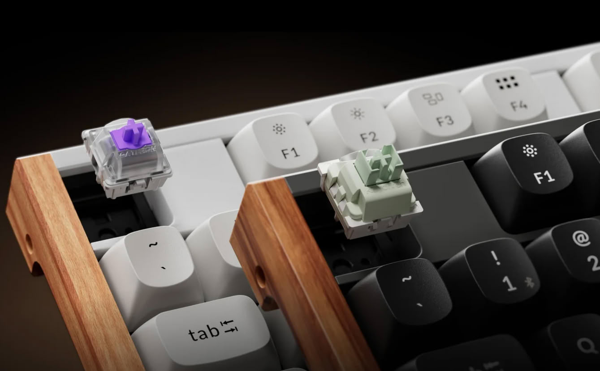
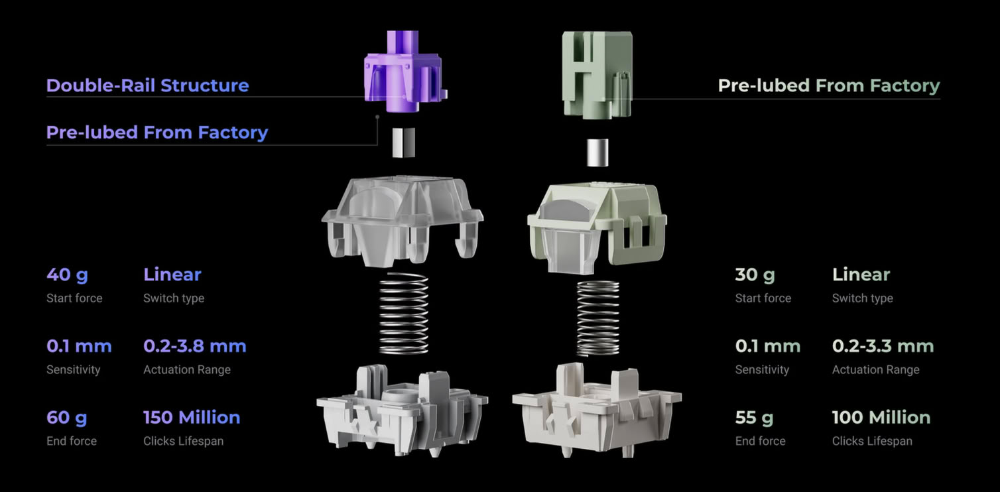
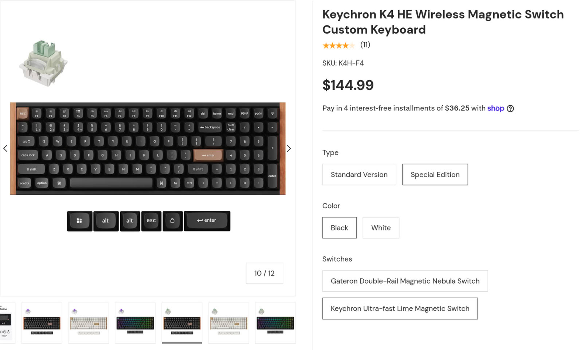

Keychron ha revisado dos de sus teclados inalámbricos con interruptores magnéticos más conocidos, el K4 HE y el K10 HE, y lo ha hecho sin tocar el precio. La novedad no está en el diseño ni en la conectividad, sino en algo que afecta directamente a quien quiera personalizar el teclado: la compatibilidad con interruptores magnéticos ha pasado del estándar S-pole al N-pole.

Hasta ahora, ambos modelos solo admitían interruptores magnéticos de polo S y salían de fábrica con los Gateron Double-Rail Magnetic Nebula. Las referencias más recientes de Keychron, incluidas sus propuestas HE y TMR, ya habían dado el salto al polo N, y la compañía ha decidido aplicar el mismo criterio a estos dos modelos veteranos.

## Qué cambia con los interruptores N-pole

La diferencia entre ambos tipos de interruptor no es cosmética. Los magnéticos de polo N cuentan con una adopción mucho mayor entre fabricantes de interruptores y de teclados, de modo que el catálogo de recambios disponibles es sensiblemente más amplio. Eso se traduce en más opciones de tacto, recorrido y peso para quien quiera modificar el comportamiento de su teclado.

Los nuevos K4 HE y K10 HE llegan de serie con los interruptores Keychron Ultra-Fast Lime Magnetic, ya de tipo N-pole. A partir de ahí, el usuario puede recurrir a alternativas de terceros como Wooting, Gateron, TTC, OwLab, Wuque Studio o MMD, entre otras firmas que fabrican interruptores HE compatibles.

El matiz importante es que la actualización se aplica únicamente a las nuevas unidades. Quien ya tenga un K4 HE o un K10 HE en casa no obtendrá esta compatibilidad ampliada, ya que se trata de una revisión de producto y no de una actualización de firmware. Por eso conviene fijarse en el tipo de interruptor antes de comprar, porque en el mercado convivirán las versiones antiguas y las nuevas bajo una denominación muy parecida.

## Precios y disponibilidad

Keychron mantiene intacta la estructura de precios de ambos modelos, que se pueden adquirir ya en su tienda oficial. El K4 HE, con distribución al 96 %, y el K10 HE, de formato completo al 100 %, cuestan 134,99 dólares en la versión Standard y 144,99 dólares en la Special Edition, con independencia del interruptor elegido. Es decir, la mejora en compatibilidad no supone un sobrecoste para el comprador.

## Por qué importa

En el segmento de teclados mecánicos y magnéticos, la compatibilidad de interruptores es uno de los factores que más pesan a medio plazo. Un teclado con una base amplia de recambios se puede ajustar a los gustos del usuario durante años, mientras que un modelo cerrado queda atado a lo que ofrezca el fabricante. Que Keychron unifique sus modelos antiguos con el estándar N-pole es una decisión sensata: reduce la fragmentación de su catálogo y coloca a estos dos modelos en una posición mucho más atractiva frente a alternativas de precio similar.

Para el aficionado hispanohablante, el mensaje práctico es claro. Si estabas pensando en comprar un K4 HE o un K10 HE para experimentar con interruptores HE de terceros, ahora tienes una razón más para hacerlo, siempre que confirmes que la unidad es la revisada. Si ya lo tienes, en cambio, no hay nada que hacer: tu teclado sigue siendo el de antes.
