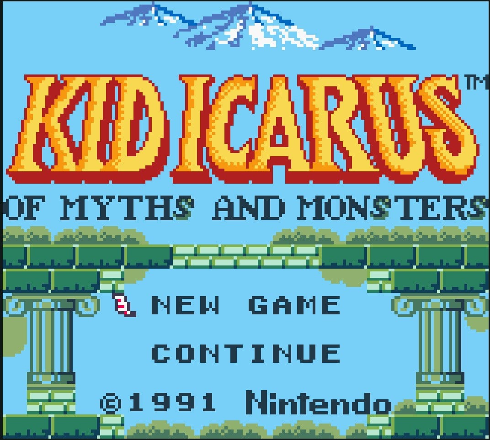
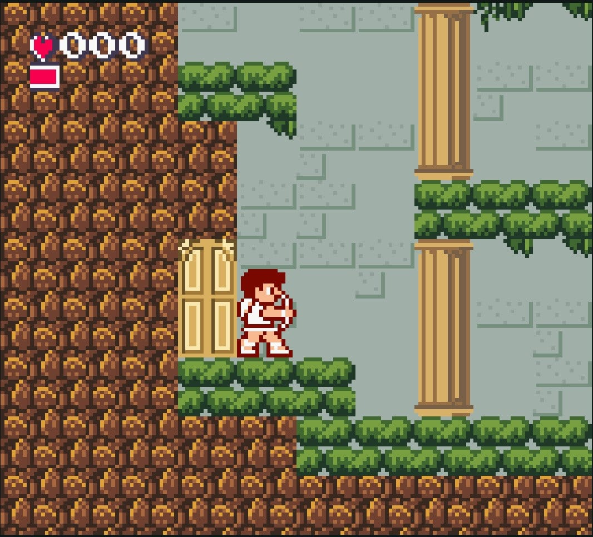
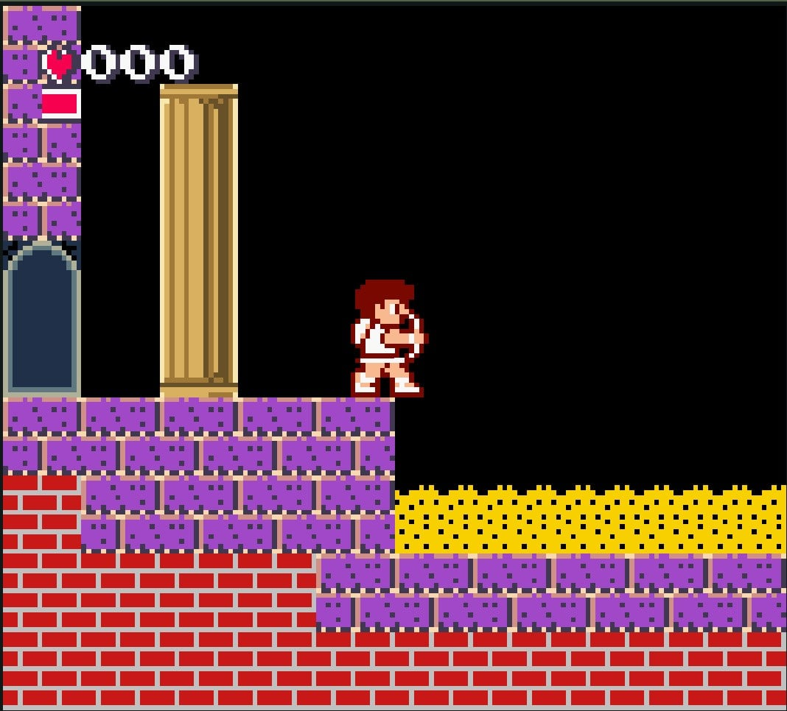

Pit vuelve a apuntar con el arco, esta vez con color. El desarrollador aficionado Astronaut_Majestic trabaja en **Kid Icarus DX**, un port no oficial a Game Boy Color de *Kid Icarus: Of Myths and Monsters*, el título que la saga tuvo en Game Boy en 1991. El proyecto avanza sin fecha de lanzamiento y, por ahora, su autor se limita a compartir unas pocas capturas del trabajo en curso.

## Qué es Kid Icarus DX y quién lo está haciendo

*Kid Icarus: Of Myths and Monsters* es la entrega portátil de la serie protagonizada por Pit, el ángel alado que debe prepararse para una invasión del reino de Angel Land. Según la premisa del juego, el demonio Orcos y su ejército de secuaces amenazan el territorio, y la diosa Palutena encarga a Pit reunir los tres Tesoros Sagrados para demostrar que está a la altura del enfrentamiento.

El port de Astronaut_Majestic traslada ese material a la paleta de color de Game Boy Color. El autor no ha detallado cómo piensa resolver la conversión ni qué añadidos incluirá, y de momento la información pública se reduce a las imágenes de progreso. En ellas ya se aprecia el cambio: lo que en el original era una pantalla en blanco y negro pasa a mostrar escenarios y personajes con tonos diferenciados.

## Por qué importa: el color que Nintendo nunca le dio a Pit

Cuando Game Boy Color llegó al mercado en 1998, Nintendo aprovechó para revisitar parte de su catálogo portátil con ediciones a todo color. Franquicias como *Tetris*, *The Legend of Zelda*, *Bomberman*, *R-Type*, *Wario Land* y *Super Mario* recibieron versiones recoloreadas, pero Kid Icarus se quedó fuera de esa hornada. El proyecto de Astronaut_Majestic cubre precisamente ese hueco que la empresa nunca llenó de forma oficial.

La reacción en los foros ha mezclado curiosidad y entusiasmo, con algún comentario socarrón sobre la propia rareza de la propuesta. Para quienes coleccionan y siguen el escenario de las consolas portátiles antiguas, se trata de un título más que añadir al catálogo de juegos a color hechos por la comunidad. Este tipo de iniciativas convive con otras herramientas del mundillo retro, como los [filtros que reproducen el aspecto de las pantallas de tubo en RetroArch](/noticias/retroarch-ntsc-shader/).

## Qué cambia para el jugador

Kid Icarus DX es, por ahora, un proyecto en desarrollo: no hay demo pública ni ventana de lanzamiento anunciada, así que conviene tomar las capturas como un avance, no como un producto terminado. Quien quiera volver al original mientras tanto puede hacerlo en su versión monocroma, disponible en el catálogo de Nintendo Classics para Nintendo Switch.

Para el aficionado a la conservación, el valor del proyecto está en rescatar una entrega poco recordada de una saga con fama de olvidada. Para el jugador casual, la noticia es más sencilla: un clásico de Game Boy que nunca tuvo versión a color puede acabar teniéndola de la mano de la comunidad.
