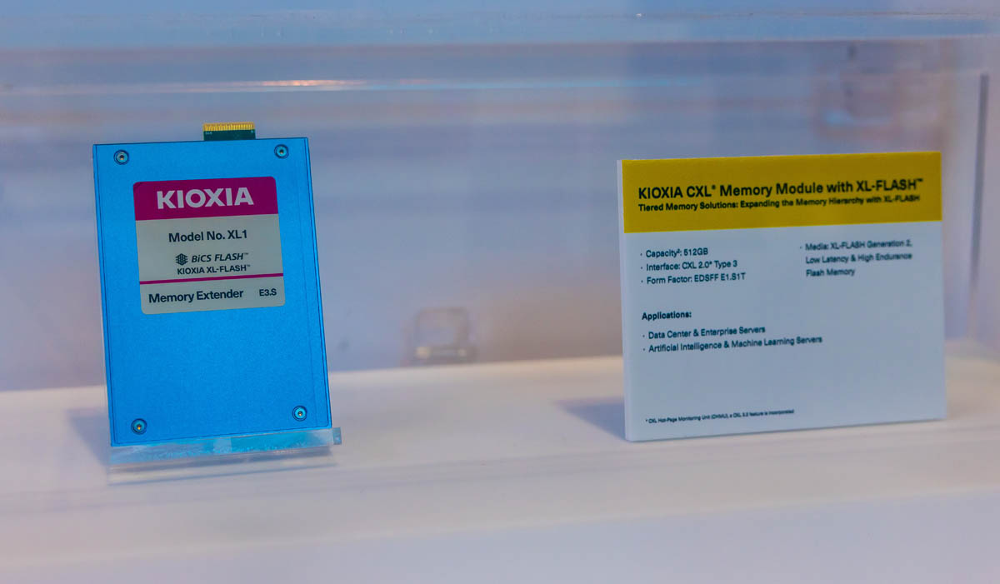
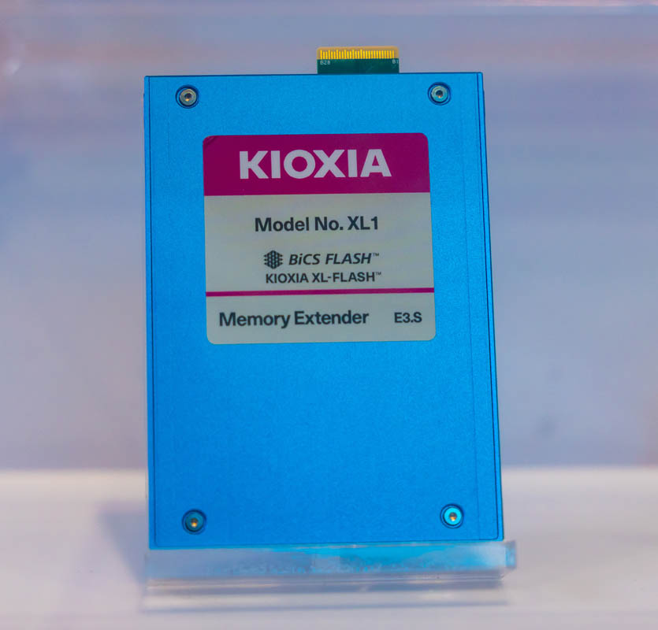
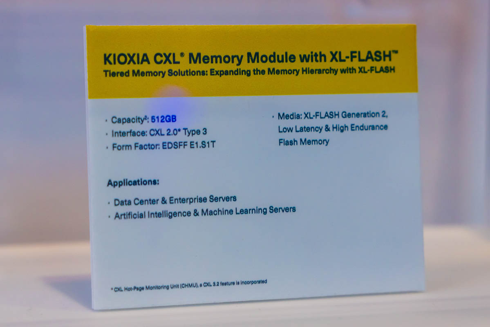
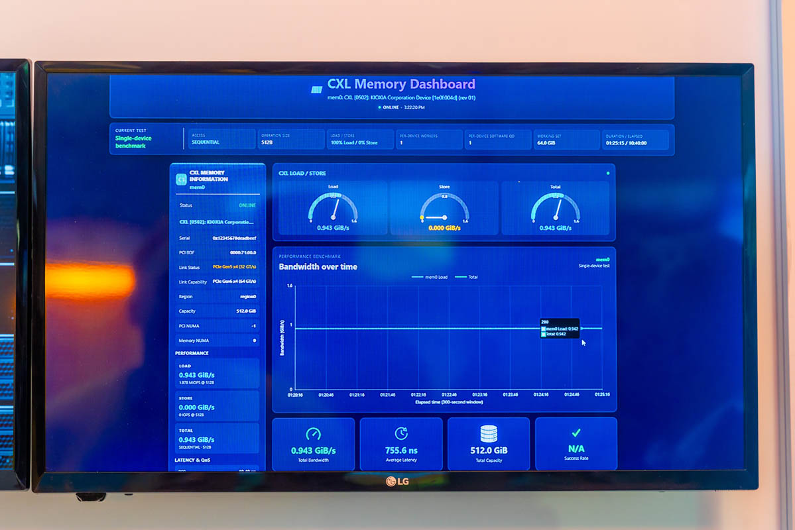

Kioxia ha mostrado en la feria FMS 2026 una unidad de su serie XL1, un dispositivo que
resuelve una pregunta poco habitual: usar memoria flash NAND como si fuera memoria de
sistema. Se trata de una unidad de 512 GB construida sobre XL-FLASH de segunda generación
que se conecta al servidor mediante CXL, no como almacenamiento NVMe al uso.

La propuesta llega en un momento en el que la DRAM sigue escasa y cara. La idea de Kioxia
es ofrecer capacidad de memoria por debajo del precio por gigabyte de la DRAM, aceptando a
cambio una latencia mayor que la de los módulos convencionales. Es el mismo principio que
sirve de base a CXL: distintos tipos de memoria pueden convivir detrás de un mismo
controlador según lo que exija cada carga de trabajo.

## El XL1, memoria de expansión en formato E3.S

La unidad expuesta era sorprendentemente discreta por fuera. El XL1 emplea un formato
**E3.S**, es decir, un conector EDSFF que en este caso transporta CXL en lugar de PCIe.
Para los diseñadores de sistemas, esa decisión aporta flexibilidad: un mismo chasis puede
alojar SSD NVMe tradicionales o dispositivos CXL, reutilizando el mismo tipo de bahía.

La hoja de especificaciones que acompañaba al dispositivo lo describe como una unidad de
**512 GB con CXL 2.0**. Al ser un dispositivo **Type 3**, su función no es acelerar cálculos
ni actuar como memoria caché coherente, sino ampliar la capacidad de memoria del sistema:
el servidor lo ve como un rango de memoria adicional accesible a través del enlace CXL.

El componente clave es **XL-FLASH de segunda generación**. Frente a la NAND TLC y QLC
habitual en los SSD de consumo, esta memoria está pensada para resistir muchas más
escrituras y responder con menor latencia, dos propiedades que importan cuando el medio se
usa como memoria y no como simple almacenamiento.

## Qué rendimiento mostró la demostración

Además de la unidad de muestra, Kioxia tenía un ejemplar en funcionamiento. Según la
demostración, el dispositivo de 512 GB operaba a **algo menos de 1 GB/s con 755 ns de
latencia** y se acercaba a los **2 millones de IOPS** en una prueba con cargas del 100 % de
512 bytes.

Son cifras que conviene leer con contexto. Una solución CXL basada en DRAM seguirá siendo
más rápida que la propuesta con NAND de Kioxia, y la propia naturaleza del medio marca ese
límite. El argumento del XL1 no es ganar en velocidad pura, sino ocupar el hueco de coste
que queda entre la DRAM y el almacenamiento SSD ordinario.

## Por qué importa: memoria en capas

La mayoría de las cargas de trabajo no accede a todos sus datos con la misma frecuencia.
Hay datos «calientes», que se consultan constantemente, y páginas de memoria «frías» que se
tocan muy de vez en cuando. La idea de asignar la memoria más rápida a lo primero y medios
más lentos y baratos a lo segundo lleva años sobre la mesa; Intel Optane fue el ejemplo más
conocido, dentro de una visión de arquitectura de memoria en la que CXL encaja de forma
natural.

El XL1 se sitúa en esa lógica: la DRAM sigue atendiendo los datos calientes y la NAND
XL-FLASH cubre las regiones frías, reduciendo el coste total del conjunto. Para el lector
hispanohablante, la señal es la misma que ya apunta el resto del sector: con la DRAM
tensionada por la demanda de la inteligencia artificial, los fabricantes buscan fórmulas
para ampliar la memoria de los servidores sin depender exclusivamente de ella. Hasta qué
punto estas unidades se adoptan fuera de los entornos de datos es algo que todavía está por
ver.
